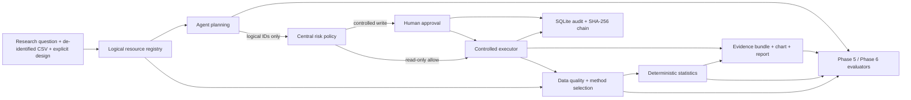

# ResearchOps Agent

[中文](README.md) · **English**

[](https://github.com/cedRiC874/researchops-agent/actions/workflows/ci.yml)


_CI signal: Ubuntu x86-64 installs locked dependencies and runs the complete Linux x86-64 offline demo; the Windows offline gate runs the complete unit/integration suite and rebuilds and verifies the frozen 50-task evidence._

**Let an LLM analyze research data without letting it invent the numbers:** ResearchOps Agent delegates planning to the model, deterministic data-quality and statistical work to controlled tools, and binds every reported claim to reviewable evidence and approval boundaries.


_Thirty-second result: provide a de-identified CSV, a research question and an explicit study design; receive an aggregate analysis with sample flow, effect estimates, confidence intervals, evidence IDs and limitations._

The model never sees real filesystem paths and cannot freely run Python, SQL or shell commands. It can only call allowlisted logical tools; deterministic local implementations produce the statistics and append them to the audit chain.

> This is a research prototype and portfolio project, not a clinical decision tool or a production-validated product.

## A concrete result: baseline-adjusted treatment effect

Example question: in a fully synthetic 240-row randomized trial, do follow-up systolic blood-pressure values differ between treatment and control, after accounting for baseline pressure?

| Method | treatment − control | 95% CI | p-value | Analysis n | Evidence ID |
| --- | ---: | ---: | ---: | ---: | --- |
| ANCOVA, baseline-adjusted, HC3 | -5.6069 mmHg | [-7.9351, -3.2787] | 3.82e-6 | 212 | `E-7C87BB6C88EB` |
| Welch, unadjusted sensitivity analysis | -6.7887 mmHg | [-10.8425, -2.7349] | 0.001134 | 212 | `E-B93CD9DC7751` |

Negative values mean lower follow-up pressure in the treatment group. The report may use benefit language only when the study design pre-specifies `beneficial_direction=lower`.

> **Professional boundary:** the requested population is intention-to-treat, but 28 missing follow-up outcomes leave 212 available cases in the realized analysis. The system therefore records `requested_population=intention_to_treat` and `realized_population=available_case`, and refuses to describe this result as a complete ITT analysis.

Reviewable artifacts: [analysis bundle](artifacts/phase3/analysis_bundle.json) · [aggregate chart](artifacts/phase3/effect_estimates.png)

## Quickstart

The strict frozen-evidence demo currently supports Python 3.11+ on Windows x86-64 and Linux x86-64 with NumPy/OpenBLAS. macOS and ARM do not yet have a comparable numerical baseline and are outside this strict demo's supported scope.

To avoid treating cross-OS floating-point differences as the same evidence, the canonical ANCOVA identity is pinned separately to Windows x86-64 `E-36034128278C` and Linux x86-64 `E-14EBFFCA843E`.

### Windows x86-64 / PowerShell

```powershell
python -m venv .venv
.\.venv\Scripts\python.exe -m pip install -r requirements.lock
powershell -ExecutionPolicy Bypass -File .\scripts\portfolio_demo.ps1
```

### Linux x86-64

```bash
python3 -m venv .venv
./.venv/bin/python -m pip install -r requirements.linux.lock
bash ./scripts/portfolio_demo.sh
```

The Linux lock keeps the same package versions as the Windows lock while excluding the Windows-only `pywin32`. The Linux demo uses the separately frozen `evals/tasks.linux-x86_64.jsonl`, which rebinds only cross-OS evidence/chart IDs without relaxing numerical or quality thresholds. CI installs this lock and runs the complete demo.

The demo rebuilds the frozen 50-task deterministic evaluation, verifies all 50 event hash chains, checks sensitive-data canaries, and writes to a new artifact directory. It never invokes an online Provider and never overwrites an existing artifact.

## Architecture



Key boundaries:

- The study design must be explicit; the system does not infer randomization, causality, pairing or covariate timing from column names.
- Method recommendations and execution bind to the dataset SHA-256 and fail safely if the input changes.
- Every report claim must match the current tool output's `evidence_id + metric_path + displayed_value + direction`.
- Unknown tools, unknown risk, unauthorized resources and unapproved writes are denied by default.

See [ARCHITECTURE.md](docs/ARCHITECTURE.md) for the detailed design.

For current online/offline validation, failure denominators, Provider history, candidate commitments and strict claim boundaries, see **[STATUS.md](STATUS.md)**.

## License

[MIT](LICENSE)
