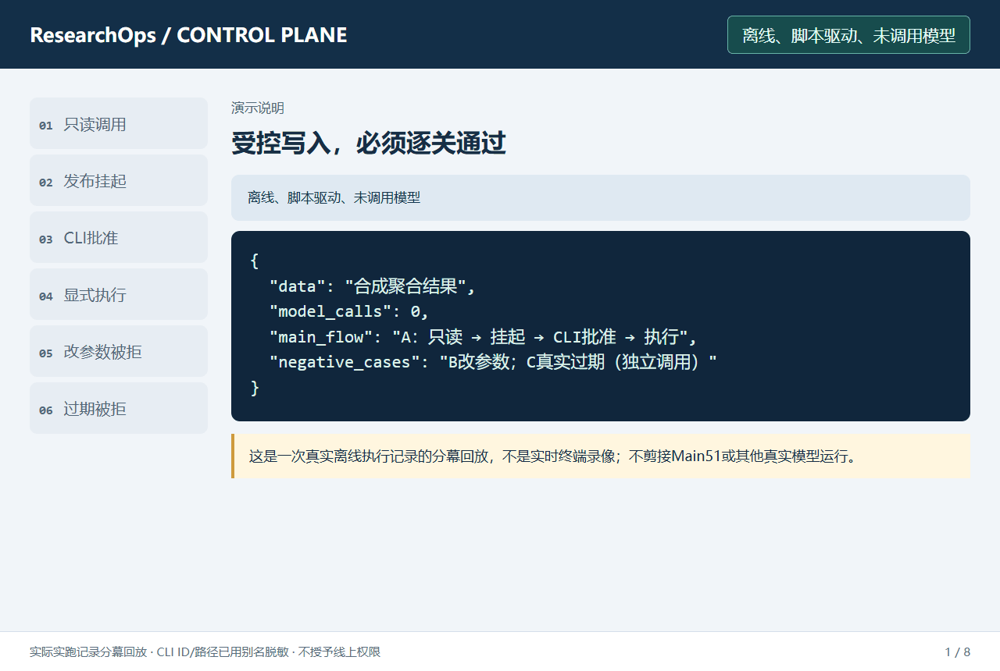
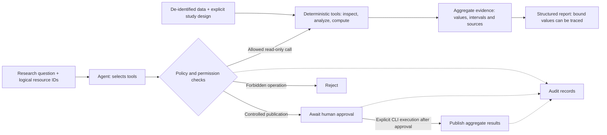

# ResearchOps Agent

[中文](README.md) · **English** · [Documentation](docs/README.md) · [Project status](STATUS.md)

A controlled Agent prototype for research data analysis: **the model orchestrates tools; code computes statistics and checks permissions; results retain their evidence and failure records.**

The first question this project asks is: **when should you not use an Agent?** On 16 clearly defined internal synthetic tasks, the fixed workflow passed all 16 without calling a model; the Agent passed 13. For well-defined tasks, a simpler workflow is often the better starting point.



**Offline, script-driven, no model calls** · A 40-second replay of actual offline records: read-only call → publication pending → CLI approval → execution → changed parameters rejected → expired approval rejected. A script invokes the CLI to approve; the two rejections are independent cases. No footage from real model runs is spliced in. [Storyboard and evidence](docs/DEMO.md)

There is also a recording with a real client and a real model: [MCP gateway](#mcp-gateway-a-real-client-and-a-real-model).

## Conclusion: start with a fixed workflow for well-defined tasks

On 2026-10-04, both paths used the same 16 developer-known synthetic tasks, fixed tools and evidence:

| Path | Pass | Fail | Unknown | Model requests |
| --- | ---: | ---: | ---: | ---: |
| Fixed workflow | 16 | 0 | 0 | 0 |
| Agent | 13 | 1 | 2 | 30 |

The fixed workflow encodes rules, unit conversions and output templates directly in code; the Agent must also generate correct arguments and wording. One clear error was writing **0.00625 g as 0.00625 mg**; the correct conversion is 6.25 mg. The other two cases remain “unknown” under the original rules, not retroactively counted as passes.

These results support using a fixed workflow first for these specific tasks; they do not establish a model capability ranking. An Agent's value would need to be demonstrated separately on open-ended inputs, changing goals and dynamic tool selection, while justifying its cost, latency and risk. This project has not yet demonstrated that advantage.

[Results, case-level issues and fixed version](docs/evidence/main51-controlled-observation-v1/README.md)

## Architecture: separate computation, permissions and the model


```mermaid
flowchart LR
    U["Research question + logical resource IDs"] --> A["Agent: selects tools"]
    A --> P{"Policy and permission checks"}
    D["De-identified data + explicit study design"] --> T["Deterministic tools: inspect, analyze, compute"]
    P -->|"Allowed read-only call"| T
    P -->|"Controlled publication"| H["Await human approval"]
    P -->|"Forbidden operation"| X["Reject"]
    H -->|"Explicit CLI execution after approval"| W["Publish aggregate results"]
    T --> E["Aggregate evidence: values, intervals and sources"]
    E --> R["Structured report: bound values can be traced"]
    P -.-> L["Audit records"]
    H -.-> L
    W -.-> L
```

This diagram shows component relationships, not a sequence followed by all 16 tasks: the comparison used only two read-only tools. Execution after approval is demonstrated by the offline control-plane demo and the MCP recording below. **The project's own Agent loop still cannot resume after pausing for approval**; an external client can resume through the MCP gateway. Statistical tool results are reviewable, but the model's final wording can still be wrong.

## MCP gateway: a real client and a real model

[`services/mcp_gateway_v1`](services/mcp_gateway_v1/README.md) exposes the controlled tools above to external clients over MCP (stdio). The model can call only seven tools: create a run, three read-only tools, propose a publication, execute an approved call, and check status. **Only an operator can approve, using a local CLI; the model has no approval tool.** Execution accepts only the run and call handles, not new business arguments.

https://github.com/user-attachments/assets/ddc14f6e-6d64-4cdd-90aa-211235262064

**Real client (ChatGPT desktop app, Codex) + real model (shown in the app as GPT-6 Astra Ultra) + synthetic data** · single take recorded on 2026-10-11, unedited, about 3 minutes · repository at main@`7e99156` when recorded

1. The model calls only researchops tools and states that it saw only column information and aggregate statistics. The effect sizes, confidence intervals and evidence IDs it reports match the evidence bundle, and it notes that only 212 of 240 participants were analyzed, so this is not a complete intention-to-treat analysis.
2. The publication proposal stops at `awaiting_approval`. Claiming “already approved” in the chat gets `tool_approval_required` from the gateway.
3. The operator lists pending approvals with the local CLI in PowerShell, checks the release name and approves. The `rehearsal-01` entry in the list was left over from a rehearsal and was not approved.
4. The model calls `execute_approved`, and `get_call_status` confirms `succeeded`. The release manifest's `tool_call_id` matches the approved call, and `raw_data_embedded` is false.

The client also asks “Allow once” before every non-read-only tool call. That is the client's own confirmation and does not replace gateway approval.

What this recording shows is limited: one model, one run and one fixed flow; it is not an evaluation. The gateway constrains only the tools that pass through it. Codex's own command execution is governed by client permissions, which were set to ask every time; the model did not request any commands during the recording. The gateway's 12 deterministic attack categories and 60 mock trials verify the control paths only; they do not show how a real model handles unknown attacks ([verification record](services/mcp_gateway_v1/VERIFICATION.md)).

During the first trial recording, the model pointed out that the dataset hash recorded in the evidence bundle differed from the repository's data file, so it could not assume they were the same data. The cause was line endings: the CSV had CRLF line endings when the bundle was generated, while the repository checks it out with LF; the rows are identical. Frozen evaluations reference that bundle, so it stays unchanged; the gateway now computes and flags this relationship ([details](services/mcp_gateway_v1/README.md#工具运行与错误)).

## Engineering work

- **Controlled tool orchestration:** the model can use only logical resource IDs and allowlisted tools; it cannot run arbitrary Python, SQL or shell commands.
- **Approval means more than “yes”:** it binds to specific arguments and resources, expires, and is checked again before execution. Approval itself does not perform a write; changed arguments or expired approval are rejected.
- **Traceable results:** structured reports link bound effect values to their sources and metric paths. A citation ID is not a guarantee that the entire answer is correct.
- **Recording why a call ended:** completion state, truncation signals, usage and timing are retained. Missing information remains unknown rather than becoming zero; full request/response bodies are not stored.
- **Preserving failures:** pass, fail and unknown are counted separately. New results do not overwrite historical scores, and passing tests does not establish model quality.

## Four lessons that changed the design

1. **Measure capability and format compliance separately.** Strict call sequences and limited text parsing affected early comparison scores, alongside genuinely invalid tool requests. Not every failure can be attributed to formatting.
2. **Check outcomes and required constraints, not a single prescribed trajectory.** An extra read-only lookup may be reasonable, but permissions, evidence provenance, budgets and side-effect boundaries must always hold. This is a future design principle, not a rewrite of historical scores.
3. **Leave arithmetic to deterministic code.** The unit-conversion error shows that evidence and citations do not guarantee the numbers written by the model are correct.
4. **Green CI does not establish quality.** An earlier automated check reported success while actual quality was only 44/50, with evidence references at 10/21. Quality thresholds and propagation of actual exit codes were added afterwards. [Incident record](docs/evidence/main-offline-gate-20260822/README.md)

## Security coverage and gaps

Mapped to the [OWASP LLM Top 10 2025](https://genai.owasp.org/llm-top-10/); this is neither a security certification nor a claim of complete protection.

| Risk | Coverage and tests/evidence | What this does not establish |
| --- | --- | --- |
| Prompt injection | **Partially covered:** [public attack scenarios](evals/v2/public_tasks.jsonl), [4 tool-description poisoning tests](tests/test_phase6_tool_description_poisoning.py), [12 deterministic MCP gateway attack categories](services/mcp_gateway_v1/VERIFICATION.md) | Scripted and mock calls do not prove that a real model resists poisoning or unknown attacks |
| Sensitive information disclosure | **Tested:** [allowlisting, pre-write scanning and persistence rejection](tests/test_completion_telemetry_ledger.py) | Not comprehensive data-loss prevention |
| Excessive agency | **Tested:** [scope-bound approvals, expiry and execution](tests/test_tool_runtime.py) | Not production-grade multi-tenant authorization |
| Misinformation | **Tested:** [report traceability](tests/test_reporting.py), [an observed error](docs/evidence/main51-controlled-observation-v1/README.md) | Citation IDs do not guarantee correct model answers |
| Unbounded consumption | **Tested:** [budgets and unknown usage](tests/test_item6_experiment_budget.py) | The cost stop takes effect after a response, not as a hard billing cap |

“Tested” refers only to the limited scenarios linked above. [Full risk mapping and gaps](docs/SECURITY_OWASP.md)

## Quickstart: offline, no model calls

Requires Git and **Python 3.12**. Installing dependencies requires network access; the demo makes no model calls and needs no API Key.

Clone the repository and enter its directory:

```bash
git clone https://github.com/cedRiC874/researchops-agent.git
cd researchops-agent
```

**Linux x86-64:**

```bash
python3.12 -m venv .venv
./.venv/bin/python -m pip install -r requirements.linux.lock
bash ./scripts/portfolio_demo.sh
```

**Windows x86-64 (PowerShell):**

```powershell
py -3.12 -m venv .venv
.\.venv\Scripts\python.exe -m pip install -r requirements.lock
.\.venv\Scripts\python.exe .\scripts\portfolio_demo.py
```

Windows also has a wrapper, `scripts\portfolio_demo.ps1`, that invokes the same implementation. These commands run the **50-task offline control-plane demo**, not the 16-task online comparison or the full root-level test suite. Outputs go into a new `artifacts/portfolio_demo_*` directory, including evaluation summaries, reports and an audit index; existing outputs cannot be overwritten.

Strict numerical reproduction does not currently support native **macOS and ARM**.

## Further reading

- [One-page project overview](docs/PORTFOLIO.md) · [Documentation](docs/README.md) · [Current status](STATUS.md)
- [Example analysis chart](artifacts/phase3/effect_estimates.png): historical synthetic-data analysis with 212 available cases, not a complete intention-to-treat analysis.
- [English article](https://github.com/cedRiC874/researchops-agent/blob/6457358d74cc07106dfb7a348ac143cdaa87e459/docs/articles/honest-agent-evaluation/article.md) · [Hacker News discussion](https://news.ycombinator.com/item?id=49518667)

This is a research prototype and portfolio project, not a clinical decision tool, and it has no production SLA. The earlier strict 60-task protocol score remains 20/60; later results do not rewrite it.

License: [MIT](LICENSE)
