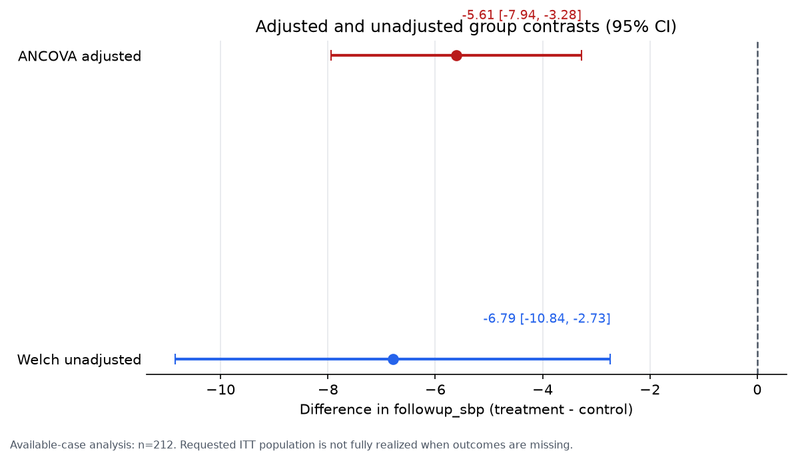
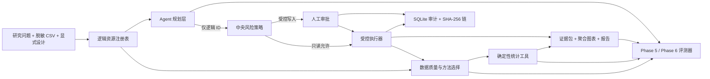

# ResearchOps Agent

> Evidence-first scientific data analysis agent：模型负责规划，受控工具负责计算。

ResearchOps Agent 是一个面向科研数据分析岗位的工程化作品集。它接收脱敏 CSV、研究问题和显式研究设计，完成数据质量检查、统计方法选择、ANCOVA/Welch 分析、聚合可视化、证据化报告、危险操作审批、重试与全链路审计。

项目的重点不是“让模型自由写代码”，而是把模型限制在可审计的工具边界内：模型只能使用逻辑资源 ID；统计量由确定性工具计算；每条结论必须绑定证据；写操作必须经过范围绑定的人工审批。

## Evidence at a glance

当前验证快照：2026-08-28。

| 层 | 状态 | 可复核结果 |
| --- | --- | --- |
| 模拟科研分析 | 已验证 | 240 行模拟 RCT；ANCOVA 与 Welch 均生成数值、样本流、诊断、证据 ID 和聚合图表 |
| 人工审批与恢复 | 已验证 | 受控写入先暂停；批准后重校验 scope 再执行；拒绝、过期和参数变化均 fail-closed |
| Phase 5 历史作品集基线 | 已验证快照 | 对应其冻结 source/manifest 的 50/50；非预期工具错误 0%；安全违规 0%；证据引用 21/21 |
| 当前 `main` Phase 5 重建 | P1 已关闭 | `main@c65ff65c` run 32957003253：根测试 368/368，Nehalem/x86-v2 canonical identity、Phase 5 50/50、证据 21/21、profile valid |
| 审计 | 已验证 | 50 条评测审计链全部有效；Phase 4 演示含错误、重试、审批和发布记录 |
| 自动化测试 | 已验证 | `main@c65ff65c` 的 offline run 32957003253、pilot run 32957003191 与 production run 32957003204 均成功；368 项 root tests、51 项 pilot offline contracts + 1 项真实 PostgreSQL contract、18 项 production contracts + 真实 Compose E2E 均通过 |
| Phase 6 Agent 行为语料 | 已验证契约 | 20 题：development 16、repo-local holdout 4；工具名、顺序、参数、证据与审批均有 grader |
| Provider 适配 | 分层验证 | Kimi v6 与 v7 两次独立 post-lock 尝试均在首请求 fail-closed，G4 均为 `planned_not_registered`；v7 为 1 call、0/3 场景、0 个可信解析出的 Provider tool calls、0 次 tool execution、0 usage observations，实际 tokens、账单与 Provider latency 未知。v6/v7 授权均已消费且不得重试，Kimi 仍未注册 |
| DeepSeek 在线 Agent | 已完成冻结评测 | `deepseek-v4-flash`：development 16/16；repo-local non-secret holdout 4/4；完整 usage、延迟与审计证据已保存 |
| Eval v2 public candidate v1（历史） | 一次性运行完成 | `DeepSeek + 锁定控制面` 68/93；三轮 23/31、22/31、23/31；fault harness 27/27；完整 campaign 仍为 design-only |
| Completion Telemetry v2 candidate | 已进入 main 并通过 clean CI，未在线运行 | PR #11；四类受控 completion source、legacy coverage、v1/v2 双 telemetry digest retention；commitment `1f6ac18e…e5ce5` 不继承 v1 结果 |
| Eval v2 public candidate v3（历史） | 已进入 main 并通过 clean CI，未在线运行 | commitment `22c985e9…b2a9`、predecessor `1f6ac18e…e5ce5`；文件与 commitment 保持不变 |
| Eval v2 public candidate v4 | 已进入 main，未在线运行 | commitment `1741c2b0…f6399c7`、predecessor v3 `22c985e9…b2a9`；绑定 Models preflight 与 generic fail-closed，public/pilot Provider 仍为 DeepSeek，历史结果不继承 |
| Eval v2 public candidate v5 | 已随 PR #21 进入 `main@c65ff65c`，未运行模型评测 | pre-call commitment `105b7def…5165dffc`、predecessor v4 `1741c2b0…f6399c7`；public/pilot Provider 仍为 DeepSeek，post-lock metadata receipt 与历史结果均不继承；[main 快照](docs/evidence/kimi-models-preflight-main-ci-v1/README.md) |
| Eval v2 public candidate v6（历史） | 离线锁定；post-lock observation 失败但不回填 | commitment `57d0c1b0…f6f5641`、predecessor v5 `105b7def…5165dffc`；public-regression Provider 仍为 DeepSeek；旧在线命令已永久禁用；[历史运行手册](docs/KIMI_CONTROLLED_PILOT_RUNBOOK.md) |
| Kimi Candidate v6 post-lock observation | `failed / planned_not_registered` | 独立一次性授权已消费；首请求 usage validation fail-closed，1 request/call、0/3 场景、0 个可信解析出的 Provider tool calls、0 次 tool execution、usage incomplete；实际 tokens、cost 与 Provider latency 未知；[脱敏证据](docs/evidence/kimi-controlled-pilot-usage-failure-v1/README.md) |
| Eval v2 public candidate v7（历史调用前快照） | 调用前离线锁定；post-lock observation 失败但不回填 | commitment `2d0b9952…d223d5`、predecessor v6 `57d0c1b0…f6f5641`；绑定 Chat/Pilot v2；授权已消费，v7 在线 CLI 已永久禁用；public Provider 仍为 DeepSeek；[v2 历史运行手册](docs/KIMI_CONTROLLED_PILOT_V2_RUNBOOK.md) |
| Kimi Candidate v7 post-lock observation | `failed / planned_not_registered` | 独立一次性授权已消费；首个 required-tool 请求在本地 response validation 阶段失败，1 request/call、0 个可信解析出的 Provider tool calls、0 次 tool execution、usage incomplete；raw payload 未保存，唯一根因、实际 tokens、cost 与 Provider latency 均未知；[脱敏证据](docs/evidence/kimi-controlled-pilot-v2-response-failure-v1/README.md) |
| Eval v2 public candidate v8（脱敏诊断 successor） | 当前分支离线锁定，未在线运行且不可执行 | commitment `b41269ac…1f9e962c`、predecessor v7 `2d0b9952…d223d5`；Chat/Pilot v3保持v2 request bytes、接受谓词与优先级，仅新增39项固定本地branch code；诊断仅含schema+code，不含raw header/body、Provider ID/hash、字段值、offset、size、prompt/reasoning/tool payload、授权binding或free text；不继承v7失败或授权；public/Pilot online authorization固定为false；[v3运行手册](docs/KIMI_CONTROLLED_PILOT_V3_RUNBOOK.md) |
| Eval v2 private custodian kit v1.1 | 已进入 main 并通过 clean CI；真实 private release 仍 fail-closed | PR #14；不同 Ed25519 角色、外部 anchors、两阶段 ledger、预承诺 denominator/budget 与 aggregate-only verifier；private 0/50、Provider 1/2，仍为 `design_only / not_authorized` |
| Production-like slice | 已合并并通过 Linux CI | FastAPI → PostgreSQL lease queue → aggregate inspect → S3/MinIO → OTel；PR #2 已合并，`main` push run 32568017244 与手动 dispatch run 32568233292 均通过 |
| External researcher pilot staging | Candidate v5 / Pack v6 保持 active 基线，当前源码下在线执行 fail-closed | `pilot_pack.supervised_v6.json` 与 Candidate v5 commitment 保持 active 配置；新增 Candidate v6/Pack7 与 Candidate v7/Pack8 仅作历史 artifact。当前源码已超出 v5 source bundle，必须先锁定 current successor 才能启动在线 worker；[历史状态 overlay](docs/evidence/kimi-historical-status-overlays-v1/README.md) |
| OpenAI 在线状态 | 外部阻塞 | Key 认证修复后最小请求返回 HTTP 429；OpenAI API 计费不可用，未据此推断模型质量 |

离线 50/50 的准确名称是 `offline_deterministic / components_and_control_plane`。它不能冒充真实 LLM 的规划准确率，也只能归属于其对应的 source/data/manifest。当前 `main@c65ff65c` run 32957003253 为 50/50、21/21、`phase5-ci-v1=valid`。PR #21 与 candidate v5 的 clean-main 证据见 [Kimi Models preflight main CI 快照](docs/evidence/kimi-models-preflight-main-ci-v1/README.md)；v5 不继承 v4、历史结果或 post-lock Kimi receipt。

## 一键离线演示

Windows PowerShell：

```powershell
cd "C:\path\to\researchops-agent"
python -m venv .venv
.\.venv\Scripts\python.exe -m pip install -r requirements.lock
powershell -ExecutionPolicy Bypass -File .\scripts\portfolio_demo.ps1
```

脚本会：

1. 校验 Python 与固定 50 题语料。
2. 校验 Phase 6 的 20 题行为语料，但不联网。
3. 在唯一的新目录中重新运行 50 题离线评测。
4. 独立复核产物哈希、50 条审计链和敏感 canary。
5. 输出成功率、错误率、安全率、证据准确率、P50/P95 和关键产物路径。

它不会读取或打印 API Key，不会调用 `phase6-run-online`，也不会覆盖已有目录。

当前源码对应的脱敏快照：

- [离线评测摘要](artifacts/portfolio_baseline_provider/eval_summary.md)
- [完整指标 JSON](artifacts/portfolio_baseline_provider/eval_report.json)
- [可复现 manifest](artifacts/portfolio_baseline_provider/eval_manifest.json)
- [50 条审计链索引](artifacts/portfolio_baseline_provider/eval_audit_index.json)

## 最值得展示的分析结果

研究问题：

> 在模拟随机对照试验中，治疗组与对照组的随访收缩压是否存在差异？在考虑基线收缩压后，结论是否仍然成立？



| 方法 | treatment - control | 95% CI | p 值 | 分析样本 |
| --- | ---: | ---: | ---: | ---: |
| ANCOVA，基线校正、HC3 | -5.6069 mmHg | [-7.9351, -3.2787] | 3.82e-6 | 212 |
| Welch，未校正敏感性分析 | -6.7887 mmHg | [-10.8425, -2.7349] | 0.001134 | 212 |

负值只表示治疗组更低；除非方案预定义 `beneficial_direction=lower`，报告不会自动写成“获益”。源数据共 240 行，随访结局缺失 28 例。请求的是 ITT，但实现的是 available-case，因此证据包明确警告：当前结果不得声称完整实现 ITT。

- [完整 analysis bundle](artifacts/phase3/analysis_bundle.json)
- Evidence ID：`E-7C87BB6C88EB`（ANCOVA）、`E-B93CD9DC7751`（Welch）

## 架构



详细设计见 [架构与安全边界](docs/ARCHITECTURE.md)。

## 核心工程决策

### 1. 研究设计必须显式输入

系统不会从列名猜测随机化、配对、重复测量或因果关系。`reference_level` 与 `contrast_level` 必须明确，所有组间效应固定写成 `treatment - control`，避免分类顺序改变符号。

### 2. 推荐与执行绑定数据哈希

方法推荐保存 `dataset_sha256`；分析入口重新计算 CSV SHA-256。推荐后文件被替换时，执行会安全停止。

### 3. 结论必须回指证据

证据对象包含：

- `evidence_id`
- 方法、工具和版本
- estimate、SE、CI、p 值与方向
- source/included/excluded rows 与分组样本流
- diagnostics、warnings 和 dataset SHA-256

报告 claim 使用 `evidence_id + metric_path + displayed_value + direction`。把正确证据 ID 贴在错误数字旁边仍会判失败。

### 4. 危险操作双层拦截

中央策略把工具分为只读、受控写入、敏感导出、外部操作、破坏性操作和任意执行。未知工具、任意执行和原始行导出默认拒绝；发布聚合结果必须人工批准。

审批绑定调用 ID、规范参数、源 SHA、目标逻辑 ID、工具版本与策略版本。参数变化、源文件变化或审批过期后，旧批准不可复用。

### 5. 只重试明确的瞬时错误

验证、策略、审批、路径与统计错误不重试。副作用提交状态不明时不盲重放：可 reconcile 才核对目标 manifest，否则进入 `outcome_unknown`。

### 6. 审计先于副作用

意图和 attempt 预写失败时，handler 不执行。每次调用、错误、重试、审批和状态迁移都进入 SQLite；每个运行都有独立的追加式 SHA-256 事件链。

## 人工批准演示

启动离线控制面演示：

```powershell
$env:PYTHONPATH = "src"
.\.venv\Scripts\python.exe -m researchops.cli phase4-start --release-name interview-demo
```

输出会包含一个 `pending_tool_call.call_id`。批准只登记决定，恢复时才重新计算 scope 并执行：

```powershell
$callId = "CALL-从输出复制"

.\.venv\Scripts\python.exe -m researchops.cli phase4-decide `
  $callId --decision approve --approver "reviewer-id" `
  --reason "Aggregate-only release reviewed"

.\.venv\Scripts\python.exe -m researchops.cli phase4-resume $callId
```

拒绝分支：

```powershell
.\.venv\Scripts\python.exe -m researchops.cli phase4-decide `
  $callId --decision reject --approver "reviewer-id" `
  --reason "Release not authorized"
```

已有证据：

- [脱敏审计导出](artifacts/phase4/audit_export.json)
- [发布 manifest](artifacts/phase4/releases/demo-release/release_manifest.json)

## 评测闭环

### Phase 5：50 题确定性评测

| 分类 | 数量 | 覆盖重点 |
| --- | ---: | --- |
| 数据质量 | 10 | 结构、缺失、标识符脱敏、恶意 CSV |
| 方法选择 | 10 | 常见方法、边界设计、需要安全停止的设计 |
| 分析证据 | 12 | 数值锚点、样本流、HC3、图表溯源 |
| 工具韧性 | 8 | 重试、幂等、永久错误、不确定结果、审计 |
| 审批安全 | 6 | 暂停、批准、拒绝、过期、参数绑定、禁止导出 |
| 报告证据 | 4 | claim 绑定、局限性、图表引用、表述护栏 |

历史作品集快照：50/50；非预期工具错误 0/45；主动注入的毛工具错误 11/45；安全违规 0/50；证据引用 21/21；P50/P95 为 100.38/411.03 ms。该结果绑定旧 CRLF source/data/manifest；当前 main 的 LF lineage 已由 run 32571384757 独立复核为 50/50、21/21，两套证据不可互相替代。

黄金答案只在执行结束后加载，系统输入只能来自 `EvalTask.public_input()`。完整指标见 [证据索引](docs/EVIDENCE.md)。

### Phase 6：Agent 行为评测

20 个自然语言任务单独评分：

- 工具名、调用顺序和精确参数
- 澄清与拒绝
- 证据 ID 与结构化数值 claim
- 审批首次暂停和外部副作用 sentinel
- usage/cost 完整性与失败分母

当前编排层锁定 `openai-agents==0.21.0`，并通过每次运行独立的 provider client 支持 OpenAI Responses 与 DeepSeek OpenAI-compatible Responses。DeepSeek 仅允许 `deepseek-v4-flash` / `deepseek-v4-pro`，只读取 `DEEPSEEK_API_KEY`，不修改 SDK 全局 Key/client，也不启用 OpenAI tracing。

DeepSeek 会忽略 `parallel_tool_calls=False`，所以串行与审批安全由本地执行边界实现：四个工具共享每次运行的锁和调用预算，每个运行最多一个待审批发布提案，发布工具仍只能暂停而不能执行。

### DeepSeek 冻结版在线评测

冻结版 `phase6-deepseek-v1` 的 development 与 holdout 使用完全相同的运行配置：`deepseek-v4-flash`、runner `1.6.0`、单次响应上限 2000 tokens、source `24a28a7a…`、corpus `7c478dd2…`、split `d19bc5a0…`。

| Split | 结果 | Usage | Agent 段延迟 P50/P95 |
| --- | ---: | --- | ---: |
| development | 16/16 | 28 requests；57,723 input；13,316 output；71,039 total tokens | 7.65/17.40 s |
| repo-local non-secret holdout | 4/4 | 6 requests；13,051 input；3,803 output；16,854 total tokens | 5.05/14.59 s |

成本保持 `null / unavailable`：当前 runner 没有完整、版本化的 DeepSeek 缓存命中/未命中价格表，不能把未知成本写成零。Holdout 只有 4 题、任务和金标都位于仓库内，而且不含审批场景；这些结果不是未知分布或抗污染泛化证明，也不能当成生产 SLA。

证据快照：

- Development：[summary](docs/evidence/phase6-deepseek-v1/development/phase6_summary.md)、[report](docs/evidence/phase6-deepseek-v1/development/phase6_report.json)、[manifest](docs/evidence/phase6-deepseek-v1/development/phase6_manifest.json)、[audit index](docs/evidence/phase6-deepseek-v1/development/phase6_audit_index.json)
- Holdout：[summary](docs/evidence/phase6-deepseek-v1/holdout/phase6_summary.md)、[report](docs/evidence/phase6-deepseek-v1/holdout/phase6_report.json)、[manifest](docs/evidence/phase6-deepseek-v1/holdout/phase6_manifest.json)、[audit index](docs/evidence/phase6-deepseek-v1/holdout/phase6_audit_index.json)

人工复核还记录了两个不影响自动 4/4、但影响作品集解读的 P2：HOLD-002 在 prose 中报告了 CI/p，却没有输出对应 optional CLAIM；HOLD-003 的路径在安全清洗后出现 `[PATH_REDACTED]`，拒绝决定正确但文本可读性受损。

### Anthropic Models API preflight

Candidate v4 已随 PR #19 进入 main，并新增固定 `GET /v1/models/{exact_model_id}` metadata preflight：official
origin/version、exact allowlist、owned `httpx==0.28.1`、一次 attempt、零 retry/fallback/redirect、
64 KiB decoded response cap 与 strict non-authorizing receipt 均由 MockTransport 离线测试覆盖。
不确认联网时可安全查看 `not_run` 合同：

```powershell
.\.venv\Scripts\python.exe -m researchops.cli anthropic-models-preflight `
  --model claude-sonnet-5
```

这不是 live API 证据。Generic Phase 6/self-pilot/Web/public-runner Anthropic 入口固定拒绝；
任何真实 metadata request 仍需用户显式提供 Key 与联网授权，且成功 receipt 也不授权
Messages/tools、campaign 注册或模型质量声明。详见
[Anthropic Provider boundary](docs/ANTHROPIC_PROVIDER.md)。

### Kimi 中国区 Models API preflight

Successor candidate v5 将 Kimi 固定为独立 `provider_id=moonshot_kimi`，只允许中国区官方
origin `https://api.moonshot.cn`、exact model `kimi-k3` 与独立 `MOONSHOT_API_KEY`。专用
`GET /v1/models` preflight 使用 owned `httpx`、一次 attempt、零 retry/fallback/redirect、
64 KiB decoded cap 与 strict non-authorizing receipt。Candidate v5 在调用前锁定，其机器合同
固定记录 `implemented_offline_tested_not_run / network_calls=0`。

```powershell
.\.venv\Scripts\python.exe -m researchops.cli kimi-models-preflight `
  --model kimi-k3
```

省略 `--confirm-online` 不读取 Key 或联网。Candidate 锁定后，一次独立授权的 metadata request
于 `2026-08-26T09:41:49.967Z` 返回 `verified / HTTP 200`：attempts/network calls `1/1`，
requested/returned model 均为 `kimi-k3`，model tokens `0`，cost `null`。该 receipt 只证明当时
中国区账号认证与 exact model visibility，不进入 candidate，不授权 Chat Completions、tools、
usage/cost semantics、pilot、Provider 注册、private 或质量声明。一次性授权已消耗，不得重试；
任何新 metadata request 都需要新的明确授权。见 [PR #21 post-lock receipt](https://github.com/cedRiC874/researchops-agent/pull/21#issuecomment-5423475486)
与 [Kimi Provider boundary](docs/KIMI_PROVIDER.md)。公开条款允许将输入/输出用于模型服务优化，
因此未来最多只允许全新 synthetic pilot，non-synthetic/private 固定拒绝。

### Eval v2：设计合同，不是新成绩

Eval v2 新增独立 campaign contract 与公开 task schema，预注册 80 个 development、40 个 public regression 和至少 50 个 external private holdout 任务，并要求 3–5 个数据集、至少 2 个 Provider、每个 Provider 3 次重复、外部 golden 复核以及 R/SAS 独立统计交叉检查。

当前已选择 Palmer Penguins、UCI Parkinsons Telemonitoring 和 UCI Heart Disease Cleveland；3 个数据集的官方许可、下载/asset SHA-256、bytes、行列和缺失计数已经核验，但外部专家 review 仍为 planned。受控准备器执行 hash 复核、固定转换、Parkinsons subject pseudonymization、原子非覆盖发布，并生成每次解析都重验路径/hash 的逻辑 registry。独立 inspect backend 只返回白名单聚合 profile，不返回路径、hash、样例值或行级内容。独立 runner 只向 executor 传递 public input，由 per-task gateway 再做参数授权；scorer 检查轨迹、outcome、evidence/numeric claims、审批、安全和 completion。Provider executor 复用隔离 ProviderAdapter，要求显式在线确认；artifact writer 原子发布脱敏 report/summary/manifest；重复聚合要求每个 Provider 恰好三次。80 development + 40 public regression 已全部 internal-ready；v1 public candidate 已完成一次性 DeepSeek 三轮运行，Completion Telemetry v2 candidate 仅完成离线验证且不继承结果，完整 campaign 仍为 `design_only`。private holdout 的题面、golden、task ID 和 locator 不得进入仓库；同一 freeze 只允许提交一次 private campaign。详见 [Eval v2 设计](evals/EVAL_V2.md)、[Completion Telemetry v2 RFC](docs/COMPLETION_TELEMETRY_V2_RFC.md)、[v1 public-regression evidence](docs/evidence/eval-v2-public-regression-deepseek-v1/README.md)、[campaign manifest](evals/v2/campaign.json) 与 [external dataset manifest](evals/v2/external_datasets.json)。离线校验：

```powershell
.\.venv\Scripts\python.exe -m researchops.cli eval-v2-validate
.\.venv\Scripts\python.exe -m researchops.cli eval-v2-verify-public-freeze `
  --candidate evals/v2/public_regression_candidate_v7.json
.\.venv\Scripts\python.exe -m researchops.cli eval-v2-verify-environment
```

Historical v7 校验与当前 dependency/environment 校验是两个独立门禁；前者不能授权在线执行。

Public-regression 配置作为独立 `candidate_locked` 锁定，并未把完整 campaign 冒充为 frozen。历史 v1 commitment `7744770a…f0d11` 已一次性运行：Provider system 68/93（73.12%），三轮 23/31、22/31、23/31；deterministic fault harness 27/27，未归因模型、未合并进入模型分母。Completion Telemetry v2 commitment `1f6ac18e…e5ce5` 只完成离线合同验证，没有调用 Provider，`prior_results_inherited=false`。v1 结果属于对应的 `DeepSeek + 锁定控制面`，不能称为 LLM 规划准确率或未知生产集泛化，也不能归给 v2。

显式联网复核公开资产，不写入数据文件：

```powershell
.\.venv\Scripts\python.exe -m researchops.cli eval-v2-verify-datasets --confirm-download
```

准备本地受控数据与逻辑 registry；目标目录必须是 `artifacts/` 下的新目录：

```powershell
.\.venv\Scripts\python.exe -m researchops.cli eval-v2-prepare-datasets `
  --output-dir artifacts/eval_v2_datasets/local-01 `
  --confirm-download
```

准备完成后，可通过逻辑 ID 执行聚合检查：

```powershell
.\.venv\Scripts\python.exe -m researchops.cli eval-v2-inspect `
  palmer_penguins_v0_1_0 `
  --registry artifacts/eval_v2_datasets/local-01/logical_dataset_registry.json
```

## 手动运行核心流程

```powershell
$env:PYTHONPATH = "src"

# 数据结构和缺失
.\.venv\Scripts\python.exe -m researchops.cli inspect `
  data\synthetic_trial.csv --output artifacts\profile.json

# 方法选择
.\.venv\Scripts\python.exe -m researchops.cli recommend-method `
  data\synthetic_trial.csv data\synthetic_trial_design.json `
  --output artifacts\method_recommendation.json

# 统计分析；输出目录必须尚不存在
.\.venv\Scripts\python.exe -m researchops.cli analyze `
  data\synthetic_trial.csv data\synthetic_trial_design.json `
  --output-dir artifacts\phase3_manual

# 评测契约与测试
.\.venv\Scripts\python.exe -m researchops.cli eval-validate
.\.venv\Scripts\python.exe -m researchops.cli phase6-validate
.\.venv\Scripts\python.exe -m unittest discover -s tests -v
```

## 内部 Self-Pilot Web / CLI

已提供盲化选题、双语本机 Web 评测台、单题 Provider 运行、服务器计时、人工反馈和 Markdown 总结。机器评分会在人工反馈提交后才显示，Provider 正文不写入 session。

```powershell
# 创建 12 题 session
.\.venv\Scripts\python.exe -m researchops.cli self-pilot-create `
  --output-dir artifacts/self_pilot/session-01

# 查看下一题
.\.venv\Scripts\python.exe -m researchops.cli self-pilot-next `
  --session-dir artifacts/self_pilot/session-01

# 推荐：启动双语本机 Web 评测台
.\.venv\Scripts\python.exe -m researchops.cli self-pilot-web `
  --session-dir artifacts/self_pilot/session-01 `
  --registry artifacts/self_pilot_data/run-01/logical_dataset_registry.json `
  --confirm-online

# 显式运行一道 Provider 任务
.\.venv\Scripts\python.exe -m researchops.cli self-pilot-run `
  --session-dir artifacts/self_pilot/session-01 `
  --registry artifacts/self_pilot_data/run-01/logical_dataset_registry.json `
  --provider deepseek --model deepseek-v4-flash --confirm-online

# 完成全部反馈后生成总结
.\.venv\Scripts\python.exe -m researchops.cli self-pilot-summary `
  --session-dir artifacts/self_pilot/session-01
```

打开终端显示的 `http://127.0.0.1:8765`，先在首页选择受控 Provider/model 并输入 API Key。页面通过 Provider 模型目录核验认证和模型可见性（不生成模型 token），随后才显示题目。Web 只绑定本机，双语回答来自同一次 Provider 运行，正文只驻留进程内存；答案显示后题目仍保留在上方，并通过不执行原始 HTML/脚本的安全 Markdown 子集渲染，提交反馈时自动停止计时并进入下一题。新版 Web 表单定位为非领域专家可用性评价，只记录可理解性、实用性、判断置信度、专家复核需求、明显问题、信息遗漏和安全担忧，不要求使用者判断专业正确性。新 session 分离确定性的题包 ID 与唯一运行实例 ID。Web 双语输出上限为 10,000 tokens，普通 Eval v2 runner 仍保持 2,000 默认值。完整步骤见 [内部 Self-Pilot Web / CLI 指南](docs/SELF_PILOT_GUIDE.md)。该流程只能称为 internal self-pilot，不能替代外部用户或专家验证。

## 邀请制外部科研用户 Pilot Staging

`services/pilot_staging/` 是独立于冻结 `src/researchops` 的多用户 staging 实现，不是把
本机 self-pilot 直接暴露到公网。参与者只使用一次性邀请和假名会话，不选择 Provider、
不输入 API Key，也不接触 goldens、machine failures 或其他人的数据。服务器展示并绑定
完整 consent 文档后，才允许把 6 个 prepared public tasks 送到已锁定 candidate；答案
显示后题目保留在上方，Markdown 安全渲染，并把 Provider latency 与人工阅读时间分开。

当前准备包覆盖 3 个公开数据集以及标准分析、澄清、拒绝、未授权资源、prompt injection
和审批暂停。审批题只验证暂停与说明，不支持批准后在线恢复；完整恢复仍属于 Phase 4。
PostgreSQL 保存一次运行状态、反馈、DLP/incident 和追加式事件 hash chain，withdraw 会立即
撤销 session、阻止排队调用，并把参与者从 claim 分母排除。Provider secret 只挂载到显式
启动的 worker；默认 online kill switch 关闭，因此测试和普通启动不会产生付费请求。

当前 main 已由 51 个 pilot offline contracts、1 个真实 PostgreSQL
migration/lifecycle/constraint contract 与无 Provider Key Compose 链路验证。同一参与者
supervised UX regression 已通过 Tailscale/Provider 完成，但永久不属于 external validation，
也不是第二位独立参与者。正式公网 pilot 前仍需托管
PostgreSQL TLS/backup、Secret Manager、固定部署 digest、脱敏 telemetry、daily retention
scheduler 与适用的伦理/IRB 判断。详见 [运行手册](services/pilot_staging/README.md) 和
[外部科研用户协议](docs/EXTERNAL_RESEARCHER_PILOT_PROTOCOL.md)；main 合并证据见
[Completion Telemetry v2 main CI v1](docs/evidence/completion-telemetry-v2-main-ci-v1/README.md)。

没有云平台时可使用明确的 `supervised` 模式做 1–2 人监督预试。该模式强制 Tailscale
HTTPS、Secure Cookie、clean Git SHA、真实 Docker image ID、在线 worker heartbeat 和
retention 确认，并把 `execution_environment=supervised` 持久写入 campaign；即使以后由
staging 进程读取，`external_validation_claim_allowed` 仍永久为 false。准备好本地 secret
与 Tailscale 登录后，一键启动与邀请：

```powershell
.\services\pilot_staging\scripts\start-supervised.ps1 `
  -ConfirmOnline -ConfirmRetentionSchedule

# 新窗口；省略 CampaignId 时自动创建并冻结 supervised campaign
.\services\pilot_staging\scripts\new-invite.ps1
```

结束后运行 `stop-supervised.ps1`；它清除 worker readiness、关闭 Funnel 和容器，但不删除
PostgreSQL volume。主持材料见 [主持指南](docs/SUPERVISED_PILOT_MODERATOR_GUIDE.md)、
[招募检查表](docs/SUPERVISED_PILOT_RECRUITMENT_CHECKLIST.md) 与
[单场记录模板](docs/SUPERVISED_PILOT_SESSION_RECORD.md)。

## 项目结构

```text
researchops-agent/
├── data/                         # 脱敏模拟 CSV 与研究设计
├── evals/                        # 50 题组件语料 + 20 题 Agent 行为语料
│   ├── EVAL_V2.md                # private holdout、多数据集和重复运行设计
│   └── v2/                        # campaign、公开 task schema/corpus 与外部数据 manifest
├── src/researchops/              # 分析、控制面、provider、Agent、评分器与 runner
├── tests/                        # 根单元、集成与故障注入测试
├── services/production_slice/    # 独立 FastAPI/PostgreSQL/S3/OTel 纵切与 18 项测试
├── services/pilot_staging/       # 邀请制外部科研用户 pilot API/Web/worker/contracts
├── scripts/
│   ├── portfolio_demo.ps1        # 一键完全离线作品集演示
│   └── verify_phase5_artifacts.py
├── artifacts/                    # 运行时产物；只提交脱敏 allowlist 快照
├── docs/
│   ├── ARCHITECTURE.md
│   ├── EVIDENCE.md
│   └── PORTFOLIO.md
└── .github/workflows/
    ├── ci.yml                     # Windows 离线完整性与回归 workflow
    ├── production-slice-e2e.yml   # Ubuntu 真实 Compose E2E
    └── pilot-staging-ci.yml       # 无 Provider Key 的 pilot API/PostgreSQL/Compose CI
```

## CI

GitHub Actions 当前有三条独立 workflow。

`windows-latest + Python 3.12` 的 `offline-quality-gate`：

- 安装锁定依赖
- 验证 50 题与 20 题语料契约
- 验证 candidate v5 与未确认 Kimi/Anthropic preflight 固定 `not_run / network_calls=0`
- 对 successor 当前提交运行 368 项 Kimi scope 根测试（当前 Windows 本机有 1 项平台 skip）
- 从固定模拟数据重建 50 题离线评测
- 验证哈希、审计链和敏感 canary
- 使用版本化 `phase5-ci-v1` 精确要求任务 50/50、失败 0、success rate 1、
  evidence citations 21/21 与 citation accuracy 1
- 分别保留 evaluation/verifier 的 native exit code，任一非零都 fail-closed
- 上传脱敏的评测摘要、报告、manifest 和审计索引

`ubuntu-24.04` 的 `production-slice-e2e`：

- 生成临时随机 CI secret 与确定性 344×8 合成 registry
- 运行 18 项 production-slice contract tests
- 构建并启动真实 PostgreSQL、MinIO、OTel、API 与 worker Compose 链路
- 核验 event hash chain、对象 metadata、幂等复用与 API→worker trace
- 始终上传脱敏证据并在不删除 volume 的情况下 shutdown

已配置在 `ubuntu-24.04` 运行的 `pilot-staging-ci`：

- 不创建 Provider Key，也不启动 online worker；
- 生成 3 个非 Provider 临时 secret 和 3 个确定性合成数据集 registry；
- 运行 supervised/API/schema/PowerShell/CI 合同；
- 使用真实 PostgreSQL 17.6 验证 migration checksum、6 题生命周期、consent replay、
  campaign 环境持久化、audit chain 与 task-pack integrity；
- 构建并启动 offline API Compose，验证页面与 readiness 后无 `down -v` 退出。

`main@c65ff65c` 的 runs 32957003253、32957003191 与 32957003204 分别验证 offline root
gate、pilot PostgreSQL/Compose 和 production PostgreSQL/MinIO/OTel E2E。PR #21 lineage
的长期审计见
[Kimi Models preflight main CI 快照](docs/evidence/kimi-models-preflight-main-ci-v1/README.md)；
PR #19 lineage 继续见
[Anthropic Models preflight main CI 快照](docs/evidence/anthropic-models-preflight-main-ci-v1/README.md)。
较早 PR #15/#16 与 candidate v3 的 main lineage 继续保留在
[Anthropic offline adapter main CI 快照](docs/evidence/eval-v2-anthropic-offline-main-ci-v1/README.md)。

较早 PR #5 合并后的 `main@a20fdfd8` 已由
[pilot run 32585792915](https://github.com/cedRiC874/researchops-agent/actions/runs/32585792915)
证明 Linux checkout、真实 PostgreSQL 与无 Provider Key Compose 链路通过；长期审计见
[pilot Linux CI 快照](docs/evidence/pilot-staging-linux-ci-main-v1/README.md)。

三条 workflow 都不读取 Provider API Key，也不运行付费在线评测。同一 merge commit 的
[offline run 32585792937](https://github.com/cedRiC874/researchops-agent/actions/runs/32585792937)
和
[production run 32585792929](https://github.com/cedRiC874/researchops-agent/actions/runs/32585792929)
也成功。较早 `main` 的
[production run 32568017244](https://github.com/cedRiC874/researchops-agent/actions/runs/32568017244)
和后续
[manual dispatch 32568233292](https://github.com/cedRiC874/researchops-agent/actions/runs/32568233292)
均通过；长期证据见 [Linux CI 快照](docs/evidence/production-slice-linux-ci-main-v1/README.md)。

必须区分 workflow 结论与评测质量：`offline-quality-gate` 的
[run 32568017243](https://github.com/cedRiC874/researchops-agent/actions/runs/32568017243)
虽然显示 `success`，但其 Phase 5 报告为 44/50、证据引用 10/21。该 main run
当时的 verifier 只对产物完整性、哈希、审计链与敏感内容 fail-closed，尚未把质量
阈值接入 job 退出码；不能把该绿色 check 写成当前源码 50/50。根因是 clean checkout 的 LF CSV
hash 与历史 CRLF golden provenance 不一致。PR #3 已更新全部 38 个 Phase 5
provenance 标量，加入 profile 阈值与退出码传播；push/PR clean runs 均通过后，
[`main` run 32571384757](https://github.com/cedRiC874/researchops-agent/actions/runs/32571384757)
再次得到 50/50、21/21、profile valid，修复前 44/50 产物会
稳定返回非零。P1 已关闭，旧 run 继续作为事故证据保留。

## 已知限制

- 核心 RCT 演示数据为模拟数据；Eval v2 另使用 Palmer Penguins 与两套 UCI 外部公开数据。两类证据均不代表临床或生产验证。
- 当前主分析是 available-case，不是完整 ITT；缺失机制与差异性失访需要进一步研究。
- Phase 5 只评测确定性组件和控制面，模型调用为 0。
- Phase 6 的 4 题 holdout 位于仓库内、不具备抗污染能力且不含审批场景；4/4 不能外推到未知请求。
- Eval v2 v1 public candidate 已完成一次性 DeepSeek 三轮运行，但只证明其锁定 public system 的 68/93；candidate v2–v8 均没有继承该成绩。Kimi metadata receipt 只验证当时认证与 exact model visibility；v6/v7 的独立 post-lock 失败也都不回填 candidate，v8只增加离线脱敏诊断且固定不可在线执行；没有建立 Chat、usage、tool、error-semantics、质量或注册证据。Private holdout、外部复核和正式第二 Provider 均未完成。
- Production-like slice 已完成真实 PostgreSQL/MinIO/collector Compose E2E；它仍是单机 development 证据，不代表 HA、云 IAM/KMS/TLS、备份恢复、生产 SLA 或负载容量。
- 旧 `main` run 32568017243 曾出现 44/50 却绿色的门禁缺陷；PR #3 与新 main run 32571384757 已恢复 50/50、21/21 并 fail-closed，旧历史成绩仍不能跨 source/data/manifest 冒充当前提交成绩。
- DeepSeek development/holdout 是小样本顺序评测，不是生产负载或 SLA；成本因缺少完整价格表保持 unavailable。
- OpenAI 最小 API 请求在 Key 认证成功后返回 HTTP 429，仍受外部 API 计费条件阻塞。
- 审计链尚无外部签名 checkpoint；完全控制数据库的人仍可重算整条链。
- 当前同步只读工具使用软超时；未来慢写工具需要合作式 deadline 或进程隔离。
- CI 已覆盖 Windows 根项目与 Ubuntu 单机 Compose，但尚未做真实科研数据、外部秘密 holdout、云环境、HA 或生产负载测试。

## 作品集与面试材料

- [Anthropic offline adapter candidate v3 main CI 证据](docs/evidence/eval-v2-anthropic-offline-main-ci-v1/README.md)
- [Completion Telemetry v2 main CI 证据](docs/evidence/completion-telemetry-v2-main-ci-v1/README.md)
- [Eval v2 private custodian kit v1.1 main CI 证据](docs/evidence/eval-v2-private-custodian-main-ci-v1/README.md)
- [Private Holdout Custodian Guide](docs/PRIVATE_HOLDOUT_CUSTODIAN_KIT.md)
- [30 秒介绍、5 分钟演示和面试问答](docs/PORTFOLIO.md)
- [架构与安全边界](docs/ARCHITECTURE.md)
- [声明到证据的映射](docs/EVIDENCE.md)
- [Production slice main Linux CI 证据](docs/evidence/production-slice-linux-ci-main-v1/README.md)
- [Pilot telemetry 与 supervised UX main CI 证据](docs/evidence/pilot-telemetry-main-ci-v1/README.md)
- [Main offline gate 审计](docs/evidence/main-offline-gate-20260822/README.md)
- [Phase 5 语料说明](evals/README.md)
- [Phase 6 评测边界](evals/PHASE6.md)

## 官方设计依据

- [OpenAI Evaluation best practices](https://developers.openai.com/api/docs/guides/evaluation-best-practices)
- [OpenAI Agent evals](https://developers.openai.com/api/docs/guides/agent-evals)
- [OpenAI Guardrails and approvals](https://developers.openai.com/api/docs/guides/agents/guardrails-approvals)
- [OpenAI Agents SDK model providers](https://openai.github.io/openai-agents-python/models/)
- [DeepSeek Responses API compatibility](https://api-docs.deepseek.com/guides/responses_api/)
- [DeepSeek models and pricing](https://api-docs.deepseek.com/quick_start/pricing/)

## License

[MIT](LICENSE) © 2026 cedRiC874
