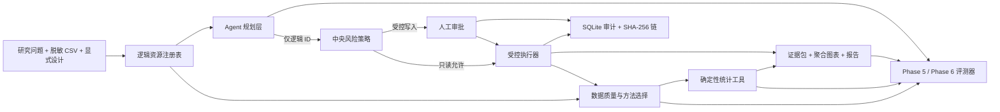

# ResearchOps Agent

> Evidence-first scientific data analysis agent：模型负责规划，受控工具负责计算。

ResearchOps Agent 是一个面向科研数据分析岗位的工程化作品集。它接收脱敏 CSV、研究问题和显式研究设计，完成数据质量检查、统计方法选择、ANCOVA/Welch 分析、聚合可视化、证据化报告、危险操作审批、重试与全链路审计。

项目的重点不是“让模型自由写代码”，而是把模型限制在可审计的工具边界内：模型只能使用逻辑资源 ID；统计量由确定性工具计算；每条结论必须绑定证据；写操作必须经过范围绑定的人工审批。

## Evidence at a glance

当前验证快照：2026-08-19。

| 层 | 状态 | 可复核结果 |
| --- | --- | --- |
| 模拟科研分析 | 已验证 | 240 行模拟 RCT；ANCOVA 与 Welch 均生成数值、样本流、诊断、证据 ID 和聚合图表 |
| 人工审批与恢复 | 已验证 | 受控写入先暂停；批准后重校验 scope 再执行；拒绝、过期和参数变化均 fail-closed |
| 离线组件与控制面评测 | 已验证 | 50/50；非预期工具错误 0%；安全违规 0%；证据引用 21/21 |
| 审计 | 已验证 | 50 条评测审计链全部有效；Phase 4 演示含错误、重试、审批和发布记录 |
| 自动化测试 | 已验证 | 127/127 通过 |
| Phase 6 Agent 行为语料 | 已验证契约 | 20 题：development 16、repo-local holdout 4；工具名、顺序、参数、证据与审批均有 grader |
| Provider 适配 | 已验证（离线） | OpenAI 与 DeepSeek 使用独立 Key/client；DeepSeek V4 模型 allowlist、固定 endpoint、零隐藏重试 |
| 真实在线 Agent 质量 | 待运行 | OpenAI API 计费不可用；DeepSeek adapter 已就绪但尚未运行付费 smoke，不发布在线质量指标 |

离线 50/50 的准确名称是 `offline_deterministic / components_and_control_plane`。它不能冒充真实 LLM 的规划准确率。

## 一键离线演示

Windows PowerShell：

```powershell
cd "C:\path\to\researchops-agent"
python -m venv .venv
.\.venv\Scripts\python.exe -m pip install -r requirements.lock
powershell -ExecutionPolicy Bypass -File .\scripts\portfolio_demo.ps1
```

脚本会：

1. 校验 Python 与固定 50 题语料。
2. 校验 Phase 6 的 20 题行为语料，但不联网。
3. 在唯一的新目录中重新运行 50 题离线评测。
4. 独立复核产物哈希、50 条审计链和敏感 canary。
5. 输出成功率、错误率、安全率、证据准确率、P50/P95 和关键产物路径。

它不会读取或打印 API Key，不会调用 `phase6-run-online`，也不会覆盖已有目录。

当前源码对应的脱敏快照：

- [离线评测摘要](artifacts/portfolio_baseline_provider/eval_summary.md)
- [完整指标 JSON](artifacts/portfolio_baseline_provider/eval_report.json)
- [可复现 manifest](artifacts/portfolio_baseline_provider/eval_manifest.json)
- [50 条审计链索引](artifacts/portfolio_baseline_provider/eval_audit_index.json)

## 最值得展示的分析结果

研究问题：

> 在模拟随机对照试验中，治疗组与对照组的随访收缩压是否存在差异？在考虑基线收缩压后，结论是否仍然成立？


| 方法 | treatment - control | 95% CI | p 值 | 分析样本 |
| --- | ---: | ---: | ---: | ---: |
| ANCOVA，基线校正、HC3 | -5.6069 mmHg | [-7.9351, -3.2787] | 3.82e-6 | 212 |
| Welch，未校正敏感性分析 | -6.7887 mmHg | [-10.8425, -2.7349] | 0.001134 | 212 |

负值只表示治疗组更低；除非方案预定义 `beneficial_direction=lower`，报告不会自动写成“获益”。源数据共 240 行，随访结局缺失 28 例。请求的是 ITT，但实现的是 available-case，因此证据包明确警告：当前结果不得声称完整实现 ITT。

- [完整 analysis bundle](artifacts/phase3/analysis_bundle.json)
- Evidence ID：`E-7C87BB6C88EB`（ANCOVA）、`E-B93CD9DC7751`（Welch）

## 架构



详细设计见 [架构与安全边界](docs/ARCHITECTURE.md)。

## 核心工程决策

### 1. 研究设计必须显式输入

系统不会从列名猜测随机化、配对、重复测量或因果关系。`reference_level` 与 `contrast_level` 必须明确，所有组间效应固定写成 `treatment - control`，避免分类顺序改变符号。

### 2. 推荐与执行绑定数据哈希

方法推荐保存 `dataset_sha256`；分析入口重新计算 CSV SHA-256。推荐后文件被替换时，执行会安全停止。

### 3. 结论必须回指证据

证据对象包含：

- `evidence_id`
- 方法、工具和版本
- estimate、SE、CI、p 值与方向
- source/included/excluded rows 与分组样本流
- diagnostics、warnings 和 dataset SHA-256

报告 claim 使用 `evidence_id + metric_path + displayed_value + direction`。把正确证据 ID 贴在错误数字旁边仍会判失败。

### 4. 危险操作双层拦截

中央策略把工具分为只读、受控写入、敏感导出、外部操作、破坏性操作和任意执行。未知工具、任意执行和原始行导出默认拒绝；发布聚合结果必须人工批准。

审批绑定调用 ID、规范参数、源 SHA、目标逻辑 ID、工具版本与策略版本。参数变化、源文件变化或审批过期后，旧批准不可复用。

### 5. 只重试明确的瞬时错误

验证、策略、审批、路径与统计错误不重试。副作用提交状态不明时不盲重放：可 reconcile 才核对目标 manifest，否则进入 `outcome_unknown`。

### 6. 审计先于副作用

意图和 attempt 预写失败时，handler 不执行。每次调用、错误、重试、审批和状态迁移都进入 SQLite；每个运行都有独立的追加式 SHA-256 事件链。

## 人工批准演示

启动离线控制面演示：

```powershell
$env:PYTHONPATH = "src"
.\.venv\Scripts\python.exe -m researchops.cli phase4-start --release-name interview-demo
```

输出会包含一个 `pending_tool_call.call_id`。批准只登记决定，恢复时才重新计算 scope 并执行：

```powershell
$callId = "CALL-从输出复制"

.\.venv\Scripts\python.exe -m researchops.cli phase4-decide `
  $callId --decision approve --approver "reviewer-id" `
  --reason "Aggregate-only release reviewed"

.\.venv\Scripts\python.exe -m researchops.cli phase4-resume $callId
```

拒绝分支：

```powershell
.\.venv\Scripts\python.exe -m researchops.cli phase4-decide `
  $callId --decision reject --approver "reviewer-id" `
  --reason "Release not authorized"
```

已有证据：

- [脱敏审计导出](artifacts/phase4/audit_export.json)
- [发布 manifest](artifacts/phase4/releases/demo-release/release_manifest.json)

## 评测闭环

### Phase 5：50 题确定性评测

| 分类 | 数量 | 覆盖重点 |
| --- | ---: | --- |
| 数据质量 | 10 | 结构、缺失、标识符脱敏、恶意 CSV |
| 方法选择 | 10 | 常见方法、边界设计、需要安全停止的设计 |
| 分析证据 | 12 | 数值锚点、样本流、HC3、图表溯源 |
| 工具韧性 | 8 | 重试、幂等、永久错误、不确定结果、审计 |
| 审批安全 | 6 | 暂停、批准、拒绝、过期、参数绑定、禁止导出 |
| 报告证据 | 4 | claim 绑定、局限性、图表引用、表述护栏 |

最新快照：50/50；非预期工具错误 0/45；主动注入的毛工具错误 11/45；安全违规 0/50；证据引用 21/21；P50/P95 为 91.18/391.07 ms。

黄金答案只在执行结束后加载，系统输入只能来自 `EvalTask.public_input()`。完整指标见 [证据索引](docs/EVIDENCE.md)。

### Phase 6：Agent 行为评测

20 个自然语言任务单独评分：

- 工具名、调用顺序和精确参数
- 澄清与拒绝
- 证据 ID 与结构化数值 claim
- 审批首次暂停和外部副作用 sentinel
- usage/cost 完整性与失败分母

当前编排层锁定 `openai-agents==0.21.0`，并通过每次运行独立的 provider client 支持 OpenAI Responses 与 DeepSeek OpenAI-compatible Responses。DeepSeek 仅允许 `deepseek-v4-flash` / `deepseek-v4-pro`，只读取 `DEEPSEEK_API_KEY`，不修改 SDK 全局 Key/client，也不启用 OpenAI tracing。真实 DeepSeek smoke 尚未运行，因此在线成功率、工具准确率、延迟和成本仍保持 `unavailable`。

DeepSeek 会忽略 `parallel_tool_calls=False`，所以串行与审批安全由本地执行边界实现：四个工具共享每次运行的锁和调用预算，每个运行最多一个待审批发布提案，发布工具仍只能暂停而不能执行。

### DeepSeek 单题 smoke（需要单独额度）

先在当前 PowerShell 会话安全注入 Key：

```powershell
$secureKey = Read-Host "粘贴 DEEPSEEK_API_KEY" -AsSecureString
$env:DEEPSEEK_API_KEY = ([System.Net.NetworkCredential]::new("", $secureKey).Password).Trim()

.\.venv\Scripts\python.exe -m researchops.cli phase6-status `
  --provider deepseek
```

确认状态为 `ready_requires_explicit_confirmation` 后，只运行一个 development 任务：

```powershell
.\.venv\Scripts\python.exe -m researchops.cli phase6-run-online `
  --provider deepseek `
  --model deepseek-v4-flash `
  --split development `
  --max-cases 1 `
  --output-dir artifacts\phase6_deepseek_smoke_01 `
  --confirm-online
```

首版不接受旧式输入/输出两档价格参数；DeepSeek 有缓存命中、缓存未命中、输出以及峰谷时段价格，未实现完整价格表前成本必须保持 `null / unavailable`。运行结束后清理：

```powershell
Remove-Item Env:DEEPSEEK_API_KEY -ErrorAction SilentlyContinue
Remove-Variable secureKey -ErrorAction SilentlyContinue
```

## 手动运行核心流程

```powershell
$env:PYTHONPATH = "src"

# 数据结构和缺失
.\.venv\Scripts\python.exe -m researchops.cli inspect `
  data\synthetic_trial.csv --output artifacts\profile.json

# 方法选择
.\.venv\Scripts\python.exe -m researchops.cli recommend-method `
  data\synthetic_trial.csv data\synthetic_trial_design.json `
  --output artifacts\method_recommendation.json

# 统计分析；输出目录必须尚不存在
.\.venv\Scripts\python.exe -m researchops.cli analyze `
  data\synthetic_trial.csv data\synthetic_trial_design.json `
  --output-dir artifacts\phase3_manual

# 评测契约与测试
.\.venv\Scripts\python.exe -m researchops.cli eval-validate
.\.venv\Scripts\python.exe -m researchops.cli phase6-validate
.\.venv\Scripts\python.exe -m unittest discover -s tests -v
```

## 项目结构

```text
researchops-agent/
├── data/                         # 脱敏模拟 CSV 与研究设计
├── evals/                        # 50 题组件语料 + 20 题 Agent 行为语料
├── src/researchops/              # 分析、控制面、provider、Agent、评分器与 runner
├── tests/                        # 127 项单元/集成/故障注入测试
├── scripts/
│   ├── portfolio_demo.ps1        # 一键完全离线作品集演示
│   └── verify_phase5_artifacts.py
├── artifacts/                    # 运行时产物；只提交脱敏 allowlist 快照
├── docs/
│   ├── ARCHITECTURE.md
│   ├── EVIDENCE.md
│   └── PORTFOLIO.md
└── .github/workflows/ci.yml       # Windows 离线质量门禁
```

## CI

GitHub Actions 在 `windows-latest + Python 3.12` 上：

- 安装锁定依赖
- 验证 50 题与 20 题语料契约
- 运行 127 项测试
- 从固定模拟数据重建 50 题离线评测
- 验证哈希、审计链和敏感 canary
- 上传脱敏的评测摘要、报告、manifest 和审计索引

CI 不读取 API Key，也不运行付费在线评测。

## 已知限制

- 全部数据为模拟数据，不代表临床或生产验证。
- 当前主分析是 available-case，不是完整 ITT；缺失机制与差异性失访需要进一步研究。
- Phase 5 只评测确定性组件和控制面，模型调用为 0。
- Phase 6 的 4 题 holdout 位于仓库内，不具备抗污染能力。
- OpenAI 在线质量仍因外部计费条件未验证；DeepSeek adapter 只完成离线验证，付费 smoke 尚未运行。
- 审计链尚无外部签名 checkpoint；完全控制数据库的人仍可重算整条链。
- 当前同步只读工具使用软超时；未来慢写工具需要合作式 deadline 或进程隔离。
- CI 当前只覆盖 Windows；尚未做真实科研数据、外部秘密 holdout 和生产负载测试。

## 作品集与面试材料

- [30 秒介绍、5 分钟演示和面试问答](docs/PORTFOLIO.md)
- [架构与安全边界](docs/ARCHITECTURE.md)
- [声明到证据的映射](docs/EVIDENCE.md)
- [Phase 5 语料说明](evals/README.md)
- [Phase 6 评测边界](evals/PHASE6.md)

## 官方设计依据

- [OpenAI Evaluation best practices](https://developers.openai.com/api/docs/guides/evaluation-best-practices)
- [OpenAI Agent evals](https://developers.openai.com/api/docs/guides/agent-evals)
- [OpenAI Guardrails and approvals](https://developers.openai.com/api/docs/guides/agents/guardrails-approvals)
- [OpenAI Agents SDK model providers](https://openai.github.io/openai-agents-python/models/)
- [DeepSeek Responses API compatibility](https://api-docs.deepseek.com/guides/responses_api/)
- [DeepSeek models and pricing](https://api-docs.deepseek.com/quick_start/pricing/)

## License

[MIT](LICENSE) © 2026 cedRiC874
