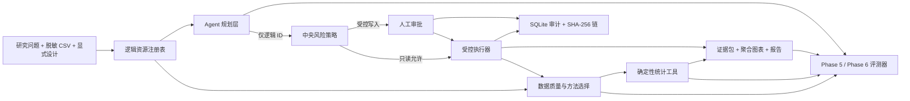

# ResearchOps Agent

**中文** · [English](README.en.md)

[](https://github.com/cedRiC874/researchops-agent/actions/workflows/ci.yml)


_CI 信号：Ubuntu x86-64 安装锁定依赖并运行完整 Linux x86-64 离线演示；Windows 离线质量门运行完整单元/集成套件，并重建与验证固定 50 题 evidence。_

**让 LLM 做科研数据分析，但不让它编数字：** ResearchOps Agent 让模型负责规划，让确定性工具负责数据质量、方法选择、统计计算与可视化，并把每条结论绑定到可复核 evidence 与人工审批边界。


_30 秒演示结果：输入脱敏 CSV、研究问题和显式研究设计，输出带样本流、效应量、置信区间、证据 ID 与限制说明的聚合分析。_

模型看不到真实文件路径，也不能自由执行 Python、SQL 或 shell；它只能调用允许的逻辑工具，统计数值由本地确定性实现产生并进入审计链。

> 这是一个 research prototype / portfolio project，不是临床决策工具，也不是已经通过生产验证的产品。

## 一个具体结果：基线校正后的治疗效应

示例问题：在 240 行完全模拟的随机对照试验中，治疗组与对照组的随访收缩压是否不同？考虑基线收缩压后，结论是否仍成立？

| 方法 | treatment − control | 95% CI | p 值 | 分析样本 | Evidence ID |
| --- | ---: | ---: | ---: | ---: | --- |
| ANCOVA，基线校正、HC3 | -5.6069 mmHg | [-7.9351, -3.2787] | 3.82e-6 | 212 | `E-7C87BB6C88EB` |
| Welch，未校正敏感性分析 | -6.7887 mmHg | [-10.8425, -2.7349] | 0.001134 | 212 | `E-B93CD9DC7751` |

负值表示治疗组随访收缩压更低；只有研究方案预定义 `beneficial_direction=lower` 时，报告才允许使用“获益”措辞。

> **专业边界：**研究请求的是 ITT 人群，但 28 个随访结局缺失后，当前实现实际分析 212 个 available cases。因此系统会明确记录 `requested_population=intention_to_treat`、`realized_population=available_case`，并拒绝把该结果描述成完整 ITT 分析。

可复核产物：[analysis bundle](artifacts/phase3/analysis_bundle.json) · [聚合图表](artifacts/phase3/effect_estimates.png)

## Quickstart

严格 frozen-evidence 演示当前支持 Python 3.11+ 的 Windows x86-64 和 Linux x86-64（NumPy/OpenBLAS）。macOS 与 ARM 尚未建立可比较的数值基线，因此不在这一严格演示的支持范围内。

为避免把跨操作系统的浮点位差异误当成同一证据，canonical ANCOVA identity 分别固定为 Windows x86-64 `E-36034128278C` 与 Linux x86-64 `E-14EBFFCA843E`。

### Windows x86-64 / PowerShell

```powershell
python -m venv .venv
.\.venv\Scripts\python.exe -m pip install -r requirements.lock
powershell -ExecutionPolicy Bypass -File .\scripts\portfolio_demo.ps1
```

### Linux x86-64

```bash
python3 -m venv .venv
./.venv/bin/python -m pip install -r requirements.linux.lock
bash ./scripts/portfolio_demo.sh
```

Linux 锁文件与 Windows 锁文件保持同一组版本，仅排除 Windows 专用的 `pywin32`；Linux demo 使用独立冻结的 `evals/tasks.linux-x86_64.jsonl`，只重绑定跨操作系统变化的 evidence/chart IDs，不放宽数值或质量阈值。CI 会安装该锁文件并执行完整 demo。

演示会重建固定 50 题确定性评测、验证 50 条事件哈希链、检查敏感信息 canary，并把结果写入一个新的 artifact 目录。它不会运行在线 Provider，也不会覆盖已有产物。

## 架构



关键边界：

- 研究设计必须显式输入；系统不从列名猜随机化、因果、配对或协变量时序。
- 方法建议与执行绑定数据 SHA-256；输入变化时安全停止。
- 报告 claim 必须匹配本次工具生成的 `evidence_id + metric_path + displayed_value + direction`。
- 未知工具、未知风险、越权资源和未批准写入默认拒绝。

详细设计见 [ARCHITECTURE.md](docs/ARCHITECTURE.md)。

当前在线/离线验证、失败分母、Provider 历史、candidate commitments 与严格声明边界见 **[STATUS.md](STATUS.md)**。

## License

[MIT](LICENSE)
