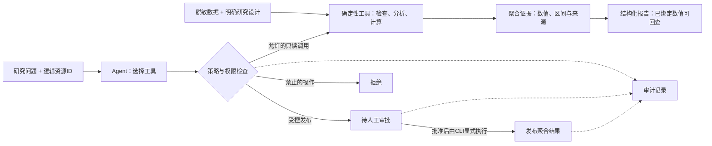

# ResearchOps Agent

**中文** · [English](README.en.md) · [文档入口](docs/README.md) · [项目状态](STATUS.md)

科研数据分析场景的受控 Agent 原型：**模型编排工具，代码计算统计量并检查权限，结果保留证据与失败记录。**

这个项目首先回答：**什么时候不该用 Agent？** 在16道定义清楚的内部合成任务上，固定流程全部通过且不调用模型，Agent通过13道。任务明确时，简单流程往往更值得优先尝试。


**离线、脚本驱动、未调用模型** · 40秒实际离线记录回放：只读调用 → 发布挂起 → CLI批准 → 执行 → 改参数被拒 → 过期被拒。批准由脚本调用CLI，两种拒绝是独立案例；没有剪接真实模型运行。[分镜与证据](docs/DEMO.md)

## 结论：任务定义清楚时，先用固定流程

2026-10-04，同一组16道开发方已知合成题、同一套固定工具与证据：

| 路径 | 通过 | 失败 | 无法判定 | 模型请求 |
| --- | ---: | ---: | ---: | ---: |
| 固定流程 | 16 | 0 | 0 | 0 |
| Agent | 13 | 1 | 2 | 30 |

固定流程把规则、单位换算和输出模板直接写进代码；Agent还需要生成正确参数和文字。一次明确错误是把 **0.00625 g写成0.00625 mg**，正确值应为6.25 mg。另两题仍按原规则保留“无法判定”，不补算通过。

这组结果支持对这些明确任务优先采用固定流程，不足以排名模型能力。Agent的价值需要在开放式输入、目标变化和动态工具选择中另行证明，并抵偿成本、延迟与风险；本项目尚未证明这类优势。

[结果、逐题问题与固定版本](docs/evidence/main51-controlled-observation-v1/README.md)

## 架构：把计算、权限与模型分开


```mermaid
flowchart LR
    U["研究问题 + 逻辑资源ID"] --> A["Agent：选择工具"]
    A --> P{"策略与权限检查"}
    D["脱敏数据 + 明确研究设计"] --> T["确定性工具：检查、分析、计算"]
    P -->|"允许的只读调用"| T
    P -->|"受控发布"| H["待人工审批"]
    P -->|"禁止的操作"| X["拒绝"]
    H -->|"批准后由CLI显式执行"| W["发布聚合结果"]
    T --> E["聚合证据：数值、区间与来源"]
    E --> R["结构化报告：已绑定数值可回查"]
    P -.-> L["审计记录"]
    H -.-> L
    W -.-> L
```

上图是组件关系，不是16题都走过的流程：这次对照只用了两个只读工具。审批后执行由离线控制面演示验证，**当前真实 Agent 在审批暂停后不能恢复**。统计工具的结果可复核，但模型最终文字仍可能出错。

## 工程上做了什么

- **受控工具编排**：模型只能使用逻辑资源ID和白名单工具，不能任意运行Python、SQL或shell。
- **审批不是一句“同意”**：批准绑定具体参数和资源，有有效期；执行前重新核对。批准本身不执行写入，参数变化或过期会被拒绝。
- **让结果能追证**：结构化报告将已绑定的效应值关联到来源与指标路径；不把引用ID当作整段回答正确的保证。
- **记录调用为什么结束**：保存完成状态、截断信号、用量和耗时；缺失就记为未知，不补零，也不保存完整请求／响应正文。
- **保留失败**：通过、失败和无法判定分开计数；新结果不覆盖历史成绩，测试通过不等于模型效果达标。

## 改变设计判断的四条教训

1. **能力与格式遵循分开测。** 早期对照的严格调用序列与有限文本解析影响了评分，也有真实不合格工具请求；不能把所有失败都归咎于格式。
2. **检查结果与必要约束，不指定唯一轨迹。** 多查一次只读数据可能合理，但权限、证据来源、预算和副作用边界必须始终成立。这是后续设计原则，不回改旧成绩。
3. **算术交给确定性代码。** 单位换算错误说明：有证据、有引用，不代表模型写出的数字就正确。
4. **CI绿色不等于质量达标。** 曾经自动检查显示成功，实际质量结果只有44/50、证据引用10/21；之后才接入质量阈值和真实退出码传递。[事故记录](docs/evidence/main-offline-gate-20260822/README.md)

## 安全覆盖与缺口

对照[OWASP LLM Top 10 2025](https://genai.owasp.org/llm-top-10/)，不是安全认证或完备防御声明。

| 风险 | 覆盖状态与测试／证据 | 尚不能证明什么 |
| --- | --- | --- |
| 提示注入 | **部分覆盖**：[公开攻击场景](evals/v2/public_tasks.jsonl)、[4项工具描述投毒测试](tests/test_phase6_tool_description_poisoning.py) | 脚本模拟调用，不证明真实模型能抵抗投毒 |
| 敏感信息泄露 | **已测试**：[白名单、写前扫描与持久化拒绝](tests/test_completion_telemetry_ledger.py) | 不等于完备的数据防泄漏 |
| 过度代理 | **已测试**：[范围绑定审批、过期及执行](tests/test_tool_runtime.py) | 不等于生产级多租户授权 |
| 错误信息 | **已测试**：[报告追证](tests/test_reporting.py)、[实际错误](docs/evidence/main51-controlled-observation-v1/README.md) | 引用ID不能保证模型回答正确 |
| 无限制消耗 | **已测试**：[预算与未知用量的处理](tests/test_item6_experiment_budget.py) | 费用停止线在响应后生效，不是账单硬封顶 |

“已测试”只指所链接的限定场景。[完整风险对照与缺口](docs/SECURITY_OWASP.md)

## 快速开始：离线，不调用模型

需要Git和 **Python 3.12**。安装依赖需要联网；演示不调用模型，无需API Key。

先克隆仓库并进入目录：

```bash
git clone https://github.com/cedRiC874/researchops-agent.git
cd researchops-agent
```

**Linux x86-64：**

```bash
python3.12 -m venv .venv
./.venv/bin/python -m pip install -r requirements.linux.lock
bash ./scripts/portfolio_demo.sh
```

**Windows x86-64（PowerShell）：**

```powershell
py -3.12 -m venv .venv
.\.venv\Scripts\python.exe -m pip install -r requirements.lock
.\.venv\Scripts\python.exe .\scripts\portfolio_demo.py
```

Windows也有包装入口 `scripts\portfolio_demo.ps1`，调用同一实现。以上运行的是**50题离线控制面演示**，不是16题线上对照或根目录全量测试。输出进入新的 `artifacts/portfolio_demo_*` 目录，包含评测摘要、报告与审计索引；已有输出拒绝覆盖。

严格数值复现暂不支持原生 **macOS 与 ARM**。

## 继续阅读

- [一页项目说明](docs/PORTFOLIO.md) · [文档导航](docs/README.md) · [当前状态](STATUS.md)
- [示例分析结果图](artifacts/phase3/effect_estimates.png)：历史合成数据分析，使用212个有可用观测的样本，不是完整意向治疗分析。
- [文章中文版](https://zhuanlan.zhihu.com/p/2078131794466099751) · [Hacker News讨论](https://news.ycombinator.com/item?id=49518667)

这是研究原型与作品集，不是临床决策工具，也没有生产SLA。早期60题严格协议的成绩仍为20/60，不被后来的结果改写。

License: [MIT](LICENSE)
