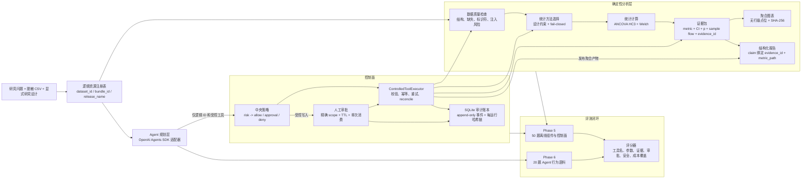
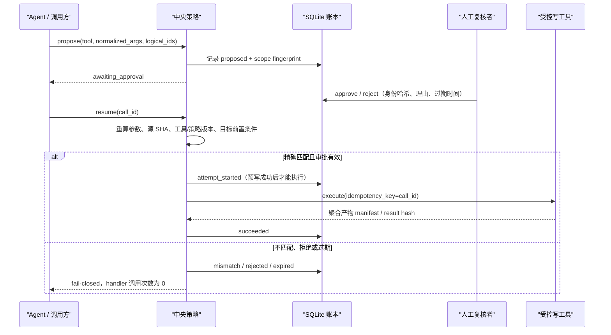

# ResearchOps Agent 架构与安全边界

## 设计目标

ResearchOps Agent 把科研分析拆成两个职责明确的层：

- Agent 负责理解研究问题、选择下一步和组织最终回答。
- 受控工具负责读取数据、计算统计量、生成图表、执行写操作和记录审计。

模型不直接获得任意文件路径、原始数据行、SQL 或代码执行能力。它只能使用注册表中的逻辑资源 ID，并接收经过白名单投影的聚合结果。

## 系统全景

## 一次分析如何流动

1. `inspect` 校验 CSV 扩展名、大小、编码、表头与数据结构，并生成不泄露标识符的 profile。
2. `recommend-method` 同时读取 profile 和显式研究设计；缺少对照方向、分析变量误用标识符或使用处理后协变量时安全停止。
3. `analyze` 重新计算数据集 SHA-256，确保方法推荐后文件没有被替换。
4. 统计工具锁定 `treatment - control` 方向，记录每个方法自己的样本流、诊断、警告和稳定证据 ID。
5. 报告器只消费聚合 evidence bundle；显示值必须能回指 `evidence_id + metric_path`。
6. 图表只展示聚合效应和置信区间，不嵌入原始行或参与者 ID。

## 人工审批与恢复

审批 scope 绑定：

- `call_id`
- 工具名与工具版本
- 策略版本
- 规范化参数
- 源资源 SHA-256
- 目标逻辑 ID

任一字段变化都需要新调用和新审批。Phase 4 命令演示完整的本地批准、拒绝、恢复和审计；Phase 6 SDK 适配器只验证首次审批暂停，不声称已经实现跨进程在线恢复。

## 重试与不确定结果

- 只有显式 `TransientToolError` 可以自动重试。
- 验证、策略、审批、路径和统计域错误不重试。
- 非幂等副作用出现提交状态不明时，不盲目重试；有 reconciler 才核对目标 manifest，否则进入 `outcome_unknown`。
- 每次 attempt、错误码、退避和最终状态都进入审计账本。

## 统计推断边界

主分析是基线校正 ANCOVA：

- 显式 `treatment - control` 对比方向。
- 基线协变量按分析集均值中心化。
- OLS 点估计、HC3 稳健协方差、残差自由度的 t 推断。
- 同一分析集检查组别 × 基线交互，但不把“不显著”解释为“假设已证明”。

敏感性分析是 Welch 独立样本 t 检验，使用样本标准差和 Welch–Satterthwaite 自由度。两种方法都单独记录完整病例规则和分组排除数。

当前模拟试验请求的是 ITT，但结局存在缺失；实现的是 available-case。因此报告会明确写出 `requested_population=intention_to_treat` 与 `realized_population=available_case`，不会把完整病例结果冒充完整 ITT。

## 审计保证与限制

`audit_events` 是权威追加事件流；可查询表只是投影。每个运行的事件使用连续 sequence、前序哈希和规范 JSON 计算 SHA-256 链。

它能够发现普通误改和单库内篡改，但不是抵抗数据库管理员重写整条链的数字签名。生产化需要把最终 chain head 发送到外部 HMAC、签名服务或不可变存储。

## 评测模式

| 模式 | 被测对象 | 当前证据 | 不能声称什么 |
| --- | --- | --- | --- |
| `offline_deterministic` | 数据质量、方法选择、统计工具、报告、重试、审批和审计控制面 | 固定 50 题，50/50 通过 | 真实 LLM 的规划成功率 |
| Phase 6 scripted/replay | Agent 工具轨迹采集、评分器和审批暂停协议 | 20 题语料校验与无网络 SDK 回归测试 | 真实 provider 的质量、延迟或成本 |
| `online_openai_agents_sdk` | 真实模型的工具选择、参数、证据回答 | 当前因 API Platform 外部计费条件阻塞 | 在线成功率、真实 token 成本或线上延迟 |

这种拆分遵循 OpenAI 官方关于任务特定评测、典型/边缘/对抗样本、持续评测，以及分别检查最终回答、工具调用和证据的建议：

- [Evaluation best practices](https://developers.openai.com/api/docs/guides/evaluation-best-practices)
- [Evaluate agent workflows](https://developers.openai.com/api/docs/guides/agent-evals)
- [Guardrails and approvals](https://developers.openai.com/api/docs/guides/agents/guardrails-approvals)
