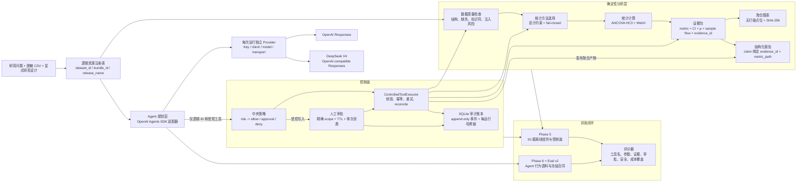
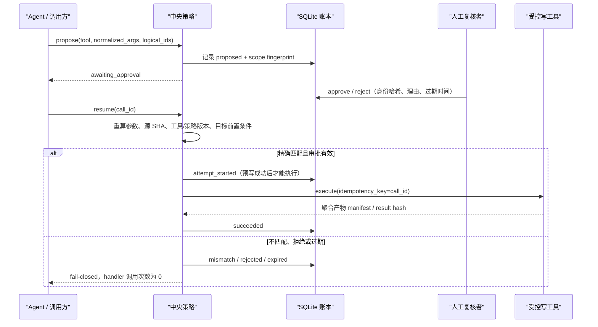

# ResearchOps Agent 架构与安全边界

## 设计目标

ResearchOps Agent 把科研分析拆成两个职责明确的层：

- Agent 负责理解研究问题、选择下一步和组织最终回答。
- 受控工具负责读取数据、计算统计量、生成图表、执行写操作和记录审计。

模型不直接获得任意文件路径、原始数据行、SQL 或代码执行能力。它只能使用注册表中的逻辑资源 ID，并接收经过白名单投影的聚合结果。

## 系统全景



## 一次分析如何流动

1. `inspect` 校验 CSV 扩展名、大小、编码、表头与数据结构，并生成不泄露标识符的 profile。
2. `recommend-method` 同时读取 profile 和显式研究设计；缺少对照方向、分析变量误用标识符或使用处理后协变量时安全停止。
3. `analyze` 重新计算数据集 SHA-256，确保方法推荐后文件没有被替换。
4. 统计工具锁定 `treatment - control` 方向，记录每个方法自己的样本流、诊断、警告和稳定证据 ID。
5. 报告器只消费聚合 evidence bundle；显示值必须能回指 `evidence_id + metric_path`。
6. 图表只展示聚合效应和置信区间，不嵌入原始行或参与者 ID。

## 人工审批与恢复



审批 scope 绑定：

- `call_id`
- 工具名与工具版本
- 策略版本
- 规范化参数
- 源资源 SHA-256
- 目标逻辑 ID

任一字段变化都需要新调用和新审批。Phase 4 命令演示完整的本地批准、拒绝、恢复和审计；Phase 6 SDK 适配器只验证首次审批暂停，不声称已经实现跨进程在线恢复。

## 重试与不确定结果

- 只有显式 `TransientToolError` 可以自动重试。
- 验证、策略、审批、路径和统计域错误不重试。
- 非幂等副作用出现提交状态不明时，不盲目重试；有 reconciler 才核对目标 manifest，否则进入 `outcome_unknown`。
- 每次 attempt、错误码、退避和最终状态都进入审计账本。

## 统计推断边界

主分析是基线校正 ANCOVA：

- 显式 `treatment - control` 对比方向。
- 基线协变量按分析集均值中心化。
- OLS 点估计、HC3 稳健协方差、残差自由度的 t 推断。
- 同一分析集检查组别 × 基线交互，但不把“不显著”解释为“假设已证明”。

敏感性分析是 Welch 独立样本 t 检验，使用样本标准差和 Welch–Satterthwaite 自由度。两种方法都单独记录完整病例规则和分组排除数。

当前模拟试验请求的是 ITT，但结局存在缺失；实现的是 available-case。因此报告会明确写出 `requested_population=intention_to_treat` 与 `realized_population=available_case`，不会把完整病例结果冒充完整 ITT。

## 审计保证与限制

`audit_events` 是权威追加事件流；可查询表只是投影。每个运行的事件使用连续 sequence、前序哈希和规范 JSON 计算 SHA-256 链。

它能够发现普通误改和单库内篡改，但不是抵抗数据库管理员重写整条链的数字签名。生产化需要把最终 chain head 发送到外部 HMAC、签名服务或不可变存储。

## 评测模式

| 模式 | 被测对象 | 当前证据 | 不能声称什么 |
| --- | --- | --- | --- |
| `offline_deterministic` | 数据质量、方法选择、统计工具、报告、重试、审批和审计控制面 | `main@3dfb0a36` run 32932614962 为 50/50、21/21、profile valid；旧 44/50 事故保留审计 | 真实 LLM 的规划成功率，或脱离 source/data/manifest 复用成绩 |
| Phase 6 scripted/replay | Agent 工具轨迹采集、评分器和审批暂停协议 | 20 题语料校验与无网络 SDK 回归测试 | 真实 provider 的质量、延迟或成本 |
| `online_agents_sdk` + `provider=openai` | OpenAI 模型的工具选择、参数、证据回答 | adapter 已验证；在线因 OpenAI API 计费条件阻塞 | 在线成功率、真实 token 成本或线上延迟 |
| `online_agents_sdk` + `provider=deepseek` | DeepSeek V4 的同一 20 题行为合同 | 冻结版 development 16/16、repo-local holdout 4/4；usage、延迟、manifest 与审计索引已保存 | 抗污染泛化、生产 SLA 或未知成本为零 |
| Eval v2 public candidate v1（历史） | schema、准备器、registry、inspect backend、Provider executor、runner/scorer、三次预承诺顺序、按 task-ID 聚合、工具请求/去重/backend telemetry、原子 artifacts 与 single-use receipt | 一次性 DeepSeek public run：Provider system 68/93；fault harness 27/27；完整 campaign仍 `design_only` | 模型单体规划准确率、private holdout、跨 Provider或未知生产泛化 |
| Completion Telemetry v2 candidate | 四类安全 failure source、legacy unknown coverage、versioned checkpoint/aggregation、pilot PostgreSQL migration 与 v1/v2 双摘要 retention | PR #11 historical clean-main 为 root 258 tests、pilot 离线 contracts 与真实 PostgreSQL contract；无 Provider 调用，且不继承 v1 成绩 | Provider 因果根因、模型质量提升、在线通过率或生产泛化 |
| Anthropic Models preflight / candidate v4 | 固定 official-origin GET、exact model identity、owned httpx、一次 attempt、零 retry/fallback/redirect、64 KiB decoded cap、strict receipt；generic Anthropic online 入口 fail closed，public/pilot Provider 仍为 DeepSeek | PR #19 已进入 `main@77911226`；MockTransport 无网络测试与三条 clean-main checks 通过，candidate `1741c2b0…f6399c7` 不继承 v3 | live Models/Messages API 可用性、工具兼容、成本、质量或正式第二 Provider |
| Kimi 中国区 Models preflight / candidate v5 | 固定 `api.moonshot.cn` GET、Bearer credential 隔离、exact `kimi-k3`、一次 attempt、零 retry/fallback/redirect、64 KiB cap、strict receipt；Chat/通用在线入口关闭，public/pilot Provider 仍为 DeepSeek | candidate `105b7def…5165dffc` 是 pre-call snapshot；post-lock 一次 GET 为 HTTP 200、1/1 call、exact model visible、0 model tokens、cost null，不继承进 candidate | Chat/Responses/tools、usage/cost semantics、质量、non-synthetic/private 或已注册第二 Provider |

Provider 是显式安全边界：OpenAI 与 DeepSeek 使用不同环境变量和独立 client，不允许任意 base URL，也不会修改 SDK 全局 Key。Anthropic adapter 继续通过 exact-pinned LiteLLM Chat Completions 提供隔离的 offline contract；独立 Models preflight 只用 fixed-origin direct httpx metadata GET。其 post-lock observation 是错误 CCTK token 在官方 origin 返回 403/0 model tokens，未验证官方 Anthropic。Kimi 同样使用独立 fixed-origin direct httpx Models-list preflight、`MOONSHOT_API_KEY` 与 `provider_id=moonshot_kimi`；candidate v5 锁定后的一次独立 metadata GET verified 认证与 exact `kimi-k3` visibility，但不授权或验证 Kimi Chat/通用在线入口。两者均未注册 campaign 或运行模型评测。DeepSeek 会忽略 `parallel_tool_calls=False`，因此工具串行、调用预算和每运行单发布提案上限均由本地控制面强制执行，而不是依赖模型服务。

## Production-like vertical slice

独立子项目 `services/production_slice/` 提供首个基础设施纵切，且不修改 Eval v2
candidate 锁定的 `src/researchops` 与根依赖：

```text
FastAPI -> PostgreSQL lease queue -> worker -> aggregate-only inspect backend
        -> S3/MinIO private object -> OpenTelemetry collector
```

API 只接受 logical `dataset_id`，要求 Bearer token 与 HMAC 后的幂等键。PostgreSQL
队列以 `FOR UPDATE SKIP LOCKED`、lease token、version CAS 和追加式 job event hash
chain 实现 at-least-once 领取。Worker 在对象写入前先保存 deterministic key、SHA-256
和 bytes 并进入 `publishing`；不确定写入进入 `outcome_unknown`，由 HEAD metadata
reconcile 为 `succeeded`、`retry_wait` 或继续 unknown，不盲目写第二次。

结果由 API 代理读取并重新校验 SHA-256，不暴露 object key、文件路径或 presigned URL。
OTel 只记录 allowlisted 状态属性，不是审计账本。当前 18 项进程内无网络测试与
真实 PostgreSQL/MinIO/collector Compose E2E 均已通过；API POST 与 worker consumer
span 的 Trace ID 一致。PR #2 已把该切片合并到 `main@badb7169`；Ubuntu
[`production-slice-e2e` run 32568017244](https://github.com/cedRiC874/researchops-agent/actions/runs/32568017244)
和后续手动 dispatch run 32568233292 均完成真实 Compose 链路、脱敏证据上传和安全
shutdown，长期快照见 [Linux CI evidence](evidence/production-slice-linux-ci-main-v1/README.md)。
这一纵切不包含 LLM、外部发布或批准后恢复；完整批准与恢复仍属于 Phase 4。

## External researcher pilot staging

`services/pilot_staging/` 是第二个独立服务边界。它调用已锁定的 Eval v2 candidate，
但不修改 `src/researchops`，也不复用只适合本机单用户的 self-pilot Web：

```text
operator admin token -> frozen campaign + one-time invites
participant invite -> HMAC digest -> HttpOnly session + CSRF -> exact consent
                  -> prepared task -> PostgreSQL queue -> online worker
                  -> locked candidate + aggregate-only registry backend
                  -> output DLP -> reveal timestamp -> non-expert feedback
                  -> aggregate summary + claim gate
```

身份记录使用随机 `PX-*` participant ID；邀请、session 和 CSRF 只在数据库中保存
peppered HMAC digest。API 容器不挂载 Provider secret，只有显式 `online` profile 的 worker
读取 server-side secret。Worker 启动时验证 candidate commitment，并写入 heartbeat；在线
模式下 API readiness 和首次 queue 都要求最近 heartbeat。任务一经 queue 不自动重跑，
campaign Agent task-execution budget 同时计算 queue reservation 与已经开始的 assignment；
它不是模型/API 请求数或费用上限。

每个 assignment 的题目来自 prepared public pack，参与者不能上传数据、改变 dataset
授权或选择 Provider endpoint。实际 answer outcome 决定是否显示 clarification feedback；
expected scenario、golden、machine score/failure 和 Provider model identity不进入逐题 participant
DTO。危险输出在 reveal 前检查 credential、email、绝对路径、subject ID 和疑似行级表格；
命中时正文不展示，campaign 自动暂停。用户报告 safety concern 也会暂停，管理员只能通过
不含 participant ID 的 incident list 复核并显式 resolve。

PostgreSQL 状态机使用 `FOR UPDATE SKIP LOCKED` 和 lease；withdraw 与完成写入在 participant/
attempt 行锁下串行，撤回会使排队任务终止，运行中结果在持久化前再次检查并丢弃。失败题
只能标成技术排除后进入下一题，不能挑选性重跑。事件流按 campaign 做 append-only SHA-256
链；summary 在 REPEATABLE READ 一致快照内复核事件链与 task-pack hash，并排除撤回参与者。

这是 pilot-ready application boundary，不是 production deployment。真实外部使用仍要求
HTTPS edge、托管 PostgreSQL TLS/PITR、Secret Manager、固定 image digest、脱敏 telemetry、
daily retention scheduler、备份恢复与伦理/IRB 判断。即使 claim gate 通过，也只允许描述
prepared public data 上的外部科研用户可用性；专业正确性、private holdout、未知分布、
生产 SLA 和批准后恢复均不在其证明范围内。

没有云主机时，`supervised` 是独立的 1–2 人操作预试环境，不是 `local` 或 `staging` 的
别名。它强制 HTTPS Funnel、Secure Cookie、非 wildcard Host、online worker、retention
确认、clean Git SHA 和实际 Docker image ID。`execution_environment` 在创建 campaign 时
持久化到 PostgreSQL，summary 必须包含
`supervised_environment_not_claim_eligible`；换进程、换配置读取旧 campaign 也不能解除。
参与者可以在调用前或看到答案后跳题，skip 进入非达标 exclusion 且不能重跑。

`start-supervised.ps1` 原子准备非敏感环境配置并默认以前台 Tailscale Funnel 运行；
`status-supervised.ps1` 只报告脱敏 readiness/identity；`new-invite.ps1` 可原子创建冻结
campaign 并显示一次性两小时链接；`stop-supervised.ps1` 先停 worker、清除 heartbeat、
关闭 API/Funnel，再无 `-v` teardown。独立 `pilot-staging-ci` 不创建 Provider Key，使用
fake executor、真实 PostgreSQL 和 offline Compose 验证这些边界。

这种拆分遵循 OpenAI 官方关于任务特定评测、典型/边缘/对抗样本、持续评测，以及分别检查最终回答、工具调用和证据的建议：

- [Evaluation best practices](https://developers.openai.com/api/docs/guides/evaluation-best-practices)
- [Evaluate agent workflows](https://developers.openai.com/api/docs/guides/agent-evals)
- [Guardrails and approvals](https://developers.openai.com/api/docs/guides/agents/guardrails-approvals)
- [Agents SDK model providers](https://openai.github.io/openai-agents-python/models/)
- [DeepSeek Responses API compatibility](https://api-docs.deepseek.com/guides/responses_api/)
