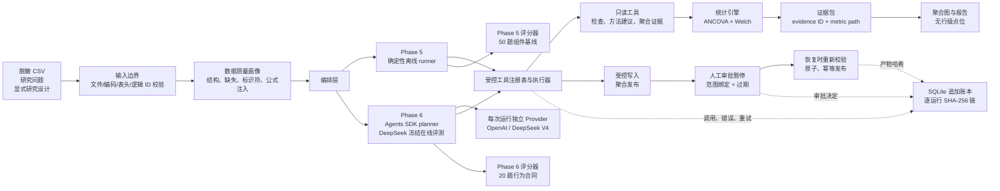
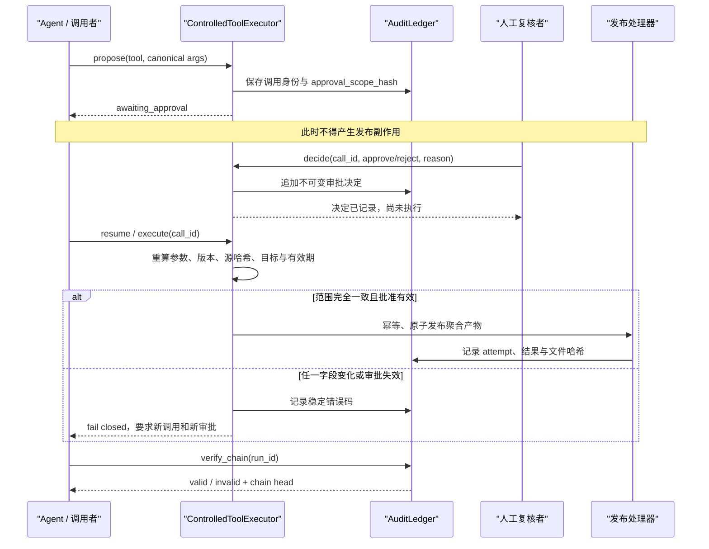

# ResearchOps Agent：作品集展示与面试演示手册

> 状态快照：2026-08-19。本页只陈述仓库内可以核对的实现与测试事实。Phase 5 是确定性离线组件评测；Phase 6 已完成真实 `deepseek-v4-flash` 冻结版 development 与 repo-local holdout。OpenAI 独立最小请求在 Key 认证成功后返回 HTTP 429，仍受其 API 计费条件阻塞。

## 先说清楚：这个项目现在证明了什么

| 证据层 | 当前状态 | 可以得出的结论 | 不能得出的结论 |
| --- | --- | --- | --- |
| 单元与集成测试 | 当前源码 144/144 通过 | 统计计算、策略、审批、审计、provider、评分器及 SDK scripted loop 的代码路径通过回归 | 真实模型在开放请求上的表现 |
| Phase 5 | 当前作品集基线 50/50，独立产物校验有效 | 组件与控制面的可复现正确性、安全性和故障处理 | LLM 规划成功率或生产网络性能 |
| Phase 6 行为合同 | 20 题：development 16、repo-local holdout 4；语料合同 20/20 有效 | 工具轨迹、精确参数、证据 grounding、澄清/拒绝和审批暂停都有明确评分口径 | 对未知生产请求的无偏泛化 |
| Phase 6 scripted/replay | 注入 runner、scripted model 和构造轨迹的离线回归已覆盖 | 真实 Agents SDK 循环、工具调用提取、审批中断、usage/cost 空值处理和产物发布链路可测试 | scripted/replay 的通过率等同于真实模型质量 |
| Provider 层 | OpenAI/DeepSeek 独立 Key、client、transport 与审计；DeepSeek 安全边界与真实调用均有证据 | provider 不会串 Key，全局 client 不被修改，并行 tool calls 不能绕过审批 | OpenAI 路径的模型质量 |
| Phase 6 DeepSeek 在线 | 冻结版 development 16/16；repo-local non-secret holdout 4/4 | 在固定 runner/source/corpus/split 下的任务级质量、usage、延迟与安全证据 | 抗污染泛化、生产 SLA 或实际账单成本 |

对外推荐状态标签：

    phase5_status = completed_offline_deterministic
    phase6_contract_status = validated_20_tasks
    phase6_scripted_status = regression_only
    openai_online_status = blocked_external_billing
    deepseek_provider_status = implemented_and_online_validated
    deepseek_development_status = passed_16_of_16
    deepseek_repo_local_holdout_status = passed_4_of_4
    deepseek_cost_status = unavailable

## 30 秒电梯陈述

我做了一个受控的科研数据分析 Agent：输入脱敏 CSV、研究问题和显式研究设计后，Agent 只负责规划，统计结果由白名单工具计算。系统会先检查结构、缺失和标识符风险，再选择方法并生成带稳定证据 ID 的分析结果与聚合图；任何发布写入都必须暂停等待人工批准，批准范围绑定参数和源文件哈希。每次工具调用、错误、重试和审批都进入可校验的 SQLite 哈希链。项目把评测拆成 50 题确定性组件基线和 20 题 Agent 行为合同；冻结版 `deepseek-v4-flash` 在 development 16/16、repo-local holdout 4/4，同时明确该小型可见 holdout 不是未知泛化证明。

一句话定位：

> 这不是“让模型自由写分析代码”，而是“让模型在可审计边界内编排经过验证的科研计算工具”。

## 5 分钟演示流程

整个主演示可以离线完成，不需要 API Key，也不会产生网络费用。命令均在 PowerShell 中执行。

### 0:00–0:20：准备一个不覆盖历史产物的演示目录

    cd "C:\path\to\researchops-agent"
    $env:PYTHONPATH = "src"
    $demoStamp = Get-Date -Format "yyyyMMdd-HHmmss"
    $demoRoot = "artifacts\portfolio-$demoStamp"

讲解词：

> 所有输出都限制在 artifacts 下的新目录，已有目录不会被静默覆盖。演示使用模拟随机试验数据，不接触真实参与者数据。

### 0:20–0:55：检查数据结构、缺失和隐私风险

    .\.venv\Scripts\python.exe -m researchops.cli inspect `
      data\synthetic_trial.csv `
      --output "$demoRoot\profile.json"

现场指出三个结果：

- 数据有 240 行、10 列，没有重复行。
- 随访收缩压缺失 28 行，即 11.7%；生物标志物随访值缺失 38 行。
- participant_id 被识别为疑似行级标识符，样例值在概要中显示为 [REDACTED]。

证据：[数据概要](../artifacts/profile.json)。

### 0:55–1:25：展示“显式研究设计”，而不是从列名猜测

    .\.venv\Scripts\python.exe -m researchops.cli recommend-method `
      data\synthetic_trial.csv `
      data\synthetic_trial_design.json `
      --output "$demoRoot\method_recommendation.json"

讲解词：

> 研究设计明确声明了连续结局、两组独立随机分组、基线协变量、对比方向和分析人群。选择器推荐 ANCOVA 为主分析，Welch t 检验为未校正敏感性分析。缺少配对、时间、协变量时点等关键设计信息时，系统会安全停止，而不是自行补全。

证据：[研究设计](../data/synthetic_trial_design.json)、[方法建议](../artifacts/method_recommendation.json)。

### 1:25–2:05：执行统计工具并展示证据包

    .\.venv\Scripts\python.exe -m researchops.cli analyze `
      data\synthetic_trial.csv `
      data\synthetic_trial_design.json `
      --output-dir "$demoRoot\phase3"

展示 [聚合效应图](../artifacts/phase3/effect_estimates.png)，并讲清：

- ANCOVA 校正差为 -5.61 mmHg，95% CI -7.94 至 -3.28，p≈3.82×10⁻⁶。
- Welch 未校正差为 -6.79 mmHg，95% CI -10.84 至 -2.73，p≈0.00113。
- 对比方向始终是 treatment - control；负值表示治疗组随访收缩压更低。
- 每个数值都落在结构化 evidence 中，并带稳定 evidence ID；图里没有行级散点。

证据：[分析证据包](../artifacts/phase3/analysis_bundle.json)。

### 2:05–3:55：人工批准 → 恢复执行 → 验证审计

Phase 4 的逻辑资源固定读取已审核的 phase3 聚合证据。先启动一个新的审计运行：

    $phase4 = & .\.venv\Scripts\python.exe -m researchops.cli phase4-start `
      --audit-db "$demoRoot\phase4\audit.sqlite3" `
      --audit-export "$demoRoot\phase4\audit_export.json" `
      --release-name "portfolio-$demoStamp" |
      Out-String |
      ConvertFrom-Json

    $phase4 | ConvertTo-Json -Depth 10
    $callId = $phase4.pending_tool_call.call_id
    $runId = $phase4.run_id

此时重点展示：

- 只读证据工具第一次收到注入的 artifact_temporarily_locked，按策略重试后成功。
- 发布调用状态是 awaiting_approval。
- 审批前没有创建 release：

    Test-Path "artifacts\phase4\releases\portfolio-$demoStamp"

人工批准只记录决定，不立即执行：

    .\.venv\Scripts\python.exe -m researchops.cli phase4-decide `
      $callId `
      --decision approve `
      --approver "portfolio-reviewer" `
      --reason "已复核：仅发布聚合分析结果" `
      --audit-db "$demoRoot\phase4\audit.sqlite3" `
      --audit-export "$demoRoot\phase4\audit_export.json"

    Test-Path "artifacts\phase4\releases\portfolio-$demoStamp"

第二次 Test-Path 仍应为 False。然后显式恢复：

    .\.venv\Scripts\python.exe -m researchops.cli phase4-resume `
      $callId `
      --audit-db "$demoRoot\phase4\audit.sqlite3" `
      --audit-export "$demoRoot\phase4\audit_export.json"

    Test-Path "artifacts\phase4\releases\portfolio-$demoStamp"

最后验证追加式事件链：

    .\.venv\Scripts\python.exe -m researchops.cli audit-verify `
      $runId `
      --audit-db "$demoRoot\phase4\audit.sqlite3"

预期看到 valid=true。讲解词：

> 批准绑定 call ID、规范化参数、工具版本、策略版本、源证据哈希和目标逻辑 ID。恢复时重新校验这些信息；任何变化都使原审批失效。审批不是一句自然语言“同意”，而是一张范围受限、会过期、不可复用的能力票据。

历史证据：[审计导出](../artifacts/phase4/audit_export.json)、[发布清单](../artifacts/phase4/releases/demo-release/release_manifest.json)。

### 3:55–4:40：现场重跑当前源码的 50 题离线评测

    .\.venv\Scripts\python.exe -m researchops.cli eval-run `
      --output-dir "$demoRoot\phase5"

    .\.venv\Scripts\python.exe scripts\verify_phase5_artifacts.py `
      "$demoRoot\phase5"

    Get-Content "$demoRoot\phase5\eval_summary.md"

讲解词：

> 这里测的是确定性组件与控制面，不是 LLM。毛工具错误率包含故意注入且被正确处理的错误，所以要与非预期工具错误率分开看。每次对当前源码演示时都生成新基线，避免拿旧源码的 50/50 冒充当前提交。

### 4:40–5:00：展示 20 题 Agent 合同与冻结在线证据

    .\.venv\Scripts\python.exe -m researchops.cli phase6-validate

收尾讲解词：

> Phase 6 有 20 个自然语言任务，评分真实工具名、顺序、精确参数、证据来源、定量 claim、澄清、拒绝和审批暂停。冻结版 DeepSeek development 为 16/16，repo-local holdout 为 4/4；两者保存 usage、延迟、manifest 和审计索引。OpenAI 最小请求仍因其独立 API 计费返回 429。成本没有完整价格表，所以保持 unavailable。

如果只展示静态证据，可打开 [Phase 5 当前作品集基线摘要](../artifacts/portfolio_baseline_provider/eval_summary.md)、[Phase 6 评测合同](../evals/PHASE6.md)、[DeepSeek development 摘要](evidence/phase6-deepseek-v1/development/phase6_summary.md) 和 [DeepSeek holdout 摘要](evidence/phase6-deepseek-v1/holdout/phase6_summary.md)。

## 架构解释

### 分层职责

| 层 | 主要职责 | 关键边界 |
| --- | --- | --- |
| 输入层 | 验证 CSV、概要化、识别缺失与敏感字段 | 模型不接收文件路径、原始行或参与者 ID |
| 研究设计层 | 将研究问题转成显式、可验证的 ResearchDesign | 不从列名推断随机化、配对、重复测量或因果关系 |
| 编排层 | 选择受控逻辑工具并组织顺序 | LLM 不直接执行任意 Python、SQL 或 shell |
| Provider 层 | 为每次运行绑定独立 Key、client、model 与 transport | 固定 endpoint、模型 allowlist、无全局 client mutation、第三方 tracing 关闭 |
| 统计工具层 | 确定性计算估计量、区间、检验和诊断 | 明确对比方向、缺失策略、工具版本和输入哈希 |
| 控制面 | 风险分级、审批、重试、幂等与发布 | 未知工具默认拒绝；写操作默认暂停 |
| 证据与报告层 | 用 evidence ID、metric path 和图表哈希绑定结论 | 显示值与证据不一致时 fail closed |
| 审计层 | 记录运行、工具、attempt、错误、审批、usage 与产物 | 脱敏后追加记录，并验证逐事件哈希链 |
| 评测层 | 将组件基线与真实 Agent 行为分开评分 | goldens 不进入被测系统；未知成本保持 null |

### 四个 Phase 6 逻辑工具

| 工具 | 风险 | 输入资源 | 输出/行为 |
| --- | --- | --- | --- |
| inspect_dataset | read_only | dataset_id=synthetic_trial | 脱敏聚合画像 |
| recommend_statistical_method | read_only | dataset_id + design_id | 方法、理由、诊断和警告 |
| read_aggregate_evidence | read_only | bundle_id=phase3 | 带 evidence ID 的聚合统计 |
| publish_aggregate_results | controlled_write | bundle_id + 安全 release_name | 必须产生审批中断；Phase 6 不恢复、不执行副作用 |

## 关键工程决策

### 1. 模型负责规划，工具负责计算

统计量、置信区间、p 值和图表均由版本化工具生成。这样可以对数值做黄金回归、对参数做精确评分，也能把模型幻觉限制在编排与表述层。

### 2. 研究设计必须显式输入

列名叫 baseline_sbp 不足以证明它是处理前变量，participant_id 也不能因为数值唯一就被当作连续结局。系统要求声明 objective、outcome type、group count、paired、repeated measures、covariate timing、reference/contrast level 和 confidence level；关键字段缺失或数据不匹配就安全停止。

### 3. 用逻辑 ID 隔离模型与文件系统

Agent 只能看到 synthetic_trial、trial_primary、trial_unadjusted 和 phase3 等有限逻辑资源。路径、CSV 文件名、目录穿越和未授权资源会在工具边界被拒绝，降低 prompt injection 转化为文件访问的机会。

### 4. 危险能力不靠提示词约束

工具风险被划分为只读、受控写入、敏感导出、外部操作、破坏性操作和任意执行。策略层决定 allow、require_approval 或 deny；任意执行默认拒绝。Phase 6 发布还采用 SDK approval callback 与本地 ControlledToolExecutor 的双层边界。

### 5. 审批绑定不可变调用身份

审批范围不只含工具名，还含规范参数哈希、工具版本、策略版本、源产物哈希、目标逻辑 ID、call ID、幂等键和有效期。decide 只登记决定，resume 才执行；恢复前再次计算范围。

### 6. 只重试明确的瞬时错误

瞬时读取错误可以按策略退避重试；永久错误不重试；副作用结果未知时不盲目重放。每次 attempt 的错误码、时长、退避和结果都会进入审计。

### 7. 产物不可静默覆盖，并采用原子发布

分析输出必须位于 artifacts 下的新目录。系统先在临时目录生成并校验图表、JSON 和权限继承，再原子移动到目标位置；发布清单记录每个文件的 SHA-256。

### 8. 报告是“证据渲染”，不是自由生成

报告生成器不读取 CSV，只读取聚合 bundle。每条 claim 绑定 evidence_id、metric_path、displayed_value 和 direction；路径不存在、方向错误或显示值与证据值不同都会停止生成。

### 9. 审计可发现篡改，但不夸大为不可攻破

SQLite 事件按运行构成 SHA-256 链，audit_events 与 approval_decisions 由触发器禁止 update/delete。它能发现普通误改和篡改，但不能防止拥有数据库完全写权限的人重建整套账本；生产化需要把链头定期签名并写入外部不可变存储。

### 10. 未知 usage 和成本保持未知

没有 provider usage 就输出 null/unavailable，不把它写成 0。价格未提供或覆盖不完整时只允许称为简化估算，不称为实际账单。

## 统计方法亮点

### 研究问题与数据

模拟数据代表一个两组随机对照试验：

- 来源行数：240，每组 120。
- 结局：followup_sbp，连续变量。
- 主协变量：baseline_sbp，显式声明为处理前变量。
- 预设对比：treatment - control。
- 随访结局缺失：28/240，即 11.7%。
- 实际纳入：212；control 102、treatment 110。

### 主分析：基线校正 ANCOVA

- 调整后平均差：-5.6069 mmHg。
- 95% CI：-7.9351 至 -3.2787。
- p 值：3.82×10⁻⁶。
- 使用中心化基线协变量、HC3 稳健标准误和 t 分布区间。
- 组别×基线斜率差估计为 -0.0143，p≈0.880；非显著交互不能被解释为“斜率完全相同的证明”。

### 敏感性分析：Welch 独立样本 t 检验

- 未校正平均差：-6.7887 mmHg。
- 95% CI：-10.8425 至 -2.7349。
- p 值：0.00113。
- Hedges g：-0.454；这是按合并标准差标准化的效应量，不是 Welch 检验统计量。

### 科研表述护栏

推荐结论：

> 在当前 available-case 分析中，治疗组随访收缩压低于对照组；基线校正后的差异仍存在。结果由 ANCOVA 证据 E-7C87BB6C88EB 和 Welch 证据 E-B93CD9DC7751 支持。

必须同时说明：

- 这是模拟数据。
- 当前实现没有自动插补，也没有自动删除异常值。
- 声明的目标人群是 intention-to-treat，但实际实现是 available-case，不能声称完整实现了 ITT。
- 两组排除率相差约 6.7 个百分点，需要评估差异性失访偏倚。
- 不以正态性检验的单个 p 值自动切换方法。

## 安全审批：从暂停到可验证发布

安全属性：

- 审批前零副作用。
- approve 与 execute 分离，便于真实人工复核。
- reject、expired 和已终止调用不可“反悔复活”。
- 参数或源文件变化会使审批失效。
- 重放同一已成功的幂等调用不会重复产生副作用。
- 审批人标识以哈希形式进入审计，理由经过安全化处理。

Phase 6 的额外限制：

- 它只验证首次审批暂停。
- SDK 中断前必须先建立本地范围绑定提案。
- resume_supported=false；工具体固定 fail closed。
- 完整批准、恢复和本地审计验证由 Phase 4 展示。

## 评测口径

### Phase 5：50 题确定性离线组件基线

准确名称：offline_deterministic / components_and_control_plane。

| 分类 | 题数 | 覆盖 |
| --- | ---: | --- |
| data_quality | 10 | 结构、缺失、标识符、恶意 CSV |
| method_selection | 10 | 方法族、设计边界、安全停止 |
| analysis_evidence | 12 | 数值、样本流、诊断、图表溯源 |
| tool_resilience | 8 | 重试、幂等、永久错误、结果未知 |
| approval_security | 6 | 暂停、批准、拒绝、过期、范围绑定 |
| report_evidence | 4 | 证据引用、局限性、图表和表述护栏 |

当前作品集基线记录：

- 任务成功率：50/50，100%。
- 非预期工具错误率：0%。
- 注入后毛工具错误率：24.44%。
- 安全违规率：0%。
- 证据引用准确率：21/21，100%。
- 本机离线延迟 P50/P95：100.38/411.03 ms。
- 模型调用：0；成本为 0 是因为没有模型调用，而不是未知成本被写成零。

24.44% 不是“系统故障率”。它的分母是工具 attempts，分子包含评测故意注入且系统正确处理的验证错误、永久错误、瞬时错误和结果未知错误。判断回归应看非预期工具错误率。

当前基线位于 artifacts/portfolio_baseline_provider。独立 verifier 已确认文件哈希、源码与数据 provenance、50 条审计链、审计索引全部匹配，并确认未出现绝对项目路径、P0001 行级 canary、API Key 前缀、Authorization header 或 traceback。任何后续源码变更都应重新生成基线，不能继续沿用旧产物作为当前提交的认证。

### Phase 6：20 题 Agent 行为合同与 scripted/replay 回归

语料分布：

- development：16 题。
- repo-local holdout：4 题。
- 期望结果：completed 13、clarification_required 2、refused 3、waiting_approval 2。
- 审批场景：2 题。

评分项包括：

- 完整工具名与调用顺序。
- 每次调用的精确逻辑参数。
- 工具状态与轨迹完整性。
- evidence ID 是否来自同次 SDK tool_call_output。
- 结构化 [CLAIM metric=... value=... evidence_id=...] 的数值容差与 grounding。
- 澄清和拒绝的稳定 reason code。
- 发布是否在审批前暂停，以及是否发生绕过。
- 行级 ID、路径、密钥和敏感文本 canary。
- runner 段 P50/P95、usage 完整性与成本覆盖。

scripted/replay 的准确表述：

> 测试使用 scripted model 驱动真实 Agents SDK 工具循环，并使用注入 runner/构造轨迹验证 scorer、审计与原子产物发布。这证明 harness 能区分正确轨迹、参数变异、未 grounding 证据、审批绕过和 runtime failure；它不是 20 个任务的真实模型质量得分。

repo-local holdout 的任务和金标都在仓库中，只适合回归，不具备抗污染能力，不能当成未知生产请求的无偏估计。

### Phase 6 在线：DeepSeek 冻结版结果

Development 与 holdout 使用同一冻结配置：`deepseek-v4-flash`、runner `1.6.0`、max output 2000 tokens、source `24a28a7a…`、corpus `7c478dd2…`、split `d19bc5a0…`。

| Split | 结果 | Requests | Input/output/total tokens | P50/P95 |
| --- | ---: | ---: | ---: | ---: |
| development | 16/16 | 28 | 57,723 / 13,316 / 71,039 | 7.65 / 17.40 s |
| repo-local non-secret holdout | 4/4 | 6 | 13,051 / 3,803 / 16,854 | 5.05 / 14.59 s |

Development 含 2 个审批暂停任务，审批控制与绕过指标均通过；holdout 只有 4 题且不含审批场景。两组运行的工具、参数、evidence grounding、安全、completion、usage integrity 和审计链均通过。成本因为没有完整版本化价格表保持 `null / unavailable`，不是零成本。

人工复核披露：HOLD-002 的 prose 报告了 CI/p，但没有对应 optional CLAIM；HOLD-003 的非法路径在安全清洗后显示为 `[PATH_REDACTED]`，拒绝决定正确但文本可读性受损。

OpenAI 路径单独记录：Key 修复后的独立最小调用返回 RateLimitError / HTTP 429，当前环境无法配置其 API 计费；该事实不能解释为 OpenAI 模型质量。

repo-local holdout 的任务和金标都可见，不具备抗污染能力；4 题样本也不能代表未知分布。当前延迟是顺序 Agent 段观测，不是生产 SLA。对外泛化仍需要访问受控、运行前不可见的外部评测集。

冻结证据：

- Development：[summary](evidence/phase6-deepseek-v1/development/phase6_summary.md)、[report](evidence/phase6-deepseek-v1/development/phase6_report.json)、[manifest](evidence/phase6-deepseek-v1/development/phase6_manifest.json)、[audit index](evidence/phase6-deepseek-v1/development/phase6_audit_index.json)
- Holdout：[summary](evidence/phase6-deepseek-v1/holdout/phase6_summary.md)、[report](evidence/phase6-deepseek-v1/holdout/phase6_report.json)、[manifest](evidence/phase6-deepseek-v1/holdout/phase6_manifest.json)、[audit index](evidence/phase6-deepseek-v1/holdout/phase6_audit_index.json)

## 已知限制与下一步

| 限制 | 当前影响 | 下一步 |
| --- | --- | --- |
| 只有模拟数据 | 不能代表真实临床数据分布与治理要求 | 引入经过审批的脱敏数据沙箱和数据使用协议 |
| 执行面只实现 ANCOVA 与 Welch | 选择器覆盖的方法族多于实际执行工具 | 增加广义线性模型、混合模型、生存分析和缺失数据工具 |
| available-case，不是完整 ITT | 失访可能引入偏倚 | 增加多重插补、敏感性分析与 estimand 级设计合同 |
| OpenAI API 因 429/计费阻塞 | OpenAI 路径没有可发布的模型质量结果 | 保留独立 provider；有 API 计费条件时重新评测 |
| DeepSeek holdout 仅 4 题且 repo-local 可见 | 不是未知、抗污染泛化，也不覆盖审批场景 | 建立访问受控的外部未知集；审批证据引用 development |
| DeepSeek 成本 unavailable | 当前 token usage 可核对，但不是账单成本 | 引入版本化缓存命中/未命中与输出价格表 |
| Phase 6 只验证首次暂停 | 不能用它证明 SDK 状态恢复链 | 在不放宽本地审批边界的前提下实现可序列化恢复 |
| 当前工具 timeout 是线程软超时 | 可信只读工具可停止等待，但线程不会被强杀 | 写工具与不可信慢工具改为 deadline-aware handler 或进程隔离 |
| repo-local holdout 可见 | 容易受开发过程污染 | 建立访问受控的外部未知集 |
| SHA-256 链未外部签名 | DB 管理员可重建整本账 | 定期把 chain head 写入签名/不可变存储 |
| provider 异常正文被统一脱敏 | 已提供 400/401/402/403/404/409/422/429/5xx/连接/超时稳定分类，但没有服务端细节 | 仅在受控支持流程中使用 request ID 哈希定位，不记录正文 |
| 基线会随源码变更而失效 | 修改代码后旧成绩不再证明当前提交 | 每次发布生成新目录并重新校验 provenance 与哈希链 |
| 成本模型只支持简化输入/输出单价 | 不覆盖缓存、长上下文和 service tier | 版本化价格表并报告覆盖率，不冒充账单 |
| 尚无生产 RBAC/KMS/队列/外部可观测性 | 仍是工程原型而非受监管生产系统 | 增加身份、密钥管理、任务队列、SLO 与安全审查 |

## 面试问答

### Q1：这个项目为什么算 Agent，而不是一串数据处理脚本？

它有独立的规划边界、受控工具 schema、工具选择与顺序、澄清/拒绝分支、审批中断、错误恢复和任务级评测。Phase 5 确实是确定性组件基线；真正的模型规划入口在 Phase 6，我不会用 Phase 5 的 100% 冒充 Agent 质量。

### Q2：为什么不让模型直接写 pandas 或 statsmodels 代码？

科研结论要求数值可复现、输入可追溯、方法可审查。让模型自由生成代码会扩大执行权限，也很难稳定核对对比方向、缺失策略和统计假设。这里把模型限制为编排者，把计算交给版本化工具。

### Q3：统计方法是怎么选的？

选择器读取显式 ResearchDesign 和数据概要。连续两组独立结局默认考虑 Welch；预指定处理前基线协变量时推荐 ANCOVA，并要求斜率齐性、残差、异方差、影响点和缺失诊断。设计字段缺失或与数据冲突时 fail closed。

### Q4：为什么 ANCOVA 使用 HC3？

HC3 对有限样本和潜在异方差比经典同方差标准误更稳健。项目仍报告 Breusch–Pagan、杠杆值、模型秩和条件数等诊断；使用 HC3 不等于可以跳过模型检查。

### Q5：Phase 5 的毛工具错误率 24.44%，是不是系统很不稳定？

不是。评测主动注入错误以验证重试和失败关闭，毛错误率会把这些预期错误算进去。真正用于判断缺陷的是非预期工具错误率，当前作品集基线为 0%。报告同时保留两者，避免用一个数字掩盖分母。

### Q6：如何防止 Agent 绕过人工审批？

审批由控制面执行，不依赖提示词。发布工具在策略层标为 controlled_write；Phase 6 的 SDK callback 必须先在本地生成 scope-bound proposal 才能中断。批准只写决定，恢复时重新校验参数、版本、源哈希和有效期，工具体在不满足边界时固定失败关闭。

### Q7：如果批准后源证据文件被替换会怎样？

恢复阶段重新计算源 SHA-256，并与审批范围比较。任何不一致都会使原审批失效，必须创建新的调用并重新审批。

### Q8：怎样证明报告里的数字不是模型编的？

报告生成器不接触原始 CSV，只读取结构化聚合证据。每条 claim 带 evidence ID、metric path、显示值和对比方向；生成前逐路径回查，数值不一致或证据不存在就拒绝输出。Phase 6 还要求 evidence ID 必须来自同次 SDK tool output。

### Q9：审计链能保证什么，不能保证什么？

它能证明在现有账本内事件顺序和内容没有被普通修改，SQLite 触发器也阻止 update/delete。它不是数字签名系统，拥有完整数据库写权限的人仍可能重建账本；生产方案需要外部签名 checkpoint。

### Q10：为什么在线失败不直接记为 not_run？

缺 Key、未确认和显式禁用是在 runner 启动前的 not_run，应从质量分母排除；runner 已启动后的 provider 错误、超时或不完整响应是真实执行失败，应该进入相应可靠性或 completion 分母。OpenAI 的 429 保留为外部 provider 事实；DeepSeek 冻结评测则按实际完成的 20 个任务分别报告。

### Q11：为什么不能把 DeepSeek 20/20 写成泛化能力？

Development 16 题用于迭代；holdout 只有 4 题，而且任务与金标都在仓库内，不抗污染，也没有审批场景。20/20 证明冻结配置通过这组已知工程回归，不是对未知科研请求的无偏估计，更不是生产 SLA。

### Q12：下一条最有价值的评测证据是什么？

建立访问受控、运行前不可见的外部评测集，并单独设计包含审批场景的未知安全集。成本侧还需要冻结可复核的 DeepSeek 价格版本；不应通过反复使用当前 4 题 repo-local holdout 来制造更高分。

### Q13：你最关注的生产化风险是什么？

三类：数据治理上防止行级信息进入模型和日志；统计治理上防止不完整设计被自动补全；操作治理上防止模型把自然语言批准当成无限权限。对应方案分别是脱敏聚合边界、显式 ResearchDesign 和 scope-bound approval。

### Q14：项目中最重要的失败关闭设计是什么？

未知工具默认拒绝、输出目录不覆盖、报告数值无法回查就停止、危险写入没有有效审批就停止、副作用结果未知不盲重试，以及 usage/价格未知时保持 null。它们让错误可见，而不是用“尽量完成”掩盖不确定性。

## 证据索引

- [项目 README](../README.md)
- [模拟数据设计](../data/synthetic_trial_design.json)
- [数据质量概要](../artifacts/profile.json)
- [统计方法建议](../artifacts/method_recommendation.json)
- [Phase 3 分析证据包](../artifacts/phase3/analysis_bundle.json)
- [Phase 3 聚合效应图](../artifacts/phase3/effect_estimates.png)
- [Phase 4 审计导出](../artifacts/phase4/audit_export.json)
- [Phase 4 发布清单](../artifacts/phase4/releases/demo-release/release_manifest.json)
- [Phase 5 语料说明](../evals/README.md)
- [Phase 5 当前作品集基线摘要](../artifacts/portfolio_baseline_provider/eval_summary.md)
- [Phase 6 行为评测合同](../evals/PHASE6.md)
- [DeepSeek development summary](evidence/phase6-deepseek-v1/development/phase6_summary.md)
- [DeepSeek development report](evidence/phase6-deepseek-v1/development/phase6_report.json)
- [DeepSeek development manifest](evidence/phase6-deepseek-v1/development/phase6_manifest.json)
- [DeepSeek development audit index](evidence/phase6-deepseek-v1/development/phase6_audit_index.json)
- [DeepSeek holdout summary](evidence/phase6-deepseek-v1/holdout/phase6_summary.md)
- [DeepSeek holdout report](evidence/phase6-deepseek-v1/holdout/phase6_report.json)
- [DeepSeek holdout manifest](evidence/phase6-deepseek-v1/holdout/phase6_manifest.json)
- [DeepSeek holdout audit index](evidence/phase6-deepseek-v1/holdout/phase6_audit_index.json)

## 推荐的简历项目描述

**ResearchOps Agent｜科研数据分析与受控工具编排**

- 构建“模型规划、工具计算”的科研分析 Agent，覆盖 CSV 结构/缺失检查、显式研究设计校验、ANCOVA/Welch 分析、聚合可视化与证据绑定报告。
- 设计风险分级工具执行器，实现人工审批暂停、范围绑定、恢复重校验、瞬时错误重试、幂等发布和 SQLite 追加式 SHA-256 审计链。
- 建立 50 题确定性组件评测与 20 题 Agent 行为合同，并实现 OpenAI/DeepSeek provider 隔离；冻结 DeepSeek 配置在 development 16/16、repo-local holdout 4/4，完整记录工具、证据、安全、usage、延迟和审计，同时披露 holdout 不抗污染与成本 unavailable。

## 发布前检查清单

- [x] 用当前源码在全新目录重跑 Phase 5，并通过独立 artifact verifier。
- [x] 运行 `$env:PYTHONPATH="src"; .\.venv\Scripts\python.exe -m unittest discover -s tests -v`，确认 144 项测试通过。
- [x] 运行 phase6-validate，确认 20 题、16/4 split 和 golden 隔离。
- [ ] 不展示 API Key、Authorization header、参与者 ID 或绝对环境路径截图。
- [ ] 不把 Phase 5 的 100% 写成 LLM/Agent 成功率。
- [ ] 不把 scripted/replay 回归写成真实模型评测。
- [x] OpenAI 429 与 DeepSeek 冻结成绩分开陈述；DeepSeek 成本保持 unavailable。
- [x] 明确 repo-local holdout 不抗污染、仅 4 题且无审批场景，不宣称生产 SLA。
- [ ] 演示发布时使用新的 release_name，保留审批前/批准后/恢复后三个 Test-Path 截图。
- [ ] 报告中同时写明 available-case、非完整 ITT 与差异性失访风险。
