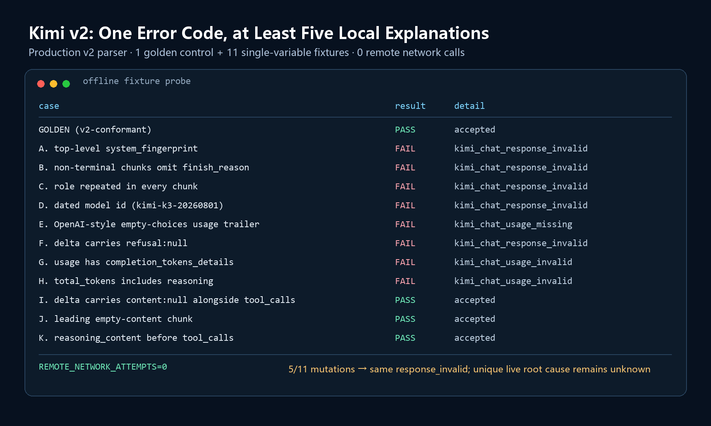

# How to Design an Agent Evaluation That Doesn’t Lie to You

> The first person an evaluation deceives is often not the reader of the report, but the person who wrote it. Clinical trials have spent decades developing defenses against this problem: pre-specified endpoints, locked protocols, denominator discipline, and the reporting of negative results. The agent field is now repeating many of the same mistakes.

Much of the current eval discourse is about benchmarks: saturation, contamination, and leaderboard gaming. This article is about an earlier failure—one that happens inside your own repository, before any benchmark is involved.

My statistical training comes from clinical research methodology: pre-specifying the primary test, locking random seeds, applying Holm correction, and reporting negative results as they are. Later, when I began building agents, I found that this kind of skepticism barely exists here.

> The cases in this article come from two of my public projects: ResearchOps Agent, an agent for scientific data analysis built around deterministic statistics, evidence binding, and human approval; and LongiEye, a validation pipeline for a public longitudinal cohort. Every number is backed either by evidence in the public repositories or by the accompanying offline probe output; verification paths appear at the end.

## The Lie I Almost Put in STATUS

While integrating a second model provider, I had several online paths that never made it to a registrable provider. The Kimi path was especially instructive. Two independent, separately authorized attempts both stopped at the very first response: validation failed, and the system refused to continue rather than improvise—a fail-closed design. The later artifact was deliberately restrained: `status=failed`, `error_code=kimi_chat_response_invalid`, and `causal_root_cause=undetermined_without_raw_provider_payload`.

The easiest line to put in STATUS would have been: “Kimi K3’s streaming response is incompatible with our parser.” It sounded professional, and it did not feel entirely dishonest. The request had, after all, failed during local parsing.

But that sentence smuggled in a causal leap the evidence did not support. “My parser rejected the response” had quietly become “the provider returned an incompatible response.” I had not saved the raw provider body. I had no idea what the online response actually looked like.

So I wrote an offline fixture probe that required neither network access nor authorization. It took a golden SSE fixture—a standard streaming response known to pass the real v2 parser—transformed it into 11 forms a real provider might plausibly return, and fed every one back through the same parsing code. Eight of the 11 variants failed. Five produced exactly the same `kimi_chat_response_invalid` error seen online. An extra `system_fingerprint`, an omitted empty `finish_reason` in a non-terminal chunk, a repeated `role`, a dated model ID, or an additional `refusal:null` in the delta could all generate the same error code.

The code made the problem even clearer. The parser contained an exact-key check using `set(value) != expected`. If an external service added a field I did not recognize—even a completely harmless one—the parser rejected the entire response.

This still does not prove that an extra field caused that particular online failure. Without the raw payload, the root cause remains unknown. But it proves something more important for attribution: my own code could reliably produce the same class of failure. Until I ruled that out, I had no basis for assigning blame to Kimi.

Without the probe, I would have permanently recorded “my parser was too strict” as “the provider was incompatible.”

This was not a failure demonstrated to have been caused by Kimi’s response. It was a failure of my evaluation: it gave me the right error code and nearly led me to write a conclusion the evidence did not support.

## I. Why Agent Evaluations Are Especially Good at Deceiving Us

The problem is not simply that “evaluation is hard.” Agent evaluation has three structural properties that systematically amplify self-deception.

### Reason 1: The denominator is hidden

“The success rate was high” tells you almost nothing unless you also say what went into the denominator: requests sent, tasks planned, tasks completed, or tasks that did not crash.

The Kimi run can be described as `0/3` scenarios completed or as `1/8` model requests executed. The first tells you that all three scenarios failed. The second tells you that the system reached only the first of eight planned requests, at the earliest response-validation stage. Add `0` trusted tool calls, `0` tool executions, and `0` usage observations, and the failure occurred before the run ever tested the model’s ability to perform the task; the investigation should focus on response validation.

Different denominators tell different stories about the same run. Reporting only the most flattering one can mislead without altering a single data point.

### Reason 2: Success can be manufactured silently

An error in a deterministic program is at least reproducible on the same input. An LLM’s error can be wrapped in an apology, a retry, and fluent prose until it looks like a correct answer. If scorer feedback is fed back into the agent, it may even learn how to pass.

That is why an evaluation must inspect the process. A correct final answer cannot excuse the use of an unauthorized tool, access to the answer, repeated retries, or a number that was not produced by the tools in the current run.

### Reason 3: Many agent evaluations lack a non-agent baseline

People compare model A with model B, but rarely ask: what happens without an agent? Could a fixed workflow, a single retrieval step, or a deterministic script already complete the task? If an agent gains only a few percentage points over that baseline while adding substantial latency, more irreproducible paths, and an entirely new security boundary, is that an improvement—or needless complexity?

Not every clinical question requires a randomized control. But if you want to make a causal claim about efficacy, you must provide a credible counterfactual. The same principle applies to agent evaluation. Without a baseline, you can show only that an agent *can* do something, not that it is *worth using* for that thing.

## II. Clinical Trials Started Solving the Same Problem Decades Ago

Many of the supposed bureaucratic rituals of clinical trials are not really there to constrain the drug. They are there to constrain the investigator. Replace the drug with an agent and the investigator with an evaluation engineer, and the correspondence is almost one-to-one.

| Rule in clinical trials | Corresponding problem in agent evaluation |
| --- | --- |
| Pre-specify the primary endpoint | Choose whichever metric looks best after the run |
| ITT (intention-to-treat) vs available-case | All tasks vs only the tasks that completed |
| Multiplicity correction | Report the best of several prompts or configurations |
| Pre-registration / protocol lock | Change the evaluation set while developing against it |
| Blinding / independent endpoint review | Source labels remain visible; fixed order introduces position bias |
| Report negative results | Publish only experiments in which the score improved |
| Define the target population | Replace a scope statement with “our agent is strong” |

Pre-specification of the primary endpoint prevents you from waiting until the run is over and then choosing the metric that looks best. If you measure success rate, tool correctness, citations, latency, cost, and formatting, then report only the largest gain, that is not a “comprehensive evaluation.” It is winner-picking. The primary metric, its direction, and the failure conditions should be fixed before the run.

Multiplicity correction addresses the same temptation. If you try enough prompt variants, one is likely to look best because of random variation even when their true capabilities are identical. Pulling that variant out, comparing it with the baseline, and treating the p-value as though you had made only one comparison turns repeated lottery tickets into a single purported experiment.

Pre-registration or protocol locking prevents you from changing the exam while looking at the answers. Run once, inspect the failures, revise the prompt, then rerun the same tasks and call the final round the “evaluation result”: those tasks have already become a development set, even if the filename still says *test*.

Blinding maps directly to LLM-as-judge. Visible source labels make the evaluation unblinded; even when the source is hidden, always presenting candidates in the same order introduces position bias. The lowest-cost safeguards are to anonymize the source, randomly swap the order within each pair, and then check flip consistency between A/B and B/A presentations. High-stakes conclusions should also receive independent, blinded human review.

The most valuable idea agent engineers can borrow is the denominator discipline behind intention-to-treat (ITT), per-protocol, and available-case analyses.

In a simulated ResearchOps study, the design requested an intention-to-treat population: `requested_population=intention_to_treat`. The raw dataset contained 240 participants, but 28 had missing follow-up outcomes, so the actual statistical analysis included only 212. The system therefore required `realized_population=available_case` and refused to describe the result as a “complete ITT analysis.”

Now map that to an agent. You lock a batch of tasks in advance. Some never finish because the API times out. You report the pass rate only among completed tasks. That is an available-case analysis. If the estimand is end-to-end success across all planned tasks, every planned task must remain in the denominator. A timeout is not contamination to be cleaned away; it is part of the system’s performance. In a clinical review, a departure from the planned analysis population must be disclosed and the claim narrowed. Agent reports often simply delete the unfinished tasks.

A clinical statistician would keep asking: why were those 28 outcomes missing? Did missingness differ between groups? What assumptions about the missingness mechanism does the conclusion require? An agent evaluation should ask the equivalent questions: did incomplete tasks fail at the provider, rate limit, context window, tool loop, or local parser? A “success rate among completers” cannot answer them.

## III. Five Rules You Can Put into Practice Now

The table above answers “which biases must we defend against?” The five rules below answer “what can an engineer do about them?” They are not a row-by-row mapping. The endpoint, denominator, and blinding safeguards that are not repeated as numbered rules reappear in the separately listed pre-freeze checklist below.

### Rule 1: Separate “the model failed” from “my code failed” before spending more money

As the Kimi probe above showed, online debugging requires authorization, may cost money, and can still end with nothing more than “root cause undetermined” (CNY 0.313600 was a local budget reservation, not a provider invoice). The reusable step is a local differential diagnosis: record one standard response, create single-variable mutations, and feed them all through the production parser. At minimum, log the case, pass or failure, stable error code, and remote-call count.

Exact-key matching should be reserved for internal artifacts that you generate and version yourself. For provider objects that may expand, validate required fields, handle known optional fields explicitly, and tolerate unknown additions unless the protocol makes a closed schema security-critical. If unknown fields truly must be rejected, return a distinct schema diagnostic. Otherwise, one harmless addition will be mislabeled as a model failure.

(This judgment has not been fed back into the v2 parser; Kimi remains unregistered.)

### Rule 2: Take numerical computation away from the model

In ResearchOps, I limited the model to understanding the request, choosing controlled logical tools, and organizing the response. Statistical numbers come from deterministic local implementations. The model sees only logical resource IDs and allowlisted aggregate projections, with no real paths, raw data rows, or tools for arbitrary Python, SQL, or shell execution.

Only then is the object of evaluation clear. Otherwise, you are not testing whether the agent selected the right analysis and reported it faithfully; you are testing whether the model happened to invent a plausible-looking number this time. The former supports golden regression tests and reproducible failures. The latter can be judged only through language.

There is another gate at report generation: conclusion-to-evidence binding, or claim binding. Every quantitative conclusion carries `evidence_id + metric_path + displayed_value + direction`. If the evidence ID was not produced by a tool in the current run, the metric path does not exist, or the displayed value disagrees with the evidence, the reporter refuses to proceed. Reversing the direction of the primary comparison also triggers fail-closed behavior.

The goal is not to ask the model to “cite evidence whenever possible.” It is to make an unbound numerical claim structurally impossible to publish.

### Rule 3: An evaluation must be able to fail, and failure must leave an evidence trail

An evaluation system that never returns “failure” is a marketing tool, not an evaluation tool.

The ResearchOps policy layer denies unknown tools, unknown risks, out-of-scope resources, and arbitrary execution by default. Controlled writes require human approval. Each of the 50 locked offline tasks has its own append-only SHA-256 event chain, recording tool calls, attempts, errors, and approvals. The artifact validator also scans for line-level canaries, absolute paths, API-key prefixes, Authorization headers, and tracebacks, so that “the evaluation passed” cannot also mean “the secrets were published with it.”

What made me trust these rules was not a 50/50 result. It was a 44/50 result. One run genuinely passed only 44 tasks and bound evidence correctly for only 10/21 citations, yet CI stayed green—an earlier failing exit code had been overwritten by a later successful verifier. After the bug was fixed, the current baseline returned to 50/50 and 21/21. The old 44/50 was not deleted; it remains part of the record as a gatekeeping incident. These numbers evaluate deterministic components and the control plane, not LLM planning accuracy.

The current 50/50 does not mean there are no failure paths. The suite includes expected errors and approval pauses; correctly refusing an unknown tool is itself a passing case. Evaluation failure and a system that correctly fails closed must be represented as two different fields.

### Rule 4: A bare number is no result at all

#### 4.1 Repeated measurements: the unit of analysis is the task, not the call

The locked DeepSeek + ResearchOps control-plane combination passed 68/93 cases in the public provider behavior evaluation, or 73.12%. Those cases were 31 fixed tasks repeated three times: 7 tasks passed 0/3 runs, 1 task passed 1/3, 2 tasks passed 2/3, and 21 tasks passed 3/3. If these 31 tasks are the complete fixed benchmark, reporting this descriptive distribution is enough. If they are treated as a sample from a larger task distribution, use a task-ID cluster bootstrap—resampling all three runs for each selected task together—and state the assumption that the tasks are representative.

The bare 73.12% suggests that “roughly three quarters work.” The actual structure is different: 21 tasks passed stably, 7 failed stably, and only 3 varied across runs. Those groups call for different next steps. Stable failures should trigger investigation of capability or contract defects; only the varying tasks primarily point to randomness. The bare rate collapses three engineering problems into one number.

#### 4.2 Multiple comparisons: the number of attempts is part of the result

This is a separate statistical problem. Ignoring dependence among repeated measurements can make uncertainty estimates too optimistic; making multiple comparisons inflates the false-positive rate.

The public-cohort LongiEye validation offers a clean counterexample. A model using just one feature—baseline spherical equivalent—had an AUC of 0.859. The full 14-feature model had an AUC of 0.872. Looking only at point estimates, it is tempting to write that “more features improved performance.”

But the three differences pre-specified in the same comparison family were 0.005, 0.013, and 0.008. After Holm correction, every p-value was 1.0000, and none of the three null hypotheses was rejected.

| Comparison | ΔAUC (95% CI) | Raw p | Holm p | Reject the null? |
| --- | ---: | ---: | ---: | --- |
| ocular vs refraction-only | 0.005 (−0.010, 0.020) | 0.5007 | 1.0000 | No |
| full vs refraction-only | 0.013 (−0.014, 0.038) | 0.3479 | 1.0000 | No |
| full vs ocular | 0.008 (−0.017, 0.030) | 0.5338 | 1.0000 | No |

The rigorous conclusion is not “additional features are useless.” A non-significant result does not prove the absence of an effect. The defensible conclusion is: “In the current data, we did not find confirmatory evidence that adding features improved AUC.”

In agent terms, this is: “I tried three prompts, and the third had the best point estimate.” Until you report the number of comparisons, paired uncertainty, and correction method, “best” is merely the ranking in this sample—not a conclusion.

### Rule 5: Physically separate the development and confirmation sets, and limit confirmation attempts in advance

The simplest test is this: if a task set’s results ever caused you to change a prompt, tool description, parser, or scoring rule, that task set is a development set. You can rename the file to *holdout*, but the information leakage remains.

I separated Eval v2’s 80 development tasks from its 40 public-regression tasks, and used a locking protocol to require that the planned private 50 be held by an external custodian—an independent holder of the sealed task set. The prompts, goldens, task IDs, and locators do not enter the repository, and the same freeze can be submitted only once. The private confirmation set has not yet been run; the number of executed tasks is 0. A public score cannot substitute for it.

The executable version is simple. Tune freely during development. At freeze time, create a commitment covering the prompt, tool schemas, parser, scorer, task manifest, and dependencies. Keep the confirmation set invisible until after the freeze. Once the run finishes, however uncomfortable the number is, that version does not get “one more try.” If you want another attempt, create an explicitly labeled successor and retain the old result in the history.

LongiEye’s public validation had neither an independent pre-registration nor an external cohort, so the repository describes it only as a pilot internal validation, not a confirmatory result. A confirmation set has confirmatory value precisely because it cannot continue serving as a training signal.

## The Pre-Freeze Checklist

- [ ] Were the primary metric, its direction, and failure conditions fixed before the run?
- [ ] What is the denominator? Are incomplete tasks still in it?
- [ ] Did I change the system after seeing results on this task set? If so, it is a development set.
- [ ] How many configurations did I compare? Did I correct for multiplicity?
- [ ] Are source labels hidden, candidate order randomized within each pair, and A/B ↔ B/A flip consistency checked?
- [ ] Are “evaluation failure” and “system refused as designed” separate fields?
- [ ] Is there a non-agent baseline?
- [ ] Did every failure leave a traceable evidence trail?

## IV. What This Costs

The cost is already visible in the results above: Kimi remains unregistered; the 25 cases that did not pass in ResearchOps’s public provider behavior evaluation remain in the denominator; and LongiEye can say only that “we have not demonstrated that the more complex model is better.” None of these results is good marketing. None can be deleted.

The more practical cost is losing the freedom to “run it one more time.” After the lock, you cannot change the timeout, swap the scorer, or delete hard cases because the run failed. Once a single-use authorization is consumed, a successor must be frozen from scratch. A release may stop, and substantial engineering work may yield only a negative result. That is not collateral damage from the process. It is the mechanism that prevents the observed result from reshaping the rules.

An honest evaluation system will keep returning negative results, incomplete states, and failures that cannot be attributed. You can accept that, or you can accept a system that lies to you. There is no third option.

## Conclusion: What This Article Does Not Prove

| Evidence used in this article | What it does not prove |
| --- | --- |
| ResearchOps deterministic statistics, control plane, online provider results, and failure artifacts | That ResearchOps is production-ready; it remains a research prototype |
| LongiEye repeated cross-fitting and multiplicity correction on a public cohort | That the results have clinical utility; the validation has only 81 events and no external cohort, and its bootstrap intervals are conditional on repeated out-of-fold (OOF) predictions rather than covering full-pipeline refitting uncertainty |
| Engineering practice in the domain of agents for scientific data analysis | That these rules already generalize to every agent setting |

What these public artifacts support is narrower: in the setting of agents for scientific data analysis, these rules at least stopped me from turning an undetermined root cause into a definite conclusion. They did not make me look more correct. They made it harder for me to look correct when I was wrong.

If your evaluation has never made you uncomfortable, it probably is not evaluating anything.

## Artifacts and Repositories

- [ResearchOps Agent](https://github.com/cedRiC874/researchops-agent): an agent for scientific data analysis. The [status ledger](https://github.com/cedRiC874/researchops-agent/blob/4b121813932aee090eaad3e95a70f3da80754301/STATUS.md), [public evaluation report](https://github.com/cedRiC874/researchops-agent/blob/4b121813932aee090eaad3e95a70f3da80754301/artifacts/eval_v2_public_regression/deepseek-v1/public_regression_report.json), and [Kimi failure evidence](https://github.com/cedRiC874/researchops-agent/blob/4b121813932aee090eaad3e95a70f3da80754301/docs/evidence/kimi-controlled-pilot-v2-response-failure-v1/README.md) used in this article are pinned to an immutable commit.
- [LongiEye](https://github.com/cedRiC874/longieye-ai-platform): a validation pipeline for a public longitudinal cohort. The [validation report](https://github.com/cedRiC874/longieye-ai-platform/blob/91a275f8b0f54bfe4c1d258689ee4b994e67fc65/docs/PUBLIC_COHORT_VALIDATION.md) and [machine-readable results](https://github.com/cedRiC874/longieye-ai-platform/blob/91a275f8b0f54bfe4c1d258689ee4b994e67fc65/benchmarks/public_cohort_validation.json) used here are pinned to an immutable commit.
- Figure 1’s [offline probe table output](assets/figure-1-kimi-fixture-probe.txt) is saved with the article. It can reproduce only the local parsing branch; it cannot identify a unique root cause for the online failure.
