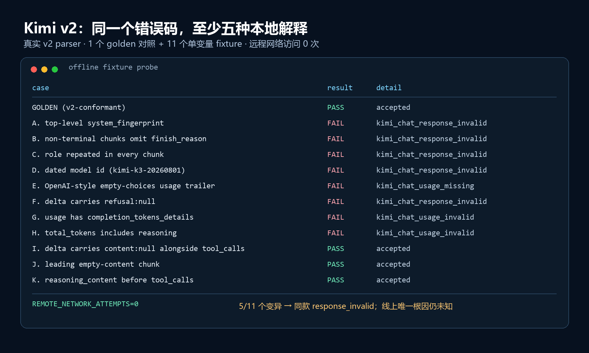

# 如何设计一个不骗自己的 Agent 评测

> 评测第一个骗的人，往往不是读报告的人，而是写评测的人。临床试验花了几十年，用预设终点、锁定方案、分母纪律和阴性结果报告来对付这件事；Agent 领域正在把同样的错误重犯一遍。

我的统计训练来自临床研究方法学——预设主检验、锁定随机种子、Holm 校正、如实报告阴性结果；后来我写 Agent，发现这套戒心在这里几乎不存在。

> 文中案例来自我的两个公开项目：ResearchOps Agent（科研数据分析 Agent，确定性统计 + 证据绑定 + 人工审批）与 LongiEye（公开纵向队列的验证流水线）。数字均对应公开仓库证据或随文离线探针输出，复核路径见文末。

## 一次我差点写进 STATUS 的谎言

我在接第二个模型供应商时，几条线上路径都没能变成可注册的 Provider。Kimi 尤其典型：两次独立、锁定后、分别授权的 Chat/pilot 尝试都在首请求进入失败即拒绝（fail-closed）。后一次产物只写：`status=failed`、`error_code=kimi_chat_response_invalid`、`causal_root_cause=undetermined_without_raw_provider_payload`。

当时最省事的 STATUS 写法是：“Kimi K3 的流式响应与我们的解析器不兼容。”但“解析器拒绝响应”不能推出“provider 响应不兼容”；原始 body 没有保存，我根本不知道线上响应长什么样。

后来我把一个能通过真实 v2 解析器的标准 SSE 响应（golden fixture）做成 11 种离线变异，再逐个灌回同一套代码。8 个失败，其中 5 个落到线上同款 `kimi_chat_response_invalid`；仅多一个 `system_fingerprint` 就足以触发它。

代码里果然有 `set(value) != expected` 的精确字段匹配。但探针仍不能证明线上恰好多了字段；它证明的是我的代码足以制造同类失败。在排除它以前，我没有资格把“解析器过度严格”永久记录成“对方不兼容”。

这不是一个已被证明由 Kimi 端响应导致的失败，而是我的评测的失败——它给了我一个正确的错误码，却差点让我写下一个证据不支持的结论。

## 一、为什么 Agent 评测特别容易骗人

不是因为“评测很难”，而是 Agent 评测有三个会系统性放大自欺的结构。

### 原因一：分母是隐藏的

“成功率很高”几乎没有信息，除非你说明分母。Kimi 那次既是 `0/3` 场景完成，也是 `1/8` 模型请求已执行：前者说全挂了，后者指出系统只走到首个响应验证。再加上 `0` 个可信 tool call、`0` 次执行、`0` 个 usage observation，这次失败尚未触及模型任务能力，排查重点应在响应验证。

同一次运行，不同分母讲的是不同故事。只报最好看的那个，不需要改一个数据，就能制造误导。

### 原因二：成功可以被静默制造

确定性程序的错误至少能在同一输入上稳定复现；LLM 的错误还会被道歉、重试和流畅措辞包装成正确答案。如果评分反馈回灌给 Agent，它甚至会学会如何过关。

所以评测必须检查过程：最终回答正确，不能覆盖中间用了越权工具、读了答案、反复重试，或者数字并非由本次工具产生。

### 原因三：很多评测没有非 Agent 基线

大家会比较模型 A 和 B，却很少问固定 workflow、普通检索或确定性脚本是否已经够用。临床研究并非都要随机对照，但因果性主张必须交代反事实；Agent 没有非 Agent 基线，最多证明“它能做”，不能证明“值得用它做”。

## 二、临床试验几十年前就在解决同一个问题

临床试验的很多“繁文缛节”，本质上不是为了约束药，而是为了约束研究者。把药换成 Agent，把研究者换成评测工程师，几乎可以逐项对应。

| 临床试验里的规矩 | 对应的 Agent 评测问题 |
| --- | --- |
| 预设主要终点 | 跑完再挑哪个指标好看 |
| ITT（意向性治疗） vs available-case（可用病例） | 全部任务 vs 只统计跑通的任务 |
| 多重性校正 | 多个 prompt 或配置里挑最好的报告 |
| 预注册 / 方案锁定 | 评测集一边开发一边改 |
| 盲法 / 独立终点评价 | 来源标签可见；固定顺序引入位置偏倚 |
| 报告阴性结果 | 只发布分数提升的实验 |
| 明确适用人群 | 用“我们的 Agent 很强”替代范围声明 |

预设主要终点，是为了防止跑完再挑指标。测了成功率、引用、延迟和成本，最后只报涨得最多的一个，不叫“全面”，而叫挑赢家。主指标、方向和失败条件必须在运行前写死。

多重性校正解决同一种诱惑：试很多 prompt，总有一个因波动显得最好。把它单独与 baseline 比，是把多次抽奖伪装成一次实验。

预注册或方案锁定，是为了防止边看答案边改试卷。只要你看过失败再改 prompt，这批题就已是开发集，哪怕文件名仍叫 test。

盲法正好对应 LLM-as-judge：看得见来源标签是非盲评价；即使隐藏来源，候选总按固定顺序出现，也会混入位置偏倚。最低成本的对策是匿名化来源、逐对随机交换顺序，再做 A/B 与 B/A 的翻转一致性检查；高风险结论还应使用独立、设盲的人工复核。

最值得 Agent 工程师借用的，是 ITT 与 available-case 的分母纪律。

ResearchOps 的模拟研究请求 ITT 人群：原始 240 例，28 例随访结局缺失，实际只分析 212 例。系统因此记录 `requested_population=intention_to_treat`、`realized_population=available_case`，并拒绝声称“完整 ITT”。

映射到 Agent：预定任务中有些超时，你却只报告完成任务的通过率，这就是 available-case。若主问题是预定任务上的端到端成功率，所有预定任务都应留在分母；分析集偏离在临床审评中必须披露并限制结论，Agent 报表却常直接删除未完成任务。

接下来还要追问缺失机制。Agent 的未完成任务究竟卡在 provider、限流、上下文、工具循环还是本地解析器？“完成者成功率”回答不了。

## 三、五条可以直接执行的规则

上表回答的是“需要防哪些偏差”；下面五条回答的是“工程上具体怎么做”。两者并非逐行对应；未单列为规则的终点、分母和盲法，统一收进随后单列的冻结前检查清单。

### 规则 1：先分离“模型不行”和“我的代码不行”，再花任何钱

如前文的 Kimi 探针所示，线上排查要授权、可能花钱，最后仍可能只能写“根因未定”（CNY 0.313600 只是本地预算保留，不是 provider 账单）。真正可复用的是先做本地鉴别诊断：录一份标准响应，设计单变量变异，再全部灌进生产 parser；输出 case、通过状态、错误码和远程调用计数。

exact-key match 应留给自己生成、版本化的内部产物。对可能扩展的 provider 对象，只校验必需字段并显式处理已知可选字段；若安全关键结构必须拒绝未知字段，就给出单独诊断码。否则一个无害增量也会被误报成模型失败。

（该判断尚未回灌到 v2 解析器；Kimi 至今未注册。）

### 规则 2：把数值计算从模型手里拿走

在 ResearchOps 里，我把模型限制在理解请求、选择受控工具和组织回答；统计数字由本地确定性实现产生。模型只拿逻辑 ID 和聚合投影，没有原始行或任意 Python、SQL、shell。否则你测的不是“是否正确分析并忠实报告”，而是“这次编得像不像”。

报告阶段还有一道结论—证据绑定（claim binding）。每个定量结论会写入 `evidence_id + metric_path + displayed_value + direction`。证据 ID 不是本次工具产生的、路径不存在、显示值与证据不一致，报告器都会拒绝；主对比方向写反，也会 fail-closed。

关键不是让模型“尽量引用”，而是让未绑定证据的数字无法发布。

### 规则 3：评测必须能失败，而且失败必须留下证据链

一个从来不输出“失败”的评测系统，是营销工具，不是评测工具。

ResearchOps 对未知工具、未知风险、越权资源和任意执行默认拒绝，写入必须审批。50 个锁定的离线任务各有独立的追加式 SHA-256 事件链；验证器还扫描行级 canary、路径、Key、Authorization header 和 traceback。

真正有用的产物是一次 44/50：证据引用仅 10/21，CI 却显示绿色——一个失败退出码被后续成功的 verifier 覆盖了。修复后基线回到 50/50、21/21；旧事故被保留。这评的是确定性组件与控制面，不是 LLM 规划准确率。

注意，当前 50/50 也不意味着“没有失败路径”。题库里有预期错误和审批暂停；正确地拒绝未知工具，本身是一道通过的题。评测失败与被测系统按设计 fail-closed，必须是两个不同字段。

### 规则 4：报一个裸数字，等于没报

#### 4.1 重复测量：分析单位是任务，不是调用

锁定的 DeepSeek + ResearchOps 控制面组合在公开 Provider 行为评测中通过 68/93，也就是 73.12%。但它其实是 31 个固定任务各重复三次：0/3 通过有 7 题、1/3 有 1 题、2/3 有 2 题、3/3 有 21 题。若这 31 题就是完整基准，报告描述分布即可；若把它们视为更大任务分布的样本，应按 task ID 做 cluster bootstrap——每次连同该题三次结果一起重采样——并声明任务代表性假设。

73.12% 暗示“大约四分之三能用”，但真实结构是 21 题稳定通过、7 题稳定失败、只有 3 题存在运行间波动。这三类指向的下一步完全不同：稳定失败的优先排查能力或契约缺陷，波动的才是随机性问题。裸比例把三件事压成了一个数。

#### 4.2 多重比较：尝试次数也是结果的一部分

这是另一个独立问题：忽略重复测量之间的依赖会让方差估计过于乐观，多次比较则会膨胀假阳性率。

LongiEye 中，1 个基线球镜等效值特征的 AUC 为 0.859，14 特征模型为 0.872；只看点估计，很容易写成“更多特征提升了性能”。完整比较如下：

| 比较 | ΔAUC（95% CI） | Raw p | Holm p | 拒绝原假设 |
| --- | ---: | ---: | ---: | --- |
| ocular vs refraction-only | 0.005（−0.010, 0.020） | 0.5007 | 1.0000 | No |
| full vs refraction-only | 0.013（−0.014, 0.038） | 0.3479 | 1.0000 | No |
| full vs ocular | 0.008（−0.017, 0.030） | 0.5338 | 1.0000 | No |

严谨结论不是“加特征没用”——未显著不能证明无效——而是“当前数据没有发现增加特征带来可确认的 AUC 改善”。

换成 Agent 场景，这就是：“我试了三个 prompt，第三个点估计最好。”在报告比较次数、配对不确定性和校正方法以前，“最好”只是这次抽样的排序，不是结论。

### 规则 5：开发集和确认集必须物理分离，确认机会必须预先限死

只要你根据某批题改过 prompt、工具、parser 或 scorer，它就是开发集；改名为 holdout 不会消除泄漏。

Eval v2 分开 80 个 development、40 个 public-regression，并规定 private 50 由外部保管方（custodian）持有，题面与标准答案不入仓；同一 freeze 只提交一次。private 尚未运行，不能用 public 分数代替。

开发时随便调；冻结时绑定 prompt、工具 schema、parser、scorer、任务清单和依赖；确认集此前不可见，跑完不得“再试一次”。再试就创建 successor，并保留旧结果。

LongiEye 的公开验证没有独立预注册，也没有外部队列，所以仓库只把它称为 pilot 内部验证，而不是确认性结果。确认集不能继续充当训练信号，正是它有确认价值的原因。

## 冻结前检查清单

- [ ] 主指标、方向和失败条件是否在运行前写死？
- [ ] 分母是什么？未完成任务还在分母里吗？
- [ ] 我是否根据这批题的结果改过系统？改过，它就是开发集。
- [ ] 比较了几个配置？做多重性校正了吗？
- [ ] 来源标签匿名化了吗？候选顺序随机交换并检查翻转一致性了吗？
- [ ] “评测失败”和“系统按设计拒绝”是两个字段吗？
- [ ] 有非 Agent 基线吗？
- [ ] 失败留下可追溯证据了吗？

## 四、这套做法的代价

代价已经写在前面的结果里：Kimi 仍未注册；ResearchOps 公开 Provider 行为评测的 25 个未通过 case 仍在分母；LongiEye 也只能说“尚未证明复杂模型更好”。这些结果不适合营销，但不能删。

更实际的代价，是你会失去“再跑一次”的自由。锁定以后，不能因为失败改超时、换 scorer、删难题；一次性授权用掉了，就只能为后继版本重新冻结。发布计划可能因此停住，已经投入的工程时间也可能只换来一个阴性结论。可这不是流程的副作用，而是防止结果反过来塑造规则的核心机制。

诚实的评测系统会持续给你阴性结果、未完成状态和无法归因的失败。你要么接受这个，要么接受一个会骗你的系统。没有第三个选项。

## 结尾：这篇文章不证明什么

| 这篇文章使用了什么证据 | 它不证明什么 |
| --- | --- |
| ResearchOps 的确定性统计、控制面、在线 Provider 结果与失败产物 | ResearchOps 已是生产可用产品；它仍是 research prototype |
| LongiEye 公开队列上的重复交叉拟合与多重性校正 | 结果具有临床效用；该验证只有 81 个事件、没有外部队列，bootstrap 区间以重复交叉拟合的折外（out-of-fold，OOF）预测为条件，并未覆盖全流水线重拟合不确定性 |
| 科研数据分析 Agent 这一领域的工程实践 | 这些规则已经适用于所有 Agent 场景 |

这些公开产物能支持的，只是：在科研数据分析 Agent 这个场景里，这些规则至少阻止了我把未定根因写成确定结论。它们没有让我看起来更正确。它们只是让我在错误时更难显得正确。

如果你的评测从来没让你难受过，它大概率没在评测。

## 产物与仓库

- [ResearchOps Agent](https://github.com/cedRiC874/researchops-agent)：科研数据分析 Agent；本文使用的 [状态账本](https://github.com/cedRiC874/researchops-agent/blob/4b121813932aee090eaad3e95a70f3da80754301/STATUS.md)、[公开评测报告](https://github.com/cedRiC874/researchops-agent/blob/4b121813932aee090eaad3e95a70f3da80754301/artifacts/eval_v2_public_regression/deepseek-v1/public_regression_report.json) 与 [Kimi 失败证据](https://github.com/cedRiC874/researchops-agent/blob/4b121813932aee090eaad3e95a70f3da80754301/docs/evidence/kimi-controlled-pilot-v2-response-failure-v1/README.md) 均绑定不可变提交。
- [LongiEye](https://github.com/cedRiC874/longieye-ai-platform)：公开纵向队列验证流水线；本文使用的 [验证报告](https://github.com/cedRiC874/longieye-ai-platform/blob/91a275f8b0f54bfe4c1d258689ee4b994e67fc65/docs/PUBLIC_COHORT_VALIDATION.md) 与 [机器可读结果](https://github.com/cedRiC874/longieye-ai-platform/blob/91a275f8b0f54bfe4c1d258689ee4b994e67fc65/benchmarks/public_cohort_validation.json) 均绑定不可变提交。
- 图 1 的 [离线探针表格输出](assets/figure-1-kimi-fixture-probe.txt) 随文章一并保存；它只能复现本地解析分支，不能倒推线上唯一根因。
