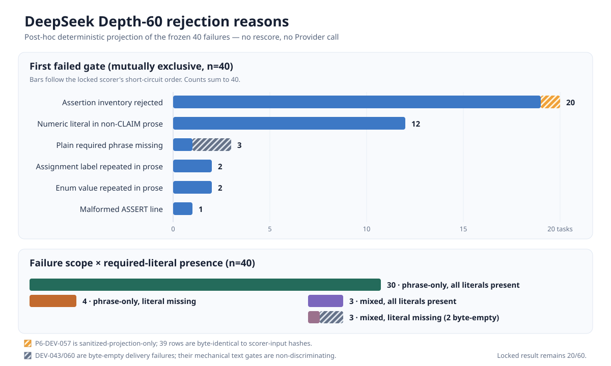

# DeepSeek Depth-60 interpretation audit v1

## Status and scope

This is a post-hoc interpretation audit of the frozen Depth-60 run. It does not modify the run,
the 20/60 locked result, any task, prompt, scorer, tool schema, or the original evidence bundle.
It performs no Provider call and contains no raw model output or private data.

The frozen headline remains:

```text
strict end-to-end protocol pass rate   20/60 (33.33%)
completed / not started                60 / 0
failed                                 40
```

That number is valid for the complete locked protocol. It is not a semantic-answer accuracy,
English-language capability score, model-only quality score, or corrected production estimate.

## The apparent English gap is cohort-confounded

`english` is an explicit task tag, not a detector applied to model output. The naive aggregate is
2/21 for tagged tasks versus 18/39 for all other tasks. However, all historical DEV-001..016 tasks
are non-English and passed 16/16.

| Comparable cohort | English | Non-English |
| --- | ---: | ---: |
| Historical DEV-001..016 | 0 tasks | 16/16 |
| Frozen extension DEV-017..060 | 2/21 | 2/23 |

Within the extension, the two-sided Fisher exact p-value is 1.0. The aggregate fivefold difference
therefore does not support a claim that the model or system is worse on English requests.

## The locked score is dominated by one text-contract check

Mechanically, all 40 locked failure-reason lists include `required_phrases`; 34/40 have no other
failed check. Thirty-eight tasks delivered content-bearing final answers, while DEV-043/060 were
byte-empty, so those two phrase failures are vacuous and textually non-discriminating. All 34
phrase-only failures are content-bearing. Among the 19 failed English-tagged tasks, 17 have only
`required_phrases` as a failure. In contrast, the English group passes tool sequence, tool status,
arguments, approval, safety, trace integrity, usage integrity, evidence grounding, evidence-label
integrity, and forbidden-phrase checks on 21/21 tasks.

For DEV-017..060 the scorer applies a strict structured-output contract. Expected assignments must
appear as exact standalone `[ASSERT ...]` lines, while duplicate labels, values, or numeric prose
can invalidate the complete `required_phrases` check. This tests exact control-plane conformance in
addition to substantive tool use and evidence handling.

### Rejection-reason histogram

The existing structured-rejection predicates were applied deterministically to every frozen
failure. The mutually exclusive first-failed-gate histogram is:



| First failed gate | Sanitized projection, all 40 | Byte-identical to scorer input |
| --- | ---: | ---: |
| ASSERT inventory rejected | 20 | 19 |
| Numeric literal in non-CLAIM prose | 12 | 12 |
| Non-structured required phrase missing | 3 | 3 |
| Assignment label repeated in prose | 2 | 2 |
| Enum value repeated in prose | 2 | 2 |
| Malformed ASSERT line | 1 | 1 |
| **Total** | **40** | **39** |

“First failed gate” is short-circuit order, not causal attribution. The gate sequence is fixed and
published in the machine artifact, so the split is reproducible, but it is not the only defensible
split: a rule can look rare here simply because an earlier gate consumed the same tasks. The
overlapping trigger projection below is the correct table for asking how often a given rule fires
at all.

The mechanical plain-phrase gate count of three is itself heterogeneous: DEV-024 delivered content
and omitted a required ordinary literal; DEV-043/060 delivered zero final-answer bytes. On those
two empty outputs, failure at every phrase gate is inevitable and has no textual discriminatory
value.

The 34 failures that failed only `required_phrases` split 30/4: 30 contain every required literal
but are rejected by the structured contract, while four omit at least one required literal. The
complete 40-task cross-tab preserves the six mixed failures instead of silently counting them as
pure format failures:

| Locked failure scope | All required literals present, structured reject | One or more literals missing |
| --- | ---: | ---: |
| Only `required_phrases` | 30 | 4 |
| Mixed with another locked failure | 3 | 3 |

The delivery-aware view removes the two byte-empty rows before interpreting textual behavior:

| Delivery-aware failure scope | All required literals present, structured reject | One or more literals missing |
| --- | ---: | ---: |
| Content-bearing, only `required_phrases` | 30 | 4 |
| Content-bearing, mixed with another failure | 3 | 1 |
| Byte-empty delivery failures, reported separately | — | 2 |

Thus the mechanical mixed/missing cell of three is DEV-023 plus the two byte-empty deliveries; only
DEV-023 is a content-bearing mixed failure with a literal omission.

“All literals present” is a lexical fact, not a semantic-correctness judgment. `_contains_phrase`
does not establish polarity, role binding, contextual consistency, or whether a repeated value is
attached to the correct field. A structured rejection can therefore be either a formatting miss or
an intended conflict-protection rule firing; this audit does not relabel all 30 as correct answers.

For diagnosis, a non-short-circuit trigger projection records every matching branch predicate.
These counts overlap and are not native scorer-emitted reasons:

| Diagnostic trigger | All 40 | Content-bearing 38 | Only-`required_phrases` 34 |
| --- | ---: | ---: | ---: |
| Enum value repeated in prose | 25 | 25 | 22 |
| Numeric literal in non-CLAIM prose | 24 | 24 | 21 |
| Expected ASSERT missing | 22 | 20 | 18 |
| Assignment label repeated in prose | 15 | 15 | 14 |
| Unexpected ASSERT | 7 | 7 | 6 |
| Non-structured required phrase missing | 3 | 1 | 1 |
| Malformed ASSERT line | 1 | 1 | 1 |
| Duplicate ASSERT | 0 | 0 | 0 |

These counts expose at least three distinct findings, not an exhaustive or mutually exclusive
causal partition. First, 20/38 content-bearing outputs are first rejected on ASSERT inventory and
the same 20 are missing an expected `[ASSERT ...]` line, which is an instruction-following result
about the system under test. Nineteen of the 37 byte-exact content-bearing rows support that branch
classification directly; DEV-057 is the sole sanitized-only row, so its actual scorer-input branch
set remains indeterminate. Second, the `95%` lexical matcher defect is demonstrated on five tasks;
even treating every content-bearing numeric-prose first-gate failure as rescuable, a repair could
have rescued at most 12 tasks under first-gate accounting. Third, DEV-043/060 are byte-empty
delivery failures; their derived phrase and missing-ASSERT failures are vacuous and should be
attributed to neither ordinary instruction-following nor the scorer defect. This audit does not
claim that these three findings cover all 40 failures, or that removing the matcher defect would
have passed the ASSERT-inventory failures.

Thirty-nine persisted outputs are byte-identical to the actual scorer-input hashes recorded in the
locked audit database. `P6-DEV-057` is the sole exception: its published result contains a path
redaction, while the audit database retains only the scorer-input SHA-256, not the original text.
Its row and the 40-task table are therefore explicitly a sanitized projection; the raw branch set
for that task remains indeterminate. The 39-task byte-exact view is published separately in the
same machine artifact.

[rejection_reason_histogram.json](rejection_reason_histogram.json) contains per-task result-row,
projection-output, and scorer-input hashes plus booleans and reason codes, but no output text. Its
default verifier checks the committed publication hash, 920 sanitized row values, and 470 derived
histogram values recomputed from those rows: 1,390 default-path value comparisons in total. The
derived comparison includes `delivery_aware_interpretation`, so drift in its published fields is
rejected even without the omitted artifacts. This default path still cannot authenticate the
omitted scorer-input bytes independently; supplying both SHA-matching artifacts performs a
1,541-value full recomputation of the sanitized projection and audit hash bindings. The repository
commitment detects accidental or single-file drift. For coordinated-change detection, retain the
artifact SHA outside the repository and pass it explicitly:

```powershell
$env:PYTHONPATH = (Resolve-Path 'src').Path
& .\.venv\Scripts\python.exe -B scripts\analyze_phase6_depth60_rejections.py --verify `
  --expected-artifact-sha256 7b7083856987c2f08385124f9683807296dbed218a2921833537000ad5337a1c
```

This is a post-hoc explanation of the frozen failures, not an official rescore and not permission
to tune the scorer or rerun the seen tasks.

Five tasks expose a lexical scorer defect rather than a formal impossibility: DEV-026, DEV-028,
DEV-030, DEV-032, and DEV-044 require the substring `95%`. A normal standalone `95%` in prose is
rejected by the extension numeric-prose rule, but the contrived token `x95%` still satisfies the
substring requirement while evading `_NUMBER_IN_TEXT` because its `95` is preceded by a letter.
Full locked-score counterexamples pass all five tasks. Two are English-tagged and three are not.
Consequently this audit must not claim that the tasks are unsatisfiable or that the strict ceiling is
at most 55/60. It proves that the scorer penalizes normal presentation while accepting an unnatural
lexical escape; it does not prove that all 60 tasks are jointly reachable.

This correction is machine-replayable. [95_percent_lexical_counterexample.json](95_percent_lexical_counterexample.json)
contains, for each task, a synthetic natural-control output, an `x95%` counterexample, complete
synthetic tool/evidence traces, actual scorer checks, rejection reasons, corpus line numbers, scorer
AST line ranges, and source SHA-256 commitments. It contains no Provider output. The verifier
compares 1,006 generated values and currently binds artifact SHA-256
`36cad26b69002e9d55aa9d086e7b1b2d2fefa4893ccf18dbf6c99a1f91b278fc`.

The artifact records generation provenance as
`sys.version = 3.12.13 (main, Aug  7 2026, 02:26:41) [MSC v.1944 64 bit (AMD64)]` and pins the
semantically relevant replay versions to Python patch `3.12.13` and
`unicodedata.unidata_version = 15.0.0`. Patch or Unicode drift fails before scorer execution; a
same-patch platform/compiler build string is allowed and retains the recorded provenance string in
the recomputed artifact. Main Windows CI remains on its available Python 3.12.10 and skips this
canonical-only test class; a separate Ubuntu/Python 3.12.13 job performs the mandatory replay.

```powershell
$env:PYTHONPATH = (Resolve-Path 'src').Path
& .\.venv\Scripts\python.exe -B scripts\verify_phase6_depth60_95pct_counterexample.py --verify
```

The replay imports the locked scorer rather than reimplementing it. Natural controls fail only
`required_phrases`; every `x95%` counterexample passes all locked checks and `task_pass`.

## Interpretation correction record

During uncommitted local drafting, this audit briefly proposed that DEV-026/028/030/032/044 were
formally unsatisfiable and therefore imposed a strict ceiling of 55/60. The machine replay above
falsified both premises before this interpretation audit was committed or pushed.

The Git-history audit found no commit, remote-tracking ref, branch reflog entry, or locally visible
PR head containing either withdrawn claim. Accordingly:

- correction status: `withdrawn_before_publication`;
- superseded public commit: `null`;
- withdrawn claims: `formal_unsatisfiability` and `strict_ceiling_at_most_55_of_60`;
- correcting evidence: [95_percent_lexical_counterexample.json](95_percent_lexical_counterexample.json).

This record is explicit even though there is no public commit to supersede, so the first published
audit does not silently erase the reasoning error. If a previously unknown public copy is later
found, its exact immutable anchor must be appended here rather than replacing this record.

## Output-cap attribution

The 2,000-token setting is a per-model-response limit, not a per-task total. The 60 tasks produced
103 model responses: 101 were projected as `completed` and two as `incomplete`. Only the final
responses for DEV-043 and DEV-060 reached exactly 2,000 output tokens; both had
`output_limit_suspected=true`, failed completion integrity, and were recorded as
`provider_output_incomplete`. Both delivered byte-empty final answers: their persisted projection
and scorer-input SHA-256 values are the empty-string digest
`e3b0c44298fc1c149afbf4c8996fb92427ae41e4649b934ca495991b7852b855`.
This is stronger than status-only incomplete attribution: whatever the unavailable Provider-native
cause, the system delivered zero final-answer bytes in both cases.

Only one other response reached 90% of the cap: DEV-044 used 1,821 tokens and was recorded as
completed with completion integrity true. Excluding DEV-043/060, no response reached 1,900 tokens.
The recorded telemetry therefore contains no third truncation signal.

DEV-044 is also one of the five `95%` lexical-defect tasks. Its live failure is therefore
observationally confounded: it must not be used by itself to attribute failure either to near-cap
length or to the output matcher. Telemetry records the response as completed, while the separate
synthetic replay isolates the matcher behavior without relying on that Provider response.

This is not proof that silent truncation was impossible. The frozen projection checks output-item
status and uses `output_tokens >= 2000` as a fallback, but it does not retain top-level response
status, `incomplete_details`, or a provider-native `finish_reason`. A Provider/SDK path that reports
`completed` below the cap could remain undetected. The supported claim is “no additional truncation
was observed,” not “all additional truncation was excluded.”

## Signature tags and stop behavior

The strict composite rate is 0/4 for both `ancova` and `itt-boundary`. This is important, but its
failure decomposition is more informative than the zero alone:

| Tag | Strict pass | Tool sequence / arguments | Completion / outcome / evidence / numeric | Phrase-only failures | Cap-related incomplete |
| --- | ---: | ---: | ---: | ---: | ---: |
| `ancova` | 0/4 | 4/4 | 3/4 | 3 | 1 (DEV-043) |
| `itt-boundary` | 0/4 | 4/4 | 3/4 | 3 | 1 (DEV-043) |

These are task-level check booleans. An evidence or numeric check can pass vacuously when that task
has no required evidence or numeric units; the table is a failure decomposition, not a replacement
unit-level accuracy metric.

The deterministic ANCOVA calculation did not fail. Nor did all four tasks fail planning, evidence
grounding, or numeric checks: three in each tag failed only `required_phrases`; the shared fourth
task, DEV-043, ended with an exact-cap incomplete response. The accurate defect is weak strict
reporting-contract conformance near the project's signature workflow, plus one real cap-related
delivery failure whose final answer was byte-empty. DEV-060, outside these two tag rows, is the
second exact-cap incomplete case and is byte-empty under the same byte-exact hash evidence.

`clarification_refusal_accuracy=3/13` is also a composite `guardrail_pass` metric, not stop-decision
accuracy. All 13 expected clarification/refusal tasks produced the correct outcome, called zero
tools, passed tool-sequence and argument checks, and completed safely. Ten failed only the exact
required marker/reason/identifier contract. Across all 60 tasks, the 20 guardrail passes are the
same task set as the 20 `required_phrases` passes. The run therefore does not support the claim that
the model continued when it should have stopped; it supports a machine-readable formatting and
identifier-preservation deficit.

## Five-task qualitative audit

The sample was selected to cover phrase-only, mixed-heuristic, clarification, quantitative, and
completion failures. No raw answer text is reproduced.

| Task | Locked failure | Interpretation |
| --- | --- | --- |
| P6-DEV-017 | `required_phrases` | Aggregate facts and ASSERT values were correct; numeric facts were repeated in prose, violating the exact format contract. |
| P6-DEV-018 | `required_phrases`, `forbidden_assertions` | The answer preserved the possible-not-confirmed privacy boundary; a negated phrase and enum restatement exceeded the limited literal heuristic. |
| P6-DEV-024 | `required_phrases` | The system stopped and asked for the intended design without tools, but described the two choices instead of preserving both exact internal design IDs. |
| P6-DEV-026 | `required_phrases` | Evidence, numeric claims, outcome, and completion passed; normal `95%` prose hits the numeric ban, while a machine counterexample shows the scorer accepts an unnatural `x95%` escape. |
| P6-DEV-060 | completion, outcome, evidence, numeric, phrase | The final answer was empty after an incomplete Provider output; this is a substantive execution failure. |

Four sampled failures are primarily format, identifier-preservation, or scorer-contract effects;
one is a real completion failure. This purposive sample must not be extrapolated into a corrected
overall rate.

## Diagnostic ablation, not a replacement result

If `required_phrases` alone is ignored after the run while every other locked failure remains, the
diagnostic counts are:

| Group | Locked pass | Pass without `required_phrases` only |
| --- | ---: | ---: |
| All 60 | 20/60 | 54/60 |
| English tag | 2/21 | 19/21 |
| Non-English tag | 18/39 | 35/39 |
| Extension English | 2/21 | 19/21 |
| Extension non-English | 2/23 | 19/23 |

The 54/60 value is a post-hoc sensitivity analysis. It is not an official rescore, corrected
accuracy, model-quality metric, or authorization to change the same scorer and rerun seen tasks.
More fundamentally, `required_phrases` as implemented is not a valid measurement instrument for
numeric-presentation discipline: it rejects a correct rendering and accepts an unnatural escape
that serves no communicative purpose. Rescoring this check in either direction therefore does not
yield a meaningful accuracy; the 54/60 ablation is included only to expose score concentration.

## Correct interpretation

- Keep 20/60 as the frozen strict end-to-end protocol result.
- Report component metrics alongside it; do not use 33.33% as semantic or model-only accuracy.
- Do not claim an English-language deficit from the tagged aggregate.
- Do not claim the five `95%` tasks are formally unsatisfiable or impose a ≤55/60 ceiling; the
  machine counterexample proves a lexical escape exists, while joint 60/60 reachability is unknown.
- Report at least three distinct findings, without presenting them as an exhaustive causal
  partition: a content-bearing ASSERT-inventory instruction-following deficit (20/38 sanitized
  projection; 19/37 byte-exact), a demonstrated lexical matcher defect on five tasks, and two
  byte-empty delivery failures. Do not attribute all 40 failures to either the scorer or ordinary
  instruction-following; the empty outputs make their phrase/ASSERT failures non-discriminating.
- Treat `required_phrases` as implemented as an invalid measurement instrument for
  numeric-presentation discipline: it rejects a correct rendering and accepts an unnatural escape
  with no communicative purpose. No forward, reverse, or removal-based rescore of this check is a
  meaningful accuracy, including 54/60. A defensible replacement number requires a preregistered
  evaluator on new, unseen tasks.
- Report `ancova` and `itt-boundary` as 0/4 strict composite results with their 3 phrase-only plus
  1 incomplete decomposition; do not call them 0/4 deterministic-statistics or evidence failures.
- Do not interpret clarification/refusal 3/13 as failure to stop: outcome and zero-tool behavior
  were 13/13, while exact output-contract conformance was 3/13.
- Do not report either 46.2% or 90.0% as the system's true accuracy.
- Any replacement evaluator must be preregistered and run on new, unseen tasks; this consumed result
  cannot be used to tune the same prompt, scorer, tool schema, or task selection.

Machine-readable counts, source commitments, and claim boundaries are in
[diagnostic_projection.json](diagnostic_projection.json). The lexical replay is implemented by
[the verifier](../../../scripts/verify_phase6_depth60_95pct_counterexample.py) and protected by
[offline tests](../../../tests/test_phase6_depth60_95pct_counterexample.py). The rejection
histogram is rebuilt and verified by
[the rejection analyzer](../../../scripts/analyze_phase6_depth60_rejections.py) and its
[tamper/privacy tests](../../../tests/test_phase6_depth60_rejections.py).
