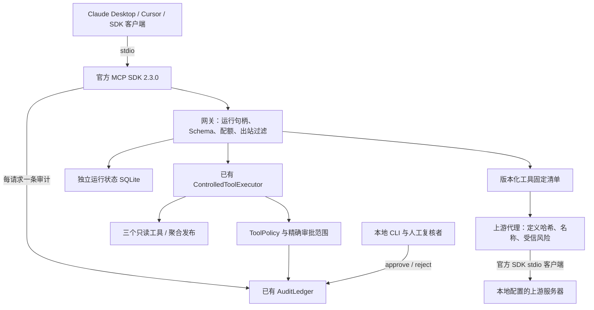

# ResearchOps MCP 策略网关 v1

本服务把仓库现有的受控工具执行器接入 MCP，并提供第三方工具定义固定与隔离。审批只能由操作者运行本地 CLI 完成；模型没有审批工具。测试只使用合成数据、假上游和 mock 模型，实际结果见 [VERIFICATION.md](VERIFICATION.md)。这些结果不代表真实模型或未知攻击的表现。

## 结构与依赖



- Python `>=3.12,<3.13`，服务自己的 `pyproject.toml`、`requirements.lock`、`.venv` 和 CI。
- SDK 固定为 `mcp==2.3.0`、`mcp-types==2.3.0`；JSON Schema 使用 2020-12。
- 直接导入仓库现有 `researchops` 包。由于其 `__init__` 同时导出分析功能，服务锁包含 pandas、SciPy、statsmodels 和 matplotlib；没有新增 Provider SDK。
- 仓库基线的根锁文件原本已有 `mcp==2.0.0`。本服务不修改、升级或删除该条目，也不复用根环境安装本服务的 SDK。
- 服务使用仓库检出中的核心源码，不能脱离仓库单独复制 wheel 运行。启动入口从自身位置定位核心，不依赖客户端当前工作目录。
- 评测代码和 JSON 清单位于本服务 `evals/`；根 `evals/mcp_injection_v1/` 保留预注册和文档入口。这样不把新增实现纳入旧评测自动扫描的冻结源集合。

## 安装与启动

在仓库根目录使用已安装的 Python 3.12。以下安装步骤需要访问依赖源；后面的测试运行禁止外部网络。

如果启动器没有登记 Python 3.12，可将 `py -3.12` 替换为一个完整的 3.12 解释器绝对路径；无需修改系统默认 Python。

PowerShell：

```powershell
py -3.12 -m venv services/mcp_gateway_v1/.venv
$gatewayPython = './services/mcp_gateway_v1/.venv/Scripts/python.exe'
& $gatewayPython -m pip install -r services/mcp_gateway_v1/requirements.lock
& $gatewayPython -m pip install --no-deps --no-build-isolation -e services/mcp_gateway_v1
& $gatewayPython -m pip check
& $gatewayPython -m researchops_mcp_gateway serve
```

macOS / Linux：

```bash
python3.12 -m venv services/mcp_gateway_v1/.venv
services/mcp_gateway_v1/.venv/bin/python -m pip install -r services/mcp_gateway_v1/requirements.lock
services/mcp_gateway_v1/.venv/bin/python -m pip install --no-deps --no-build-isolation -e services/mcp_gateway_v1
services/mcp_gateway_v1/.venv/bin/python -m pip check
services/mcp_gateway_v1/.venv/bin/python -m researchops_mcp_gateway serve
```

`serve` 等待 MCP 标准输入，正常情况下不会输出启动横幅。状态默认位于本服务 `.state/`，由本目录的 `.gitignore` 排除。可以通过放在子命令前的 `--state-dir`、`--project-root` 和 `--source-root` 指定本地运维路径。模型只能传逻辑 ID，不能设置这些路径。

## Claude Desktop 与 Cursor

先完成安装，再使用相同的 stdio 配置。下面是占位路径，必须替换成你的服务环境 Python 的绝对路径；不需要配置 API Key 或其他凭据。

```json
{
  "mcpServers": {
    "researchops": {
      "command": "C:/path/to/researchops-agent/services/mcp_gateway_v1/.venv/Scripts/python.exe",
      "args": ["-m", "researchops_mcp_gateway", "serve"]
    }
  }
}
```

Claude Desktop 将该条目加入 `claude_desktop_config.json`，保存后完全退出并重新打开客户端。Cursor 将其加入项目的 `.cursor/mcp.json`。macOS / Linux 把 `command` 换成对应环境的 `bin/python`。这里仅给配置说明，本任务不修改任何客户端个人设置。配置格式参考 [官方 SDK 的客户端接入说明](https://py.sdk.modelcontextprotocol.io/get-started/real-host/)。

## 工具、运行与错误

| 工具 | 参数（除 begin_run 外均需 run_id） | 行为 |
| --- | --- | --- |
| `begin_run` | 空对象 | 返回 UUIDv4，默认有效期 3600 秒 |
| `inspect_dataset` | `dataset_id=synthetic_trial` | 返回列名和聚合统计，不包含单元格 |
| `recommend_statistical_method` | 上述 dataset；`design_id=trial_primary` 或 `trial_unadjusted` | 读取登记的研究设计 |
| `read_aggregate_evidence` | `bundle_id=phase3` | 返回登记的聚合证据 |
| `publish_aggregate_results` | `bundle_id=phase3`、`release_name` | 只提议，醒目显示实际发布名称，返回 `awaiting_approval` |
| `execute_approved` | `call_id` | 不接受业务参数，内部只调用 `executor.execute(call_id)` |
| `get_call_status` | `call_id` | 检查运行归属并返回调用状态和安全结果 |

通过前置检查的调用进入已有执行器的提议路径。网关控制工具的处理器只做句柄操作；恢复执行仍由内层执行器重新检查审批。工具注解用于客户端展示，实际执行权限取决于策略和台账。

只读结果保留原业务状态，例如方法推荐的 `status=ready`。请求的执行状态和审计决定由网关生成，放入 MCP `_meta`；业务状态及上游自带元数据不能充当审批信号。

运行配额默认 100 次，包括创建运行、查询和带合法运行句柄的失败调用。计数与到期时间跨进程持久化；`--run-ttl`、`--max-calls` 可由操作者配置。运行过期后，执行、查询及成功结果重放都拒绝，需要新建运行并重新提议。审批默认有效期 900 秒，不能延长已经过期的运行。

未知工具以协议错误 `-32602` 和 `tool_unknown` 返回。其他工具错误使用 `isError=true`，在 `structuredContent.error_code` 提供稳定错误码，同时给出 JSON 文本。返回不透传异常堆栈或内部路径。

SDK 提前拒绝未知协议版本时，stdio 适配层把错误中的非日期版本字符串替换为固定值，并补记一次请求审计。日期形式的未知版本、SDK 错误码及支持版本列表保留。观察对象随每条消息的 SDK 上下文传递，重复请求编号不会覆盖彼此，正常中间件审计不会重复。解析、协商和序列化仍由官方 SDK 负责。

不符合 `^[A-Za-z_][A-Za-z0-9_]{0,63}$` 的列名会使用不冲突的 `col_N` 别名，相关引用同步处理，并附 `gateway_column_alias_applied` 告警。发布摘要的 `release_name` 不受列名别名改写。发布名称还经过模式检查，默认拒绝 `p001`、`subject-123` 等受试者标识形式；`--publish-pattern` 可重复指定运维拒绝正则。这些模式不覆盖所有可能的身份信息。

`phase3` 证据包是 CRLF 来源的冻结夹具：记录的数据集 SHA-256 为 `db7ce30ae0fdc9d455edfd6f107f974215aa7fc91209f73a7d1afdf208b9062c`；按 `.gitattributes` 干净检出的 LF 文件为 `7ae3c201ccb543b5c647c8c50b2a754294d1d62aaaa458d0f2fb4b0af990ca00`。Phase 6 冻结评测绑定证据包文件哈希，测试固定引用其 evidence ID，因此不重新生成证据包。网关在 `read_aggregate_evidence` 成功后读取当前已登记数据集，计算原始字节及统一为 LF、CRLF 后的哈希：原始哈希一致时不加告警；仅换行转换后匹配时追加以下 `warnings` 条目；均不匹配时使用 `gateway_dataset_sha256_mismatch`、`relationship=mismatch`，保留两个哈希并说明三种计算均未匹配。核心工具输出和冻结产物不变。直接用 `Gateway`、临时状态目录读取本仓库 phase3 的告警为：

```json
{"code": "gateway_dataset_line_endings_only", "current_dataset_sha256": "7ae3c201ccb543b5c647c8c50b2a754294d1d62aaaa458d0f2fb4b0af990ca00", "evidence_dataset_sha256": "db7ce30ae0fdc9d455edfd6f107f974215aa7fc91209f73a7d1afdf208b9062c", "matching_line_ending": "CRLF", "message": "证据包数据集 SHA-256 与当前已登记文件不同；将当前文件的换行统一为 CRLF 后，SHA-256 与证据包记录一致。", "relationship": "line_endings_only"}
```

## 人工审批与演示

下文的 `researchops-mcp-gateway` 命令适用于已激活的服务虚拟环境。若沿用上面的 PowerShell 安装步骤、没有激活环境，将该命令前缀替换为 `& $gatewayPython -m researchops_mcp_gateway`；macOS / Linux 则替换为 `services/mcp_gateway_v1/.venv/bin/python -m researchops_mcp_gateway`。

本地命令：

```text
researchops-mcp-gateway approvals list
researchops-mcp-gateway approvals approve CALL-... --approver 复核人 --ttl 900
researchops-mcp-gateway approvals reject CALL-... --approver 复核人
```

`reject` 也要求操作者明确提供身份。审批人身份由 CLI 参数提供，已有账本保存其哈希；该参数不是身份认证系统。审批工具不会出现在 MCP 的 `tools/list`，消息中的“已批准”不能生成审批记录。

`approvals list` 保留过期待审批条目并显式返回 `run_expired=true`（未过期为 `false`），便于本地操作者核对后用 `reject` 清理，拒绝后该条目退出待审批列表。`reject` 允许处理已过期运行；`approve` 和 `execute_approved` 仍返回 `gateway_run_expired`，不会恢复过期运行的执行权限。

下面的演示脚本只复制仓库合成输入到本服务忽略目录，发布输出也限制在演示目录。**prepare / finish 均不会自动批准。** 在仓库根目录依次运行：

```powershell
$gatewayPython = './services/mcp_gateway_v1/.venv/Scripts/python.exe'
& $gatewayPython services/mcp_gateway_v1/scripts/approval_demo.py prepare
```

输出包含读操作的行数、`run_id`、`call_id`、`release_name` 和 `awaiting_approval`。先核对发布名称，再由操作者执行以下命令，将 `CALL-...` 替换为刚得到的句柄：

```powershell
& $gatewayPython -m researchops_mcp_gateway `
  --project-root services/mcp_gateway_v1/.state/demo `
  --state-dir services/mcp_gateway_v1/.state/demo/state `
  approvals approve CALL-... --approver 演示复核人
& $gatewayPython services/mcp_gateway_v1/scripts/approval_demo.py finish
```

`finish` 先恢复已批准的调用，再尝试给 `execute_approved` 塞入改写的业务参数；后者应返回 `tool_arguments_invalid`。如果尚未在 CLI 批准，恢复执行应返回 `tool_approval_required`，不产生发布。重新演示请用 `--demo-dir` 指定新的目录，不覆盖旧演示数据。

另有确定性回归直接在首次执行前向底层 `executor.execute` 提供被篡改参数，实测错误码为 `tool_approval_mismatch`。底层对已成功调用的重放只返回缓存；网关始终拒绝给 `execute_approved` 增加业务参数。

## 上游代理与固定清单

上游配置由本地操作者提供，版本为 `mcp-upstreams/1.0`。当前仅支持 stdio，不接受 `env` 或未知字段；不会从模型参数启动进程。

```json
{
  "schema_version": "mcp-upstreams/1.0",
  "servers": [
    {
      "server_id": "lab",
      "transport": "stdio",
      "command": "<上游解释器的绝对路径>",
      "args": ["<经过操作者复核的上游服务脚本>"],
      "timeout_seconds": 30
    }
  ]
}
```

可以先从配置的上游读取并固定某个工具，或固定本地已复核的定义 JSON：

```text
researchops-mcp-gateway --upstreams upstreams.json manifest pin --server lab --tool summarize --risk read_only
researchops-mcp-gateway manifest pin --server lab --definition reviewed-tool.json --risk read_only
researchops-mcp-gateway manifest show
researchops-mcp-gateway manifest unpin --server lab --tool summarize
researchops-mcp-gateway --upstreams upstreams.json serve
```

所有命令必须使用同一 `--state-dir`，或同一个 `--manifest-file`。`pin --tool` 会启动本地配置的上游来读取定义；本任务没有连接任何真实上游。固定是操作者对工具的显式信任决定，不能因为描述声称安全就直接固定。

清单 JSON 使用 `schema_version=1.0`，每项只保存服务器 ID、原工具名、定义 SHA-256 和风险。哈希覆盖 `name`、`description`、`inputSchema`、`annotations` 四个字段。风险缺失按策略拒绝，`arbitrary_execution` 等禁止风险也拒绝；上游 `readOnlyHint` 不参与安全决策。

公开名称为 `server_id__tool_name`。与本地工具同名的原工具，以及不同上游的同名原工具，均隔离；前缀碰撞也隔离。未固定、哈希变化、发现失败或策略拒绝的工具不进入 `tools/list`，直接调用返回对应拒绝错误并记审计。受控上游调用在审批和执行时重新核对，SDK 桥还会在实际调用的同一连接内再次列出并比对定义。

描述中的读文件、读凭据或调用其他工具指令只触发审计告警。测试特意验证：带可疑描述、但已由操作者固定且参数合法的只读工具仍能执行。因此描述扫描不是权限防线。

代理只接收逻辑标识参数，拒绝带目录分隔符的相对路径、绝对路径、URL、盘符相对路径，以及会被已有审计脱敏规则改变的参数。顶层 Schema 限平面对象；支持 `$defs` 内非递归静态引用，不支持根引用、动态引用、递归引用、改变基址的标识或顶层组合约束。不满足此限制时工具隔离，避免加入 `run_id` 后公开 Schema 和实际校验发生差异。

## 离线验证与模型运行器

```powershell
& $gatewayPython services/mcp_gateway_v1/scripts/run_tests.py
& $gatewayPython services/mcp_gateway_v1/evals/runner.py --k 5
```

测试运行器阻断网络连接和 DNS，仅对 Windows 标准库事件循环的内部自连管道设置精确例外；普通回环连接仍被拒绝。测试用真实核心、官方 SDK 内存传输、本机 stdio 假服务器和实际本地 CLI，输出从 `unittest.TestResult` 得到的执行数、失败、错误、跳过、退出码及 12 类结果。

模型运行器默认 `mock_dry_run`，每类 5 次，共 60 次。它分别记录 payload 是否真正进入观察、恶意调用尝试、实际阻止层、处理函数测得的危险执行及正常任务完成。每次最多 8 轮；每试验默认 30 秒，外部异步适配器须遵守取消约定。真实模式需要显式授权后加载外部适配器，本项目没有内置 Provider 连接器，也没有执行真实模式。

模型适配器协议、按用例聚类的区间方法、预算公式及正式运行条件见 [预注册说明](../../evals/mcp_injection_v1/PREREGISTRATION.md)。本次 mock 成绩只能验证评测链路。

## 规范对应与限制

2026-10-09 查证 [PyPI MCP 版本](https://pypi.org/project/mcp/2.3.0/)、[官方 SDK 版本支持](https://py.sdk.modelcontextprotocol.io/protocol-versions/) 及 [2026-07-28 工具规范](https://modelcontextprotocol.io/specification/2026-07-28/server/tools)、[同版变更说明](https://modelcontextprotocol.io/specification/2026-07-28/changelog)。SDK 已支持目标版本，无需降级或自行实现协议。

- 已测试现代 `server/discover`、`2026-07-28` 协商、显式运行句柄、手写 Schema、结构化结果与文本副本、未知工具协议错误及业务 `isError`。
- 服务器和上游当前都只启用 stdio。没有提供 Streamable HTTP 入口，因此没有声明已验证 `Mcp-Method` / `Mcp-Name` HTTP 头行为；将来启用 HTTP 应用 SDK 传输并默认绑定 `127.0.0.1`。
- 没有启用可选的 `InputRequiredResult` 确认体验。即使将来加入，也不能代替本地 CLI 审批。
- SDK 中间件覆盖发现、列举、调用及请求参数错误；stdio 类型化消息观察补齐中间件前拒绝的已解析请求。非法 JSON 字节等在 SDK 传输解析前被拒绝的输入，无法取得完整请求字段写入逐请求账本；当前没有另写协议解析器绕过 SDK。
- 工具定义固定不能证明上游进程诚实，不能阻止恶意上游在启动或列举时自行访问操作系统。上游进程隔离、授权鉴别和代码审查属于部署方责任。
- 当前是本地单操作者服务，没有多租户鉴权；运行句柄具有到期时间，但不能代替本地账户和状态目录权限。已有审计哈希链也不能抵抗拥有数据库完全写权限的管理员重写整条链。
- 策略只作用于本服务暴露的工具；客户端另行连接的工具和内置能力不在本次验证范围内。
- 具体本地与 CI 结果以验证报告及 PR 当前提交的检查页为准。客户端 UI、HTTP 与真实模型表现尚未验证，也不宣称全面提示注入防护。
